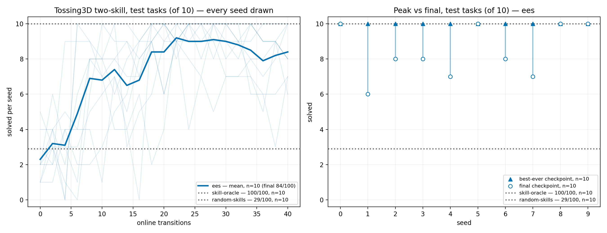
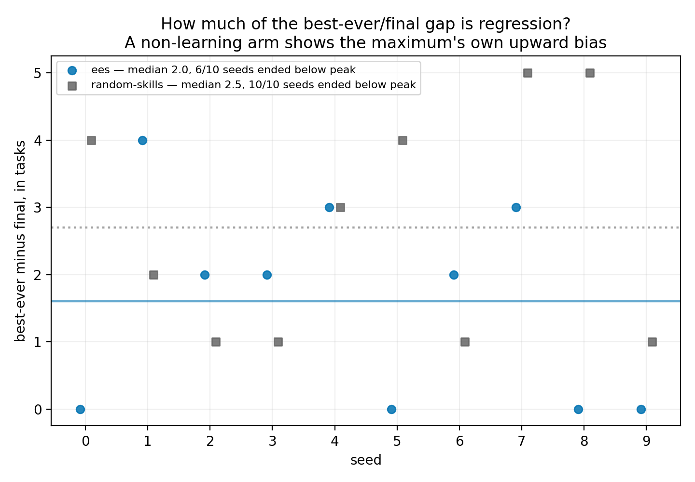

# EES on the two-skill Tossing3D domain

**2026-08-16.** Three arms (`ees`, `random-skills`, `skill-oracle`) x seeds 0-9, at
`--num-cycles 20 --max-steps-per-interaction 20 --num-test-tasks 10`. 30/30 runs completed.

**TL;DR.** `ees` ends at **84/100** against **29/100** for `random-skills` and **100/100**
for the `skill-oracle` ceiling; paired over the ten shared seeds that gap is **+5.5 tasks
per seed, Wilcoxon p = 0.00195**. **10/10 `ees` seeds touch `10/10` at some checkpoint**
while **0/10 `random-skills` seeds ever do** (their best is `7/10`), so the 16-task
shortfall from the ceiling is not a capability limit. But the tempting next step —
reading "best-ever `100/100`, final `84/100`" as late-training regression — **does not
survive its control.** The same best-minus-final gap on `random-skills`, an arm that
cannot learn, is **larger** (mean 2.7 tasks/seed against `ees`'s 1.6), the two are
statistically indistinguishable (p = 0.30469), and a paired test for late-training drift
inside `ees` is a **null result** (−0.58 tasks/seed, p = 0.15234, MDE 1.097). What the
data supports is *checkpoint-to-checkpoint instability throughout training*, most of the
best-versus-final gap being the upward bias of a maximum taken over 21 noisy checkpoints.

> **Provenance warning, read before quoting any number here.** These runs did **not**
> execute against the KINDER commits this branch pins, and the branch's pins are the ones
> that are wrong. See [Provenance](#provenance-the-kinder-pins-on-this-branch-are-stale)
> below. The numbers describe the two-skill domain correctly; they are **not reproducible
> from a checkout of this stack** until `reference/kinder-baselines` is bumped.

## Question / goal

Does EES learn the two-skill Tossing3D domain, and if it falls short of the
`skill-oracle` ceiling, is that shortfall a limit on what it can reach or a failure to
*hold* what it reached?

## Background

`environments/tossing3d/` used to decompose the task into three lifted skills — `Pick`
(distance, rotation), `MoveToThrowPose` (standoff) and `Toss` (speed, release ms). PR #258
migrated it to upstream's two-skill decomposition:

| was | is |
| --- | --- |
| `Pick` (2 parameters) | `PickCube`, **`param_dim = 0`** |
| `MoveToThrowPose` (1 parameter) | folded into the toss |
| `Toss` (2 parameters) | `MoveToTossLocationAndToss`, **`param_dim = 4`** |

Two consequences shape what this experiment can measure. **Every learnable parameter in
the domain now belongs to one skill**: `PickCube` declares no continuous parameters, so
no sampler exists for it and none can. And the toss's sampling box is narrower than the
one the old domain drew from — upstream measured every scoring draw falling in speed
`[117.5, 140.0]` deg/s and release `[710.4, 836.1]` ms and set its bounds a small margin
outside that, against the old `TOSS_SPEED_BOUNDS` of `(60, 140)` and
`TOSS_RELEASE_MS_BOUNDS` of `(300, 1400)`. **Narrowing the box raises what an untrained
sampler scores**, which is the baseline a trained one has to beat.

The horizon also changed. `Tossing3DProblem.max_episode_steps` is "the shortest solve plus
two"; the shortest solve lost a step when the base move was composed into the toss, so the
literal moved from `3 + 2 = 5` to `2 + 2 = 4`.

**Why the analysis needed new code, and why this matters beyond housekeeping.** The
existing readers — `analysis/practice_makes_perfect/tossing3d_ees_arms.py`,
`tossing3d_practice_diagnosis.py`, `tossing3d_reset_free_arms.py` — key on the *old* skill
names and read per-skill tallies with `.get(name)`. Pointed at a two-skill results tree
they find nothing, fall back to the `{}` default, and report `0/0` **without raising**: a
confident empty plot that looks like a measurement. This log's numbers come from a new
reader, `analysis/practice_makes_perfect/tossing3d_two_skill_curves.py`, which fails loudly
instead.

## Hypothesis

Registered before the numbers were read: `ees` beats `random-skills` on final task success
by a margin detectable at ten paired seeds, and falls short of the `skill-oracle` ceiling.
No directional hypothesis was registered about *where* the shortfall comes from — that
question was posed after the curves were first seen, and everything below about regression
versus instability is therefore **exploratory, not confirmatory**.

## Guidance given

- Re-derive every number from the raw `stats.json` rather than trusting the summary the
  task carried.
- Report counts as `x/y`, never a bare percentage.
- Never assert an effect without a p-value; use paired tests where arms share seeds.
- Plot per-seed traces, not only means — the shape of interest is invisible in a mean.
- Exclude the prior `80.8/100` EES plateau as a comparator, and say why.
- State the horizon asymmetry between this repo and kinder-baselines' refiner.

## Methods

`scripts/run_sweep.py`, fixed seeds 0-9, three arms, into
`<results-root>/<method>/<seed>/`. Read back with
`analysis/practice_makes_perfect/tossing3d_two_skill_curves.py`, which is post-run only —
it reads `stats.json` and never constructs a `Problem`, `Method` or `Environment`.

`ees` and `random-skills` each write 21 evaluation checkpoints (before any practice, then
after each of 20 cycles). `skill-oracle` writes one: it does not learn, so it is drawn as
a flat horizontal reference line rather than a curve.

Paired tests use `analysis/practice_makes_perfect/paired_tests.py`'s exact Wilcoxon
signed-rank, with its minimum detectable effect reported beside every null result. Paired
because all three arms ran the same ten seeds; an unpaired test would discard that
structure.

**Skill-coverage guard.** Before any number is reported, the reader checks that the
results tree actually describes the two-skill domain, and distinguishes two very different
kinds of empty:

| skill | declared `param_dim` | informed draws | unparameterized draws | verdict |
| --- | --- | --- | --- | --- |
| `PickCube` | 0 | 0/200 | 200/200 | `unlearnable-by-construction` — **correctly empty** |
| `MoveToTossLocationAndToss` | 4 | 89/200 | 0/200 | `learnable` |

`PickCube` contributing nothing to a competence plot is the *healthy* state, not a
failure. A guard that fired on it would be muted, and a muted guard protects nothing —
so "this skill has no learnable parameters" and "the skill names did not match" are
separate statuses, and only the second raises.

## Results

### Task success

| arm | final | best-ever | per-seed final | seeds ever reaching `10/10` |
| --- | --- | --- | --- | --- |
| `ees` | **84/100** | 100/100 | 6, 7, 7, 8, 8, 8, 10, 10, 10, 10 | **10/10** |
| `random-skills` | 29/100 | 56/100 | 1, 2, 2, 3, 3, 3, 3, 4, 4, 4 | **0/10** (best `7/10`) |
| `skill-oracle` | 100/100 | 100/100 | 10 x `10/10` | 10/10 |

**`ees` against `random-skills`, paired over the ten shared seeds:** per-seed differences
`[7, 2, 4, 5, 4, 8, 5, 5, 9, 6]`, mean **+5.5 tasks/seed**, exact Wilcoxon
**p = 0.00195**, MDE 1.832. Every seed favours `ees`. This is the one clearly significant
finding in the experiment.

**The ceiling is reached, and reaching it is what `random-skills` never does.** All 10/10
`ees` seeds hit `10/10` at some checkpoint; no `random-skills` seed ever exceeds `7/10`.
So the 16-task shortfall between `ees`'s final `84/100` and the oracle's `100/100` is not
a statement about what the learned sampler is capable of.

### The best-versus-final gap is mostly the maximum's own bias, not regression

6/10 `ees` seeds end below their own best checkpoint (seed 1 peaked `10/10` at checkpoint
9 and ended `6/10`; seed 4 peaked at checkpoint 3 and ended `7/10`; seed 7 peaked at
checkpoint 12 and ended `7/10`; seeds 2, 3 and 6 each end 2 tasks down). Read alone that
looks like the robot learning the task and then losing it. **It does not survive its
control.**

| arm | per-seed (best − final) | mean | seeds ending below peak |
| --- | --- | --- | --- |
| `ees` | 0, 4, 2, 2, 3, 0, 2, 3, 0, 0 | **1.6** | 6/10 |
| `random-skills` | 4, 2, 1, 1, 3, 4, 1, 5, 5, 1 | **2.7** | **10/10** |

A maximum over 21 noisy checkpoints exceeds the final checkpoint for *any* arm, including
one that consults no sampler and cannot improve. `random-skills`' gap is **larger** than
`ees`'s. Paired over seeds, the difference between the two arms' gaps is a **null result**
— mean −1.10 in `ees`'s favour, **p = 0.30469**, MDE 2.228.

**So "best-ever 100/100" should not be quoted on its own.** It is an upward-biased
estimate, and this sweep contains its own calibration for how biased.

### Late-training drift: a null result

Testing the specific claim that the loss is *late*: per seed, the mean of checkpoints
16-20 minus the mean of checkpoints 10-14.

| arm | mean difference | exact Wilcoxon p | MDE |
| --- | --- | --- | --- |
| `ees` | −0.58 tasks/seed | **0.15234** | 1.097 |
| `random-skills` | +0.30 tasks/seed | 0.57617 | 1.064 |

**Null result** for `ees`. The point estimate is negative and six of ten seeds move down,
which is suggestive, but at ten seeds nothing below about 1.1 tasks/seed is detectable at
all and the observed −0.58 is inside that. This experiment **cannot** distinguish a real
late decline from noise; a directional claim either way is unsupported.

What *is* visible without a test, in the per-seed traces on the left panel of the first
figure, is that **no `ees` seed holds its peak**. Instability is not confined to the end
of training: seed 0 first reaches `10/10` at checkpoint 5 and dips to `6/10` afterwards;
seed 9 reaches `10/10` at checkpoint 3 and drops to `7/10`. Late trajectories that wander
(seed 1: `9, 7, 5, 9, 6`; seed 4: `7, 7, 6, 3, 7`; seed 7: `10, 6, 6, 6, 7`) sit against
four that hold (seed 0: `9, 10, 10, 10, 10`), and the split between those two populations
is not explained here.

### Comparators

| comparator | value | note |
| --- | --- | --- |
| `skill-oracle` ceiling | 100/100 | this sweep |
| bilevel planning, seeds 100-139 | 40/40 scored, 0/40 `planned_not_scored`, 0/40 `plan_not_found` | different harness — see the horizon asymmetry below |
| single uniform draw of the composed toss | 31/100 | one draw, no learning |
| `random-skills` | 29/100 | this sweep |
| ~~prior EES plateau, 80.8/100~~ | **excluded** | see below |

**The 80.8/100 is deliberately not used, and 84 versus 80.8 must not be presented as an
improvement.** It was measured on the **three-skill** domain at `max_episode_steps = 5`.
This sweep is a different domain *and* a different budget: the two-skill decomposition
corrects the horizon to 4 (shortest solve is 2 skills plus 2 slack). Two changes at once,
in unknown directions, across a 3.2-task difference — the comparison carries no
information.

**The horizon asymmetry, where EES and bilevel planning appear together.** They do not
share a success criterion. kinder-baselines' refiner **discards** a skill whose controller
overruns its step budget; this repo's `KinderBackend.run_controller` records
`terminated=False` and **continues**, treating an overrun as an ordinary outcome of
parameters that did not work out (`take_action` must be total). Neither binds on this
sweep — `pick_cube` runs 114-132 steps and the composed toss 53-60 against limits of
`pick_step_limit = 400` and `toss_step_limit = 1000`, with episodes around 170 steps — so
the asymmetry does not explain any number here. **The step counts in that sentence are
carried from the task brief and were not re-measured**; this sweep ran with
`--record-episode-traces` off, so they are unverified. The limits and the `terminated=False`
behaviour *were* verified at source (`kinder_backend.py`, `run_controller` and
`pick_step_limit`/`toss_step_limit`).

## Provenance: the KINDER pins on this branch are stale

**Every run in this sweep executed against KINDER checkouts that diverge from the commits
this branch pins**, and the pins are what is wrong, not the runs.

| submodule | pinned at `a62b091` | `config_snapshot.json` records | relation |
| --- | --- | --- | --- |
| `reference/kinder-baselines` | `2f3fc90` | `a1adebd` | diverged, 24 ahead / 2 behind |
| `reference/kindergarden` | `c9f00e8` | `f3c05a2` | diverged, 7 ahead / 1 behind |

The 24 commits `a1adebd` has and `2f3fc90` lacks are **the two-skill migration itself** —
`compose the base move and the toss into one skill`, `give Tossing3D a parameterless
pick_cube`, `retire RobotAtThrowPose`, `narrow the toss's speed/release-ms sampling
bounds`. Checked directly against each commit's own
`kinder_models/dynamic3d/tossing/parameterized_skills.py`:

| commit | controllers present |
| --- | --- |
| `2f3fc90` (pinned) | `MoveToThrowPoseController`, `TossFromWindupController` — the **three-skill** set. No `PickCubeController`, no `MoveToTossLocationAndTossController`. |
| `a1adebd` (what ran) | `PickCubeController`, `MoveToTossLocationAndTossController` — the two-skill set. |

So `src/hitl_pmp/environments/tossing3d/kinder_backend.py` drives `pick_cube` and
`move_to_toss_location_and_toss`, **neither of which exists at the pinned commit**. The
sweep ran against the right code; the gitlink was never bumped alongside the `src/`
migration.

Consequences, stated at the strength they are warranted:

- **Verified:** the pinned commit does not contain the two controllers this domain calls.
  A checkout of this stack that populates `reference/` and installs the extra therefore
  cannot run `--env tossing3d` at all.
- **Verified:** these results were produced at `a1adebd` / `f3c05a2`, per each run's own
  `config_snapshot.json`, which also records `git_dirty = True` for this repo at
  `a62b091`.
- **Unverified:** whether the `kindergarden` divergence (`c9f00e8` → `f3c05a2`, which
  touches `envs.py`, `mujoco_utils.py`, `object_types.py` and `tidybot_robot_env.py`)
  changes the dynamics these numbers were measured under. It was not investigated.

This is a defect in the base branch, not in this log's analysis, and it is **not fixed
here** — bumping a submodule pin is a deliberate act that belongs to the PR that
introduced the mismatch.

### The shared `reference/` tree has also drifted since the sweep ran

Discovered while running the gate, and it compounds the above. A worktree's `reference/`
is empty, and the editable install resolves `kinder_models` by absolute path to the **main
checkout's** tree — which every agent and every local gate on this machine shares. Read
just now, that tree's `MoveToTossLocationAndTossController` declares:

| constant | shared tree, now | `skills.py` on this branch | sweep's `config_snapshot.json` |
| --- | --- | --- | --- |
| `SPEED_BOUNDS` | `(1.0472, 2.4435)` rad/s = **(60, 140)** deg/s | `TOSS_SPEED_BOUNDS = (115, 140)` deg/s | ran at `a1adebd` |
| `RELEASE_MS_BOUNDS` | **`(600.0, 840.0)`** | `TOSS_RELEASE_MS_BOUNDS = (700, 840)` | ran at `a1adebd` |

The shared tree **has** both two-skill controllers but **not** the narrowed bounds, so it
sits before `a1adebd` — the commit named `narrow the toss's speed/release-ms sampling
bounds`, which is the last of the 24. The tree therefore moved *after* the sweep recorded
`a1adebd` and *before* this gate ran.

The consequence for verification is direct: **20/1894 tests fail on this branch**
(1871 passed, 3 skipped), and all 20 are Tossing3D — 16 under
`tests/environments/tossing3d/` plus 4 `test_tossing3d_*` cases in
`tests/scripts/test_reproducibility.py`. Every one is explained by that mismatch rather
than by anything in this PR: `test_kinder_pin.py` fails asserting exactly the two bounds
in the table above, the `test_kinder_fidelity.py` failures are a `ValueError` raised
inside `bilevel_planning`'s own `structs.py`, and the reproducibility cases fail because
the `--env tossing3d` subprocess they shell out to exits non-zero. They fail identically
without this PR's files, which touch only `analysis/`, `tests/analysis/` and `docs/`.

**No number in this log is affected** — they were all read out of `stats.json` files
written at `a1adebd`, and nothing here recomputes against live bounds. But it means the
sweep is *doubly* unreproducible right now: the branch pins a commit that predates the
domain, and the shared tree everything actually imports sits at a third commit that
predates the bounds.

## Recommendation

1. **Bump `reference/kinder-baselines` to `a1adebd` on PR #258 before this stack merges**,
   and decide what to do about the `kindergarden` divergence. Until then the stack is not
   runnable from a fresh checkout and this log's numbers are not reproducible from it.
   This is the highest-priority item here. **Separately, put the shared main-checkout
   `reference/kinder-baselines` back on the pin** — it is currently before `a1adebd`, and
   16 Tossing3D tests fail on this branch because of it, for everyone on this machine.
2. **Quote `84/100` as the result, and never `100/100` on its own.** Best-ever is a
   maximum over 21 noisy checkpoints; this sweep's own non-learning arm shows a larger
   gap than the learning arm does.
3. **Do not claim late-training regression on this evidence.** It is a null result at
   ten seeds with an MDE of 1.097 tasks/seed. A directional claim needs either more seeds
   or an evaluation with less checkpoint-level noise — averaging a window of checkpoints
   rather than reading the last one would cost nothing and is what
   `tossing3d_plateau.py` already does for exactly this reason.
4. **Do not compare against the 80.8/100 three-skill plateau** in any write-up. Different
   domain and different horizon.
5. The remaining open question worth an experiment: **why some seeds hold `10/10` and
   others oscillate.** Four of ten hold, six wander, and nothing here explains the split.
