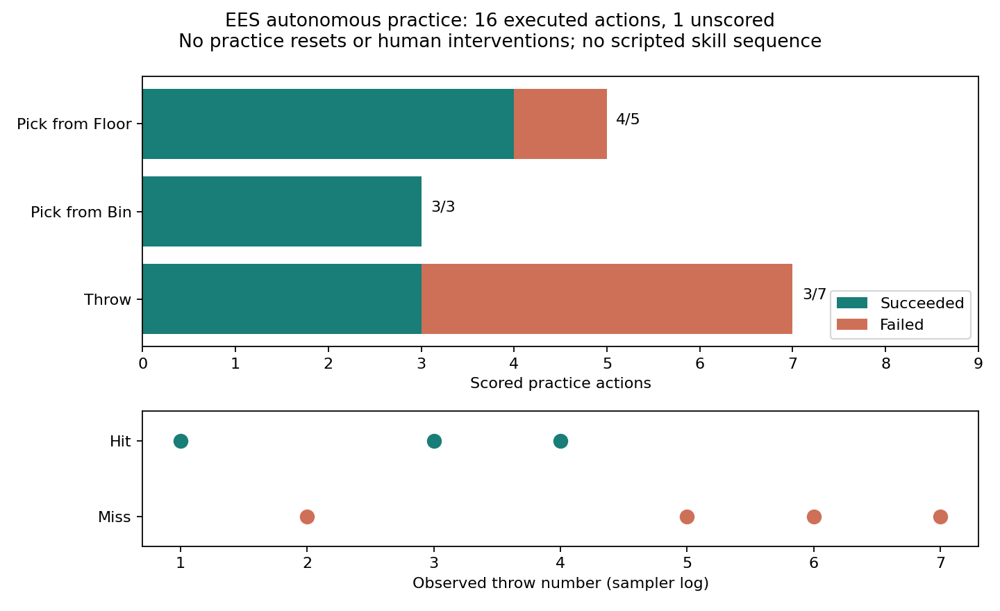

# Autonomous same-side Tossing3D through EES

## Question / goal

Can the robot pick, throw, retrieve from the bin or floor, and repeat until its practice
budget ends, with the sequence arising from EES rather than a prescribed action loop?

## Background

Step 1 provides the same-side scene. Step 2 provides physical bin retrieval and the
floor/bin operator models. This step uses the existing EES implementation unchanged.

## Hypothesis

EES selects a practice target and plans to its preconditions. Another throw requires
`Holding`; the observed cube location determines whether floor or bin pickup establishes
it. A successful bin pickup deletes `InBin`, so the planner cannot retain a stale goal.

## Guidance given

Create a stack of draft PRs with TDD and video/graph evidence for every step. No human
resets, hidden teleports, or scripted pick/throw choreography in the EES demonstration.

## Methods

The launcher tests initially failed on the missing launcher module; the evidence test
failed on the missing analysis module. They now check delegation to the standard CLI,
continuous-practice configuration, positive budgets, refusal of reset/human-assisted
runs, and explicit accounting for unscored actions. An EES policy regression replays
floor → held → bin → held → floor observations through the real policy without injecting
plans or targets, and gets pick → throw → bin pickup → throw → floor pickup.

Run the recorded protocol:

```bash
scripts/with_env.sh python scripts/tossing3d_autonomous_demo.py --output-dir artifacts/autonomous
scripts/with_env.sh python analysis/tossing3d_autonomous.py --run-dir artifacts/autonomous --output artifacts/autonomous/outcomes.png
```

The wrapper delegates directly to `Cli.main`: same-side scene, canonical seed 125,
EES seed 0, one 16-action practice period, two-action goal-pursuit horizon, no practice
resets, no human reset skill, one held-out evaluation task, 200 sampler training iterations.
The supplied video is produced by the launcher; the launcher-delegation test pins its
argument list. The repeated run produced identical metrics to the initial direct-CLI
pilot. All throw parameters were sampled by EES. The two-action horizon only limits initial goal pursuit; it does not
specify the subsequent skills or their parameters.

The normal loop performs baseline and final evaluation on a separate environment.
The included video is the **single continuous practice clip**, 149.3 seconds at 20 fps,
with no cuts, speed changes or inter-attempt resets. It excludes evaluation and the
sampler refit after practice. Captions report the skill and its post-action state;
coordinates in the caption are not an instantaneous substep measurement.

## Results



[Watch continuous autonomous practice](2026-08-27-tossing3d-autonomous/practice.mp4)

| Measured result | Count |
| --- | ---: |
| Executed practice actions | 16 |
| Scored actions | 15 |
| Bin retrievals succeeding | 3 / 3 |
| Floor pickups succeeding (including initial pickup) | 4 / 5 |
| Throws hitting the bin | 3 / 7 |
| Practice resets / human interventions | 0 / 0 |

EES selected throwing as a practice target eight times. It selected neither pickup as
a practice target: those executions arose as **prerequisites**. This is recorded in
`practice_target_outcomes_per_cycle`, not inferred just from the video's apparent order.
One floor pickup failed; it remains a failure in the evidence. The final action is
unscored because EES observes pending outcomes on its next policy call. No success is
invented for that final action.

The short session exercises planning and recovery, not a learning curve. All seven
scored throws used the uninformative sampler before the first refit. Baseline and final
evaluation both solved the single held-out task; that does not establish improvement.
Use more cycles for practice after refitting (`--cycles 3 --steps 16`); evaluation and
refit pauses then separate the per-cycle practice videos while the practice state persists.

Evidence:

- [Raw metrics](2026-08-27-tossing3d-autonomous/stats.json)
- [Configuration and revisions](2026-08-27-tossing3d-autonomous/config_snapshot.json)
- [Throw parameters, outcomes and final features](2026-08-27-tossing3d-autonomous/sampler_draws.jsonl)
- [Competence checkpoints](2026-08-27-tossing3d-autonomous/competence_log.jsonl)
- [Plot summary](2026-08-27-tossing3d-autonomous/outcomes.json)

## Recommendation

Review the stack in order, including the upstream controller dependency. Keep it draft.
This is a working bounded demonstration, not a guarantee that every landing or random
seed is recoverable. The physical controller test and policy regression distinguish
controller failures from planner failures; longer multi-seed trials are the next check
before making robustness or learning-improvement claims.
