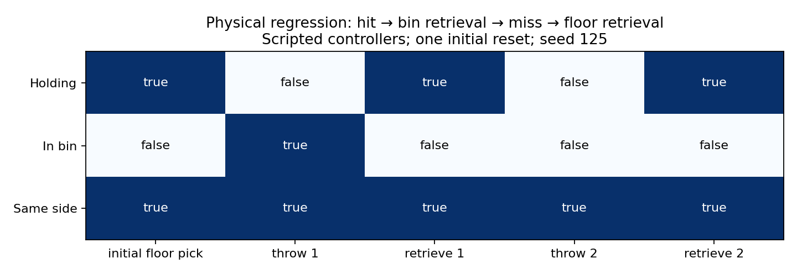

# Same-side Tossing3D: physical recovery

## Question / goal

Can the robot recover the cube after both a hit and a miss, without resetting it?

## Background

This is step 2 of the autonomous-practice stack, built on the named same-side scene.
The stock floor grasp did not retrieve the cube from inside the bin. Controller
termination alone is insufficient: the measured `Holding` predicate must become true.

## Hypothesis

An open-bin collision model, a rim-clearing lift and accurate base placement enable
retrieval. Separate floor/bin operators let EES plan the required recovery from observation.

## Guidance given

Use TDD, preserve the stock barrier environment, make each step a draft PR, and provide
video or graph evidence. Do not script the eventual EES practice loop.

## Methods

The new bin-collision test first failed because `add_bin` was missing. The physical
regression first failed because action 3 could not retrieve the cube. The symbolic test
first failed because `PickCubeFromBin` was absent. These now pass.

The dependency adds a five-box open bin, tries four grasp-symmetric approaches, lifts
above the rim before retracting, and uses 3 mm base tolerance for bin pickup only.
A 1 mm allowed collision penetration accounts for MuJoCo's measured 0.42 mm cube/bottom
support contact. It does not remove the bin from collision checking.

Same-side operators distinguish `OnFloor` from `InBin`, preserve `Reachable` after a
successful throw, delete `InBin` when picking from the bin, and allow `OpenGripper` only
when the hand is closed and not holding the cube. Four real Fast Downward tests cover
floor/bin recovery with open/closed-empty hands. The stock operator set is unchanged.

Reproduce the **scripted controller regression**, not an EES rollout:

```bash
scripts/with_env.sh python scripts/tossing3d_retrieval_demo.py --output-dir artifacts/retrieval
scripts/with_env.sh python analysis/tossing3d_retrieval.py --input artifacts/retrieval/results.json --output artifacts/retrieval/results.png
```

The recording has one initial reset, seed 125. It executes a floor pick, a throw at
`[1.35, 0, 130, 792]`, bin recovery, a throw at `[1.35, 0, 115, 700]`, then recovery from
the observed landing location. It checks actual `Holding` after every pickup and fails
if the cube was not grasped. Frame capture is at simulator control-step cadence.

## Results



[Continuous physical video](2026-08-27-tossing3d-retrieval.mp4) ·
[Measured outcomes and actions](2026-08-27-tossing3d-retrieval.json)

Both retrievals succeeded: the first throw hit the bin; the second landed on the floor
at x=-0.363, y=-0.704. The cube stayed on the robot's side throughout. No human action,
teleport, or reset occurred between attempts. The bin retrieval used 350 control steps.

This is one reproducible physical trajectory, not a claim of universal grasp robustness
or learned improvement. EES selection and continuous autonomous practice are step 3.

## Recommendation

Keep draft until the dependent controller PR and EES integration are reviewed. Validate
additional landing poses before treating the grasp as reliable across the full sampler
range; missed grasps must be observed as failures, never counted as success on termination.
