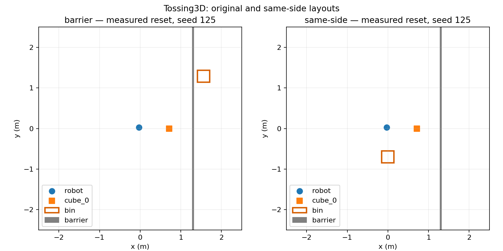
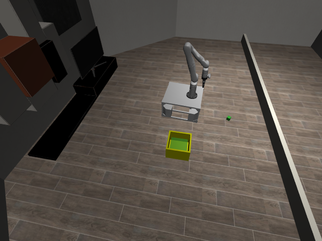

# Tossing3D: explicit same-side layout

## Question / goal

Can the bin spawn on the robot's side without changing the original barrier benchmark?
This is step 1 of the autonomous EES retrieval stack, not a demonstration of recovery yet.

## Background

The shipped scene places the bin beyond a barrier. The existing symbolic model makes
throwing irreversible. Autonomous repeated practice needs a distinct scene and, in the
next step, retrieval controllers and accurate operator models.

## Hypothesis

None — implementation task, not an experiment.

## Guidance given

Preserve the original benchmark, start with failing tests, and provide visual evidence
for each step. Eventually all pick/throw/retrieve decisions must come from EES.

## Methods

Added `--layout same-side` while retaining `barrier` as the default. The packaged scene
changes the bin's initial region and the camera; cube/robot sampling, bin dimensions,
barrier, dynamics, and bin-relative goal are unchanged. Run configuration and state-log
headers preserve the selection; legacy logs default to `barrier`.

The new layout tests initially failed at collection on the missing layout module.
The initial offline layout tests and existing CLI/backend tests then passed (35/35).
The live geometry test independently checks both scene variants.

Reproduce the measurements and figure from the repository root:

``` bash
scripts/with_env.sh python -m scripts.tossing3d_layout_demo --output-dir results/layout-demo --seed 125
scripts/with_env.sh python -m analysis.tossing3d_layout --poses results/layout-demo/poses.json --output results/layout-demo/layout.png
```

## Results

Both layouts were reset and rendered with seed 125. The original bin's measured x is
1.5626 m; the same-side bin's x is 0.0001 m. The barrier's x is 1.3003 m in both.
The same-side bin's entire 0.30 m footprint is on the robot's side, and its throwing
standoff fits within the base planner's x bounds. These are geometry checks, not a
claim about throwing or retrieval reliability.





[Measured poses](2026-08-27-tossing3d-same-side-layout.json).

## Recommendation

Use this explicit layout for the retrieval implementation. Do not interpret it as an
EES recovery demonstration yet: the original skill model is unchanged in this step.
Misses can still leave the reachable workspace; placement alone does not guarantee
recovery. The camera was moved inside the lab after an initial viewpoint rendered a wall.
