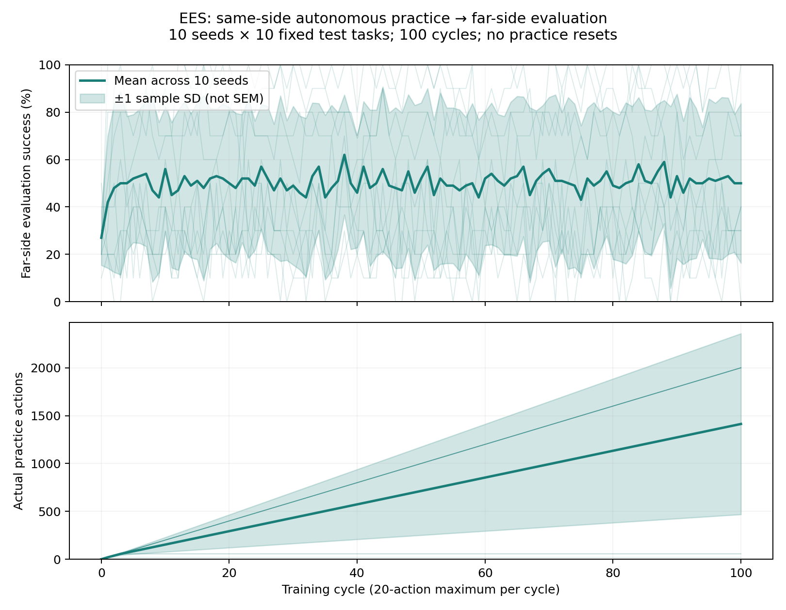

# Standard EES transfer benchmark — protocol registered before the full run

## Question / goal

Does autonomous practice with a recoverable same-side bin improve success on the
original far-side Tossing3D tasks? Report mean and standard deviation across run seeds,
and retain videos of every practice session.

## Background

The prior 16-action video used one same-side evaluation task and 200 sampler iterations.
It established a physical sequence, not benchmark performance or learning improvement.
The established later Tossing3D protocol uses 100 cycles × 20 actions, ten seeds and ten
test tasks, as documented in the 100-cycle plateau and reset-free remeasurement logs.

## Hypothesis

Repeated autonomous recovery supplies throw outcomes for the learned sampler. Whether
that learning transfers to the far-side scene is an empirical question; practice may
also stall after an unrecoverable landing. Neither failure is removed from the results.

## Guidance given

Use the same standard settings as previous experiments, ten far-side test tasks,
mean/std learning curves, practice videos, and draft PRs. Preserve TDD and reset-free
practice rather than silently restoring the cube between attempts.

## Methods

- Run seeds: 0–9, no replacement or best-seed selection.
- Practice: same-side scene, canonical scene seed 125, continuous state across cycles.
- Evaluation: stock barrier scene; ten tasks sampled once per run and reused at every
  checkpoint. The test seed stream is derived from each run seed, as in prior experiments.
- Budget: 100 cycles, maximum 20 actions per cycle, baseline plus 100 evaluation sweeps.
- Learning: normal EES defaults, including 10,000 sampler training iterations; no demo
  goal-pursuit cap, no human reset skill, no periodic or interval resets.
- Record every practice period with the standard period recorder. Evaluation uses a
  separate simulator and separate replay log, never resetting the practice environment.
- Primary plot: success fraction per run seed, mean ± one **sample standard deviation**
  (`ddof=1`) across the ten seeds, not SEM or a confidence interval.
- Align by cycle. Plot actual cumulative practice actions separately, because stalled
  runs need not share an action-count grid. Show individual seed trajectories too.
- Require all ten seeds and 101 checkpoints, each with denominator ten. Do not silently
  omit incomplete runs or substitute the two-cycle preflight for the full budget.

Reproduce:

```bash
scripts/with_env.sh python -m scripts.tossing3d_transfer_benchmark --results-root artifacts/tossing3d-transfer-standard --max-workers 10
scripts/with_env.sh python -m analysis.practice_makes_perfect.tossing3d_transfer_curve --results-root artifacts/tossing3d-transfer-standard --output-dir artifacts/tossing3d-transfer-standard/plots
```

Each seed writes `ees/<seed>/stats.json`, `config_snapshot.json`, sampler/competence
logs and `period_videos/practice/cycle_0000.mp4` through `cycle_0099.mp4`. Existing seed
output directories are refused, preventing accidental overwrites. The sweep runner
limits each child to one math thread. Concurrency changes wall time, not the protocol.

TDD: the recipe and aggregation tests first failed on missing modules. Tests now pin
the standard budget and far-side layout, verify sample SD against a known matrix,
reject unequal checkpoint grids/wrong task counts, and require all seed directories
and matching experiment configurations.

## Results

Completed: all ten seeds produced 101 checkpoints (baseline plus 100 cycles), with
ten fixed far-side test tasks per seed. This is the run at source commit
`e855da4fd043754b72f924793241f1a5251f6177`, **before the rim recovery fix**.
Later stack maintenance and the optional-reset correction do not change the source
commit recorded in these original results. Human resets were disabled throughout.
The original source revision is retained on `codex/tossing3d-transfer-recorded-run`
so restacking the draft PRs does not remove its branch reference. This archive is
not an additional PR or a new experiment.



Baseline success was **27.0% ± 11.6 percentage points** (sample SD); final success was
**50.0% ± 33.7 percentage points**. These are descriptive results, not a statistically
supported improvement or a comparison against a control arm. The wide spread and
early practice stalls matter; continued evaluation does not imply continued practice.

| Seed | Final successes / 10 tasks | Actual practice actions |
| --- | --- | --- |
| 0 | 3 | 2000 |
| 1 | 7 | 55 |
| 2 | 10 | 57 |
| 3 | 3 | 19 |
| 4 | 2 | 2000 |
| 5 | 4 | 2000 |
| 6 | 4 | 2000 |
| 7 | 10 | 2000 |
| 8 | 7 | 2000 |
| 9 | 0 | 2000 |

Seeds 1, 2 and 3 stopped accumulating actions early; their later evaluation checkpoints
are retained. Seed 3 supplies the saved upright-rim regression in the later PR.
The other two stalled states are not established as the same upright-rim case.
Reaching 2000 actions also does not prove successful repeated retrieval: failed
controller attempts count as actions. All seeds recorded zero practice resets and
zero human interventions.

### Reviewable artifacts

[Evidence directory](2026-08-27-tossing3d-transfer/) contains the original
`ees/0` through `ees/9` stats, configuration snapshots and timing files,
[curve data](2026-08-27-tossing3d-transfer/plots/learning-curve.csv),
[summary](2026-08-27-tossing3d-transfer/plots/summary.json), PNG/SVG/PDF figures,
and a [SHA-256 manifest](2026-08-27-tossing3d-transfer/manifest.json).
The configurations preserve the exact source/dependency commits and settings.

Five untrimmed practice periods are included, selected for coverage rather than
success. These are practice footage, not evaluation episodes:

- [Seed 0, first period](2026-08-27-tossing3d-transfer/videos/seed-0-cycle-0000.mp4).
- [Seed 0, final period](2026-08-27-tossing3d-transfer/videos/seed-0-cycle-0099.mp4).
- [Seed 1, last period with new actions](2026-08-27-tossing3d-transfer/videos/seed-1-cycle-0002.mp4).
- [Seed 2, last period with new actions](2026-08-27-tossing3d-transfer/videos/seed-2-cycle-0002.mp4).
- [Seed 3, period ending at the rim](2026-08-27-tossing3d-transfer/videos/seed-3-cycle-0000.mp4).

All 100 practice-video filenames per seed were present in the original local run.
The remaining 995 videos and large raw state logs are not committed; the manifest
records that distinction. The five included videos were fully decoded to check for
corruption. The figures can be regenerated from the committed data without simulation:

```bash
scripts/with_env.sh python -m analysis.practice_makes_perfect.tossing3d_transfer_curve --results-root docs/experiment-logs/2026-08-27-tossing3d-transfer --output-dir /tmp/tossing3d-transfer-plots
```

## Recommendation

Keep this as evidence for the pre-rim-fix implementation. Do not claim that the
later rim fix prevents all stalls or improves these numbers: that needs a new full
benchmark. The saved-state rim pickup regression and overturned-bin limitations
are separate from this completed run. All PRs remain drafts for review.
