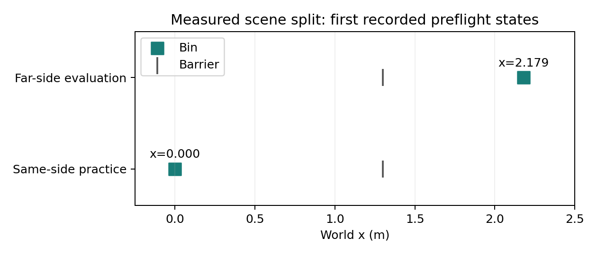

# Same-side practice, far-side evaluation

## Question / goal

Keep autonomous practice recoverable, but measure task success on the original
far-side Tossing3D benchmark with ten fixed test tasks per run.

## Background

The video demo used one same-side evaluation task. It did not measure benchmark
transfer or establish learning improvement. The two environments previously inherited
one layout setting, so simply increasing the task count would still test the wrong scene.

## Hypothesis

An explicit evaluation-layout override can change geometry without changing the fixed
seed stream, learned sampler, practice state, or evaluation scheduling.

## Guidance given

Use the established experiment settings, report mean/std curves, record practice
sessions, and keep every PR draft. Use TDD for the new wiring.

## Methods

New tests first failed on the missing evaluation-layout flag and builder. The implementation
adds `--evaluation-layout barrier` alongside `--layout same-side`, copying the namespace
rather than mutating practice configuration. Omission preserves existing behavior.

Different layouts receive separate state-log headers/files; otherwise replay would put
far-side ticks into same-side geometry. A composition-root regression checks both the
actual runner arguments and the two log headers. Task seed streams remain identical to
the previous benchmark and the loop samples its ten test tasks once per run.

## Results

[Measured geometry](2026-08-27-tossing3d-transfer-geometry.json) comes from the first recorded
physics state of each environment in a two-cycle preflight. The practice bin is near x=0;
the evaluation bin is beyond the x=1.3 barrier. The initial sweep solved 2/10 far-side tasks.
This is a wiring check, not the requested learning curve.

Seventeen offline layout/CLI tests pass. The full domain suite and the preflight are
being checked separately before the benchmark launch.

## Recommendation

Use this split for the full standard experiment: seeds 0–9, 100 cycles, 20 actions per
cycle, ten fixed evaluation tasks per seed, normal EES sampler settings. Preserve
continuous practice with no human or scheduled resets. Report results only after all
seeds complete, without replacing missing runs or shortening the budget.
