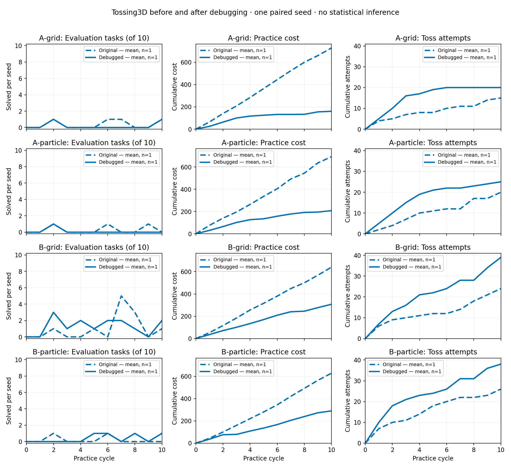
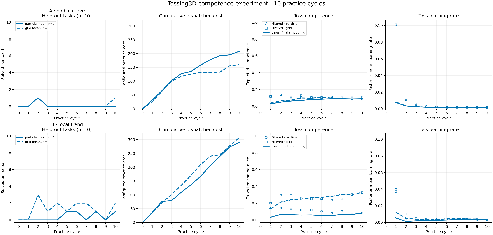

# Tossing3D: debugged competence model × inference rerun

All four arms completed ten practice cycles and eleven evaluation sweeps after
correcting the practice planner. The comparison preserves the original
[ten-cycle pilot](2026-09-20-tossing3d-competence-2x2.md) and its published numbers.
This is one paired seed per arm; no statistical inference about either the
inference methods or the debugging changes is supported.

| Model | Inference | Final evaluation | Successful practice tosses | Actions | Resets | Cost |
| --- | --- | ---: | ---: | ---: | ---: | ---: |
| A: global curve | Particles | 0/10 | 0/25 | 100 | 27 | 208 |
| A: global curve | Fixed grid | 1/10 | 0/20 | 76 | 21 | 160 |
| B: local trend | Particles | 1/10 | 0/38 | 142 | 37 | 290 |
| B: local trend | Fixed grid | 2/10 | 3/39 | 147 | 40 | 307 |



[Before/after PDF](2026-09-20-tossing3d-competence-2x2-before-after.pdf),
[before/after data](2026-09-20-tossing3d-competence-2x2-before-after.json),
[rerun CSV](2026-09-20-tossing3d-competence-2x2-debugged.csv),
[rerun detailed summary](2026-09-20-tossing3d-competence-2x2-debugged.json),
[independent verification](2026-09-20-tossing3d-competence-2x2-debugged-review.json).

## What changed

The original pilot spent 107–132 of its 200 actions per arm on resets. Its
search could plan past the real practice budget, its sampled deployment values
were noisy relative to the cost penalty, and its symbolic reset could incorrectly
retain `Holding` after physically relocating the cube. Failed throws were also
forecast as leaving the state unchanged even when the cube had been released.

The rerun applies these corrections:

- Search receives the actual number of remaining actions, including paid resets.
  Its selected paths and cached values respect that remaining budget.
- Deployment success is integrated analytically over the represented competence
  beliefs using mixed moments. This removes Monte Carlo noise from that value;
  particle approximation and hypothetical learning approximation remain.
- Reset removes `Holding`. It preserves the incoming gripper command, representing
  a previously holding gripper as `ClosedEmpty`. Conditional effects are used by
  both the practice and task planners.
- Real failed executions train an empirical distribution over their resulting
  symbolic states, conditional on skill, starting state and exploration mode.
  Search uses a frozen copy of the observed distribution. Branching over these
  effects does not duplicate success/failure evidence, cost or training examples.
- Reset completion is known to succeed or raise an execution error. Hypothetical
  resets therefore change state and cost without inventing competence information
  or training improvement. Resets that leave the modeled state unchanged are
  omitted. Actual completed resets retain their original accounting and records.

The last rule is justified inside the current symbolic model with nonnegative
costs. A reset can change physical geometry without changing symbolic predicates;
that potential benefit remains outside this abstraction. For unseen failed-action
contexts the model still defaults to unchanged state, an optimistic approximation.

Independent saved-state ablations illustrate why the complete correction matters.
Across three ready-to-pick states and three fixed seeds, the horizon/value/reset
semantics fixes alone still selected six resets in nine solves. With the known
reset contract and self-loop pruning, all nine selected Pick; six solves from two
holding states selected Toss. These are counterfactual solves at fixed seeds,
not historical random-state replays or evidence of physical task success.

## Protocol and original requirements

The matrix remains Model A's global phi curve versus Model B's local trend,
crossed with 1,024-particle inference versus fixed-grid inference. Particle ancestry
smoothing and grid backward smoothing remain retrospective and never feed online
choices. Learning-rate hypotheses update implicitly from success/failure evidence;
there is no direct learning-rate observation. The
[protocol and equations](../tossing3d-competence-2x2.md) specify both models,
observation likelihoods, discretization and unchanged cost objective.

All runs use seed 0, the barrier scene, ten evaluation tasks per checkpoint,
no free practice resets and a maximum of twenty actions per cycle. Ordinary
skills cost 1; both reset mechanisms cost 5; linear lambda remains 0.0003.
The cost equation, parameter bounds, proposal sampler, seeds and solver settings
are unchanged. The only added command flag records evaluation episode traces.

Twenty actions is a cap: STOP remains available. The rerun does not force the
planner to spend unused actions. Zero-action cycles still receive their scheduled
refit and evaluation. Fewer dispatched actions therefore explain part of the cost
difference; costs were not reduced by changing prices or omitting charges.

## Results and remaining low success

Resets account for 125/465 dispatched actions in the rerun, versus 472/800 in
the original pilot. Total recorded practice cost is 965 versus 2,688. There are
122 toss attempts versus 85, despite fewer total actions. No consecutive resets
or action-budget violations were observed in any rerun arm.

Task success remains low. Final evaluations are 0/10, 1/10, 1/10 and 2/10 in the
order shown above. Only B/grid obtains successful practice toss labels: 3/39.
Its evaluation peaks at 3/10 after cycle 2 and ends at 2/10; the other three arms
never exceed 1/10. These raw trajectories do not establish a general performance
improvement. In particular, the original B/grid pilot transiently reached 5/10.

A/particles, A/grid and B/grid choose STOP before the cap in all ten cycles;
B/particles does so in eight cycles and uses the cap in two. Respectively they
leave 100, 124, 53 and 58 of the possible 200 action slots unused. STOP means that
none of the bounded solver's explored paths beats stopping under the current
objective and surprise penalty. It does not prove that more physical exploration
would be unhelpful.

The full-run traces classify all 122 practice tosses: 62/122 fail before any
controller tick, 56/122 execute and land short, 1/122 is another miss, and 3/122
succeed. Every one of the 56 short throws remains short of the scoring x window
throughout its recorded trajectory. Of the 62 pre-motion failures, 37 requested a
base center beyond the barrier. The other 25 targets put the robot footprint into
the barrier: their centers are at x=1.003–1.259 m, whereas near-side clearance
requires approximately x<=0.993–0.995 m, depending on yaw. The barrier spans beyond
the base planner's lateral search bounds. Thus all 62 targets violate a pinned
planning geometry constraint. This is an analytic geometry check; the traces lack
controller error strings identifying the exact rejection stage. Pick and Open
have no observed failures in these four runs.

The one-cycle smoke diagnosis found six pre-motion failures in 24 practice tosses
and eighteen executed throws, all landing short. The pinned controller combines
speed with release timing; some sampled throws sent the cube upward or backward.
Its unit conversion and release scheduling matched the declared parameter units.
Existing calibrated witness tests establish that the scene is physically solvable,
but do not establish that uniform exploration will readily find successful throws.

With only failure labels, the current learned sampler returns equal scores and
falls back to uniform proposals. A first successful example is therefore a material
bottleneck. Geometry filtering, a different cold-start proposal policy, calibrated
bootstrap examples and changing costs were not introduced in this rerun.



[PDF of all four debugged arms](2026-09-20-tossing3d-competence-2x2-debugged.pdf).
The posterior and smoothed curves describe the assumed competence models; they
are not substitutes for the measured task-success counts. The matrix does not
establish a winning inference method, a calibrated competence model or a complete
solution to low physical success.

## Validation and reproduction

A separate reviewer who did not implement these changes independently checked
2,525 skill-posterior checkpoints, 503 exact deployment values and action-budget
decisions, 119 learned failure-effect updates and 125 nonidentity reset selections.
Every outcome, training transition and smoothing history replayed exactly. Each
arm has ten refits, ten smoothing events, eleven evaluations and zero free practice
resets. All four processes exited successfully without retries.

The reviewer also rechecked all six original experiment requirements. Across
4,752 phi cases the exponential curve, Beta-mode mapping and derivative of its
conditional mean agreed, with maximum finite-difference error 1.28e-11. The A and
B grids contain 29,700 and 400 normalized states respectively. All four inference
arms reject direct learning-rate observations and update latent learning-rate
hypotheses through success/failure evidence after training.

Local validation passed: 263 Tossing3D tests with one existing non-strict XPASS,
the final 90-test reset/model/method/failure-effect gate, 1,531 core/method/planning/
script tests with four expected skips, and 374 historical-analysis tests. Ruff,
formatting, mypy, import contracts and documentation links passed. Independent
numerical checks covered 1,625 exact rational recurrence cases and 624 production
integration cases; the latter's maximum absolute error was 3.33e-16.

The measured runtime passed every applicable GitHub CI job; the historical-analysis
job is main-only, and that suite passed locally.

Measured runtime: `412b270d90f4a17646b50d0f2cb976668e2ea911`.
KINDER: `8f600231da8ee898da1055144665a8c5f6c246f0`.
kinder-baselines: `5eb24d9232bcfa6b90103f5b6f47e13dd2354159`.
The source and isolated dependency snapshots were frozen throughout measurement;
all four end-of-run snapshots record the measured revision and a clean checkout.
The environment remained Python 3.10.20, NumPy 1.26.4, SciPy 1.14.0 and MuJoCo 3.3.7.
Two workers shared a 12 GB memory cap; monitoring recorded progress, actions,
reset sequences, path-budget violations and resource use every thirty seconds.

Run the existing matrix launcher and summary from an isolated configured checkout:

```bash
scripts/with_env.sh python -m scripts.tossing3d_competence_2x2 \
  --results-root /absolute/path/to/new/results
scripts/with_env.sh python scripts/summarize_tossing3d_competence_2x2.py \
  --results-root /absolute/path/to/new/results
scripts/with_env.sh python analysis/practice_makes_perfect/tossing3d_competence_debug_comparison.py \
  --original /absolute/path/to/original/summary.json \
  --debugged /absolute/path/to/new/results/summary.json \
  --output-dir /absolute/path/to/new/results
```

Use the repository's memory-limited service convention for long runs. Full new
logs, trajectory traces, checksums, source/dependency snapshots and independent
review evidence are retained locally under
`artifacts/tossing3d-competence-2x2-debugged-20260920/`. The original artifact root
is unchanged.


## Follow-up qualification (2026-09-21)

The [subsequent production integration and algorithm audit](2026-09-21-tossing3d-production.md)
identifies additional reset-region, proposal-feasibility, sampler-lifecycle, and
stochastic-planning limitations, and reports a separate four-arm rerun. These
findings qualify interpretation of this earlier pilot; its measurements above
remain unchanged.
