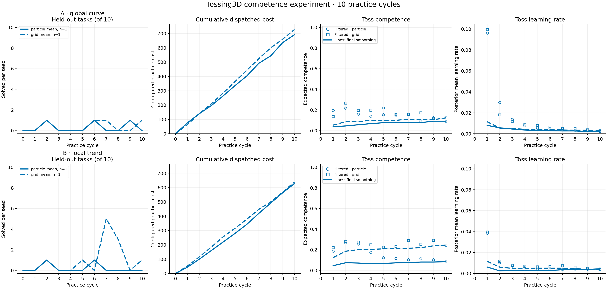

# Tossing3D: competence model × inference, ten-cycle pilot

All four arms completed 10 practice cycles and 11 evaluation sweeps. Each used
200 actions, with no free practice resets. This is one paired seed per arm;
the raw results support no statistical inference about which combination is better.

| Competence model | Inference | Final evaluation | Successful practice tosses | Total practice cost |
| --- | --- | ---: | ---: | ---: |
| A: global curve | Particles | 0/10 | 0/20 | 692 |
| A: global curve | Fixed grid | 1/10 | 0/15 | 728 |
| B: local trend | Particles | 0/10 | 0/26 | 628 |
| B: local trend | Fixed grid | 1/10 | 2/24 | 640 |



[PDF figure](2026-09-20-tossing3d-competence-2x2.pdf),
[CSV summary](2026-09-20-tossing3d-competence-2x2.csv),
[detailed JSON summary](2026-09-20-tossing3d-competence-2x2.json),
[independent verification](2026-09-20-tossing3d-competence-2x2-review.json).

## Question and implementation

The experiment crosses the global phi learning curve (Model A) and local
competence/learning-rate dynamics (Model B) with particle filtering and a fixed
grid. The previous runtime constructed a learning-rate observation from changes
in posterior competence means. The new implementation uses success/failure
evidence to update joint learning hypotheses implicitly.

The [protocol and equations](../tossing3d-competence-2x2.md) specify the shared
particle/grid prior within each model, CDF-integrated grid probability masses,
process transitions, and cost model. Model A's Beta parameterization uses the
phi curve as its mode; reported learning rate differentiates its conditional
mean. Model B's eta remains latent. The two models have different prior
assumptions, so their comparison is not a prior-matched structural ablation.

Recorded cycle-end posteriors support particle ancestry smoothing and grid
backward smoothing. The figure's points show causal filtered estimates before
each training transition; lines use all ten recorded cycles retrospectively.
Smoothed histories never feed online planning or evaluation.

## Fixed protocol

All arms used seed 0, barrier practice/evaluation layouts, canonical seed 125,
10 evaluation tasks per sweep, no free practice resets, and 20 actions per
cycle. Ordinary robot skills cost 1; both reset mechanisms retain configured
cost 5. The existing linear objective uses lambda 0.0003. The determinized A*
solver retained 100 search iterations, 100 value samples, and observation
probability weight 0.001. No planner or cost setting was tuned after seeing
the results.

Particles used a population of 1,024. The grid used 25 competence bins and,
for Model B, 16 learning-rate bins. Model B's process standard deviations were
0.03 for competence and 0.005 for eta, with per-example decay 0.9 and eta cap
0.15. Model A's 1,188 shared phi configurations yield 29,700 grid states.

Existing long-range support was integrated after PR #353 merged: distance
1.25–2.6 m, angular speed 115–420 degrees/s, and release time 400–840 ms.
Custom scene construction and furniture-safe resets were made compatible with
the pinned simulator API. Calibrated far-scene throw tests succeeded at three
seeds, verifying that the widened domain can solve the physical task.

## Results and interpretation

Initial evaluation was 0/10 in every arm. Model B/grid reached 5/10 after cycle
7 and 3/10 after cycle 8, then 0/10 after cycle 9 and 1/10 after cycle 10. The
full curve therefore matters: its transient success did not establish sustained
high competence. It recorded 2/22 successful policy-scored tosses and 0/2
successful epsilon-random tosses. The other three arms recorded no successful
practice tosses.

Ten-cycle costs include all attempted actions under the existing charging
contract. The named reset counts were 123/200 actions for A/particles,
132/200 for A/grid, 107/200 for B/particles, and 110/200 for B/grid. The legacy
intervention counter includes both human and non-human resets; the JSON summary
also separates their counts and costs.

The particle approximations retained support throughout the measured runs.
A/particles retained 97 distinct toss phi configurations and 127 early toss
ancestors; its earliest smoothed toss ESS was 35.0. B/particles retained 290
early toss ancestors, with earliest smoothed toss ESS 45.8. Across all skills,
the minimum remaining early ancestor counts were 122 and 290 respectively.
These diagnostics quantify approximation limits rather than certify equality
with the grid.

## Debugging findings and limitations

Motion-plan failures are represented among negative toss examples. In the four
one-cycle smoke runs, 11/15 toss attempts executed physics and 4/15 failed before
simulation ticks. Replaying those exact states and parameters reproduced base
motion-planning failures near or beyond the barrier. All attempts had sampler
records; the existing `uninformative` sampler category explained why the older
random/informed counters alone did not cover every attempt.

The preserved planner also has material limitations. In A/particles, 75/123
reset choices immediately followed another reset; 65/123 occurred when Pick was
already applicable. For 121/123 reset decisions, the maximum explored depth
exceeded the real 20-action cycle limit (median 53, maximum 70). These are
explored depths, not the unrecorded selected-path lengths. A saved-belief
calculation estimated a 100-sample objective standard error of 0.0168, compared
with the 0.0015 objective penalty for an extra reset. Deep sampled paths and
noisy value estimates can therefore make reset-first plans appear attractive;
the logs do not establish a unique cause for each choice.

An existing symbolic reset model preserves `Holding`, although physical reset
relocates the cube away from the gripper. All 24/24 measured A/particle resets
chosen while holding were followed by `ClosedEmpty`. These planning mechanisms
were held fixed across arms. The pilot does not establish that its allocation
or low task success is caused solely by the competence model or inference engine.

## Validation and reproduction

A separate reviewer checked all four arms: 4,200 skill-posterior checkpoints
were finite, nonnegative, and normalized. Every observed posterior update,
cycle transition, and emitted smoothing history replayed exactly. All arms
had ten refits, ten smoothing events, eleven evaluation sweeps and correct
action/cost accounting. No zero-support failure occurred.

Validation included 29 numerical tests, 18 lifecycle integration tests, four
cache-memory regressions, 240 Tossing3D tests, the full 322-test method suite,
the 374-test historical analysis suite, and the core/script gate. Two stale
CLI/dependency assertions were updated and
their 37-test files passed. Ruff, mypy, import contracts and the measured
runtime's complete GitHub CI passed. Separate numerical stress tests exposed
approximation error under abrupt reversals and zero-support failures at tiny
particle populations; the configured 1,024-particle measured runs remained valid.

Measured runtime source was `68dd6a9797fc651922991f4aa3b888d8f7249d1c`.
KINDER was frozen at `8f600231da8ee898da1055144665a8c5f6c246f0` and
kinder-baselines at `5eb24d9232bcfa6b90103f5b6f47e13dd2354159`. Imports were
verified against isolated snapshots, with only ignored mesh assets shared.
The runs used Python 3.10.20, NumPy 1.26.4, SciPy 1.14.0 and MuJoCo 3.3.7.
Two workers ran under a shared 12 GB memory limit, with progress/resource
snapshots every 30 seconds near the end.

The manifest records the launch revision and commands. End-of-run configuration
snapshots can name later documentation/analysis commits; the reviewer verified
that simulator and inference source remained identical throughout. The later
launcher refactor reuses the repository's shared `SweepRunner` and adds its
standard timing/retry bookkeeping. All four simulation commands remain exactly
equal to the measured manifest. The measured runs retain their original process
timestamps and monotonic progress records; no timing samples were fabricated.

From a configured, isolated checkout, run the
[matrix launcher](../../scripts/tossing3d_competence_2x2.py), then the
[streaming summary](../../scripts/summarize_tossing3d_competence_2x2.py):

```bash
scripts/with_env.sh python -m scripts.tossing3d_competence_2x2 \
  --results-root /absolute/path/to/new/results
scripts/with_env.sh python scripts/summarize_tossing3d_competence_2x2.py \
  --results-root /absolute/path/to/new/results
```

Use the repository's memory-limited service convention for long workstation runs.
The original full logs, manifest, dependency provenance, monitoring snapshots and
planner diagnosis are retained locally under
`artifacts/tossing3d-competence-2x2-20260920/`.
