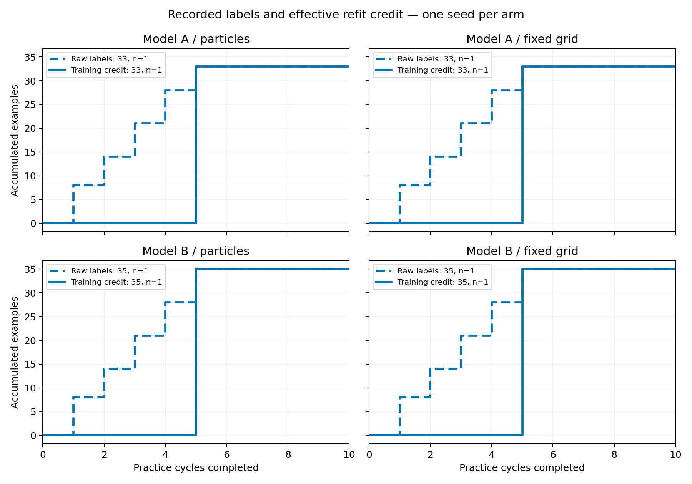

# Independent integration audit

All four experiments completed 10/10 practice cycles from clean runtime commit
`371361b9ed72c33f441bae714e6ba2d7e62e892b`. The runtime artifacts pass the checks below.
The B-arm end-of-run snapshots set `git_dirty=true` because a dispatch-isolation
unit test was corrected while the runs were active. Independent checks match all
152/152 source/script hashes and
177/177 dependency hashes
against `experiments/runtime_provenance.json`; no runtime source changed.
The A-arm snapshots remained clean.

This audit checks execution and accounting; one seed per arm does not establish an
effect or a reliable comparison between inference engines.

| Arm | Cycles | Practice toss successes | Effective refit examples | First mixed fit (1-based cycle) | Practice cost | Selected gate violations | Zero-tick tosses | Reset postconditions |
| --- | ---: | ---: | ---: | ---: | ---: | ---: | ---: | ---: |
| Model A / particles | 10/10 | 1/33 | 33 | 5 | 180 | 0/152 | 2/152 | 23/23 |
| Model A / fixed grid | 10/10 | 1/33 | 33 | 5 | 180 | 0/152 | 2/152 | 23/23 |
| Model B / particles | 10/10 | 1/35 | 35 | 5 | 194 | 0/153 | 2/153 | 25/25 |
| Model B / fixed grid | 10/10 | 1/35 | 35 | 5 | 194 | 0/153 | 2/153 | 25/25 |

The original proposal RNG was replayed in execution order from seed 0, using each
throw's saved float32 state. All 185272 raw proposals reproduce the recorded
rejection counts and reasons; 61000 were accepted across 610
batches. Every selected vector belongs to its accepted pool. There were
0/610 empty batches and 0/610 selected gate violations.
Practice and evaluation states were tracked independently during this replay.

All 440/440 completed evaluation episodes agree with the recorded
scoring-box geometry. Every practice label agrees with its achieved state and
with its POMDP success/failure observation. Evaluation rows do not enter the
practice training data. Exactly 100 accepted candidates were supplied per batch.

Raw and fitted positive/negative counts match the actual labels at every refit.
Single-class fits receive zero latent improvement; the first mixed fit credits
the retained examples; later fits credit only new examples. All 36/36
zero-growth sampler checks and 160/160 fixed-controller checks preserve
the latent values and weights exactly across refitting. The recorded learning-rate
evidence is success/failure only in each arm.

Each physical skill dispatch costs 1 and each explicit reset costs 5. The audit
checks cumulative session cost, action-budget accounting, final reset totals, and
each recorded post-reset decision's symbolic state. The configs retain no scheduled practice resets,
barrier layouts, 20 action slots per cycle, linear cost lambda 0.0003, and the same
expectation backup at depth 6 with surprise weight 0.001. A cycle may stop before
using all slots. The existing metric named `num_human_interventions_recorded`
includes both explicitly charged reset names, so this report calls them resets.

There remain 8/610 tosses that execute zero physics ticks.
All are real failures and are counted in labels and cost. Pure SE2 replay found
base paths for 8/8 of these saved states. Thus the original
blocked-base issue does not explain these cases; the remaining arm-planning or
controller stage is implicated. Exact exception messages were not persisted, so
the audit cannot identify a specific windup or swing failure. The geometry gate
only rules out its proved obstructions and does not promise successful execution.
No new physics or training labels were produced by this audit.

`final.json` contains per-arm checks and ordered replay summaries.
`*-candidate_replay.jsonl` contains the full accepted pools, selected parameters,
float32 prestates, phase/cycle, timestamps, and observed outcomes for the independent
learner analysis. Their hashes are in `candidate_replay_sha256.json`.
`zero_tick_diagnostics.json` preserves the remaining failure cases.
