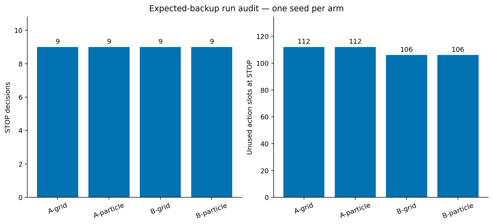

# Independent final-run planner audit

Only new practice decision logs enter the STOP reconstruction and depth comparisons. Evaluation outcomes are summarized separately as descriptive context. Each STOP is reconstructed from its recorded belief, physical atoms, empirical failure effects, sampler label support and cumulative cost. Outcome logs precede the sampler-label callback, so that callback is reproduced before evaluating the next decision.

The baseline decision is replayed before considering deeper lookahead. Depths seven and eight are attempted only when real action slots remain, with a 30-second or 20,000-node cap per solve under a 4 GB memory cap. A resource-limited result is inconclusive. Deeper decisions are counterfactual forecasts under the same model, not measured changes in physical performance.

| Arm | Completed refits | STOPs | Unused slots at STOP | Exact baseline replays | Beneficial deeper continuations | Limited deeper states |
| --- | ---: | ---: | ---: | ---: | ---: | ---: |
| global_curve-grid-seed_00 | 10 | 9 | 112 | 9 | 0/6 eligible | 0 |
| global_curve-particle-seed_00 | 10 | 9 | 112 | 9 | 0/6 eligible | 0 |
| local_trend-grid-seed_00 | 10 | 9 | 106 | 9 | 0/5 eligible | 0 |
| local_trend-particle-seed_00 | 10 | 9 | 106 | 9 | 0/5 eligible | 0 |

All four arms completed ten cycles. Complete per-decision beliefs, action values and search results are preserved in the individual JSON files. The original run outputs are read-only, and their consumed prefixes are identified by SHA-256.

## Interpreting the remaining STOPs

A STOP that survives depths seven and eight is stable within the tested extension; this does not certify optimal stopping across all twenty possible remaining slots. The model's mean learning forecast and the cost of reaching another toss can explain its choice without proving that the forecast accurately predicts the physical learner.

The following descriptive evaluation context is separate from planning. The task-value forecast and conditional toss-competence forecast are distinct quantities. Counts use only checkpoints after the final effective sampler fit, when the parameter policy is unchanged. These are repeated evaluations on the same ten scenes, not independent new scenes. The real replanning evaluator and the canonical deployment model also need not have identical recovery dynamics. Forecast/count differences alone do not establish posterior miscalibration.

| Arm | Final effective fit checkpoint | Toss competence forecast | Cost-free deployment J | Reported learning rate | Actual tosses after fit | Actual task episodes after fit |
| --- | ---: | ---: | ---: | ---: | ---: | ---: |
| global_curve-grid | 5 | 0.46421 | 0.45355 | 0.001699 | 21/61 | 21/60 |
| global_curve-particle | 5 | 0.48379 | 0.47565 | 0.001659 | 21/61 | 21/60 |
| local_trend-grid | 5 | 0.80563 | 0.79986 | 0.002170 | 11/60 | 11/60 |
| local_trend-particle | 5 | 0.77942 | 0.77135 | 0.002525 | 11/60 | 11/60 |

A/PF and A/grid produce identical evaluation counts and classifier data in these runs; they must not be pooled as independent evidence. The separate learner audit reproduces 152/152 selected parameters in each A arm, with 33/33 training labels classified correctly from one positive and 32 negatives. Nevertheless, from ten premeasured feasible proposals per scene, their classifiers select zero successful throws across ten scenes, although five scenes contain a successful candidate. This is limited evidence of ranking/generalization weakness. It is not the actual 100-candidate evaluation protocol or a direct calibration test of the competence posterior. See [A/grid learner audit](../final_learning_audit/global_curve-grid.json) and [A/particle learner audit](../final_learning_audit/global_curve-particle.json).
