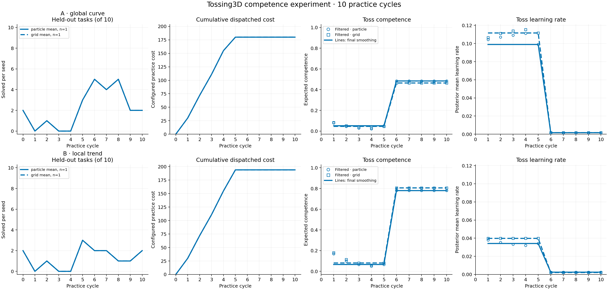
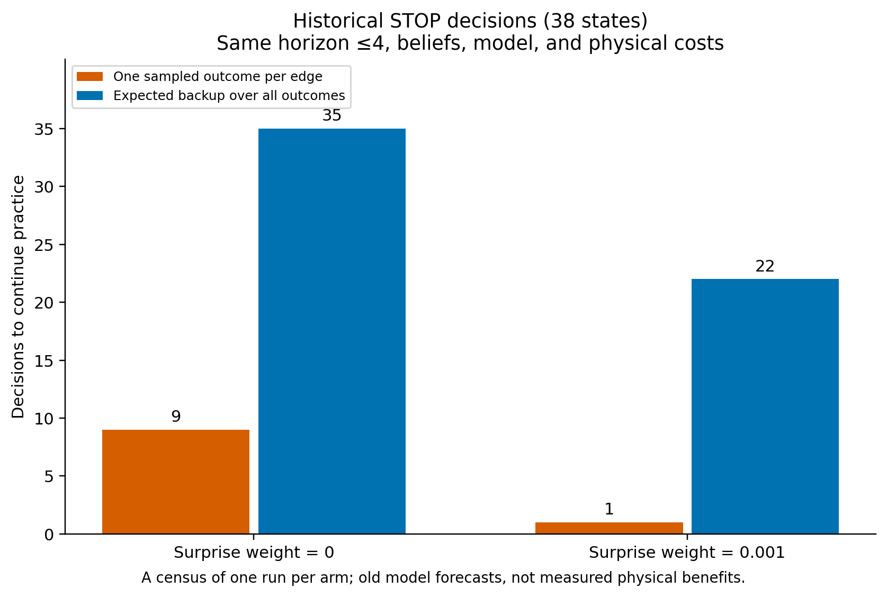
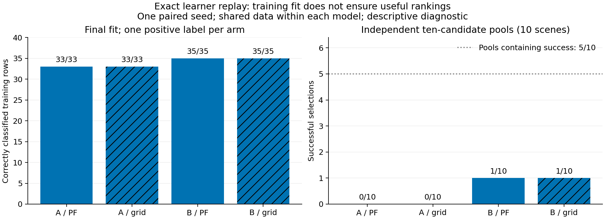

# Tossing3D: production feasibility checks and expected-outcome planning

All four arms completed ten practice cycles, with final task success **2/10 in
each arm**. The investigation establishes planner and model/runtime defects
without attributing everything to exploration. Correcting them does not yet
produce reliable throwing. The remaining evidence points to limited classifier
generalization and an unvalidated forecast of how much further training helps.

This is a new descriptive, paired-seed pilot. The
[original experiment](2026-09-20-tossing3d-competence-2x2.md) and
[earlier debugging rerun](2026-09-20-tossing3d-competence-2x2-debugged.md)
retain their original measurements. Several corrections changed together here;
this run neither isolates their physical effects nor establishes a winning arm.
No population or statistical effect claim is made.

## Protocol and implementation

The matrix is Model A's global phi learning curve versus Model B's local trend,
crossed with particle filtering versus fixed-grid inference. All arms retain
seed 0, practice seed 125, barrier scenes, ten evaluation tasks, twenty available
practice actions per cycle, no free practice resets, reset cost 5, and linear
cost coefficient 0.0003. The observation-surprise weight remains 0.001.
Success/failure is the only learning-rate evidence; ancestry/grid smoothing is
retrospective. The phi and local-trend equations, cost inference, and model
priors are unchanged from the earlier matrix.

The partial-reset adapter preserves the declared cube/bin center-region support,
subject to physical collision checks. This fixes the mismatch between those
regions and an upstream sampler that erodes regions by the object's footprint.
It does not assert that partial and full resets have identical conditional
distributions or random-number consumption.

A conservative, pure geometry check rejects provably blocked throw proposals
before selection. It uses the actual supplied policy state in practice and
evaluation. The original raw parameter distribution and bounds, speed/release
parameterization, epsilon 0.5, and 100 accepted candidates per selection remain
unchanged. Rejection is bounded; an empty pool creates no physical action,
charge, or learning observation. The experimental swing-progress proposal and
successful oracle witness parameters are not used.

The model now tracks the real sampler's label support and most recent refit.
An unfitted or one-class classifier samples uniformly without taking the
epsilon branch; the hypothetical model now matches that behavior. One-class
refits cannot change this policy and receive no competence-growth credit.
Their labels remain available: the first mixed-class fit uses the retained
dataset. Pick, gripper, and reset controllers receive no fictitious training
credit, while their actual success/failure and cost observations remain intact.

The measured solver uses probability-weighted expected outcomes through six
practice actions, capped by the actual remaining slots. It evaluates deployment
value exactly over the represented posterior and charges physical costs and
the expected observation-surprise penalty once. This is bounded lookahead,
not a full-horizon optimal policy. Hypothetical particle observations retain
likelihood weights rather than injecting resampling noise into action values;
online particle filtering still resamples at its ESS threshold and retains
ancestry for smoothing. The determinized solver remains available, with a
separate repair that propagates cheaper paths through already-expanded states
without redrawing their sampled outcomes.

## Completed matrix

| Model | Inference | Cycles | Final tasks | Practice toss successes | Actions | Resets | Cost |
| --- | --- | ---: | ---: | ---: | ---: | ---: | ---: |
| A: global curve | Particles | 10/10 | 2/10 | 1/33 | 88/200 | 23 | 180 |
| A: global curve | Fixed grid | 10/10 | 2/10 | 1/33 | 88/200 | 23 | 180 |
| B: local trend | Particles | 10/10 | 2/10 | 1/35 | 94/200 | 25 | 194 |
| B: local trend | Fixed grid | 10/10 | 2/10 | 1/35 | 94/200 | 25 | 194 |

All runs returned successfully on their first launch, with eleven evaluation
checkpoints, ten refits, ten smoothing records, and zero free practice resets.
The particle/grid arms within each model generated identical actual candidate
choices and outcomes, despite different posterior approximations. They must not
be counted as independent physical replications.

Machine-readable results are in the
[summary CSV](2026-09-21-tossing3d-production.csv) and
[archived compact run artifacts](2026-09-21-tossing3d-production-runs/summary.json).
The full transition, proposal, decision, and replay logs remain in the local
artifact tree `artifacts/tossing3d-production-20260921/`.

## What was wrong with the algorithm

The original search selected an attractive single imagined outcome instead of
integrating success and failure before choosing an action. A fully specified
one-action example has STOP value 0.10 and expected practice value 0.17, yet
the sampled planner chooses STOP for 94/100 fixed RNG seeds. More queue
iterations do not expose an outcome that was never sampled. This counterexample
requires no classifier, simulator, or exploration data.

A real corrected-model smoke test also reproduced the problem. With no toss
labels, the sampled planner picked the cube, paid to reset while holding it,
then stopped with eighteen unused action slots. Its sampled graph was exhausted.
On the same holding-state belief, six-action expected planning values Toss at
0.25652, reset at 0.22027, and STOP at 0.21924. After the reset it values recovery
above STOP as well. Production expected planning reproduces the independently
computed actions and values.

The figure covers every historical STOP at a matched horizon of at most four
actions. With the same 0.001 observation penalty, expected planning continues
in 22/38 states and sampled planning in 1/38, a different state. These are
old-model forecasts, including its now-corrected training assumptions, not
measured physical gains. The corrected-model smoke above avoids that confound.

Two related inconsistencies rewarded imagined learning: executing a fixed
controller could improve its modeled skill, and fitting additional failures
could improve a classifier whose actual output remained constant. Both are
removed. A numerical audit additionally found spurious positive practice value
from hypothetical particle resampling; retaining weighted branches removes it.

The cheaper-path propagation bug is independently real, but historical replay
found no material closed-state improvements. It is not established as the cause
of the recorded early stops. Likewise, the retained surprise penalty can make
small expected gains unattractive by design; that is an objective choice.

## Remaining limits

Each arm reaches its first mixed-class fit with only one positive example.
Both A classifiers fit 33/33 training rows correctly; both B classifiers fit
35/35. Exact replay verifies that labels, refits, and candidate selection reach
the actual learner. Good training fit does not establish generalization.

In a separate offline diagnostic, each final classifier ranks ten previously
measured feasible proposals in each of ten independent scenes. There are 6/100
successful proposals, distributed across 5/10 scenes. A selects 0/10 successes
and B selects 1/10. None of these labels enters training. These smaller pools
are not the main 100-candidate evaluation policy and cannot substitute for its
task score; they provide concrete examples of poor rankings even when a pool
contains a successful throw.

The first mixed-class fit is also where the competence forecasts jump and the
planner stops gathering labels. Final toss-competence means are about 0.46–0.48
for A and 0.78–0.81 for B, with predicted per-example learning rates below 0.003.
There is no subsequent practice evidence to correct these forecasts. The
evaluation outcomes remain held out. A separate audit checks whether deeper
lookahead changes STOP under the same model; this tests search truncation, not
whether the model correctly predicts real learning. The next modeling question
is whether its refit transition and expected benefit from another labeled
example match this classifier's measured learning behavior.

The independent audit reproduces 36/36 STOPs exactly. All 22 states with real
budget beyond six actions still stop at depths seven and eight where available;
all 78 solves finish without a resource cutoff. This rules out those specific
lookahead extensions as a remedy, not all longer-horizon strategies. Across
checkpoints after the final effective fit, A solves 21/60 task episodes and B
11/60. These are repeated tests on the same ten scenes, not sixty independent
scenes, and the canonical forecast differs from the physical replanning
evaluator. These counts alone do not establish posterior miscalibration.

The geometry gate is a necessary-feasibility check, not a success certificate.
Some throws still fail before simulation advances; saved-state replay rules out
the original blocked-base-path explanation for the remaining examples but does
not identify the later controller failure. The exact exception was not logged.
Other residual approximations include candidate-specific score ties after a
mixed-class fit, the assumed success rate of epsilon-random throws, and
unobserved physical effects omitted by symbolic planning.

## Verification and provenance

Measured runtime: `371361b9ed72c33f441bae714e6ba2d7e62e892b`.
Frozen kindergarden: `8f600231da8ee898da1055144665a8c5f6c246f0`.
Frozen kinder-models: `5eb24d9232bcfa6b90103f5b6f47e13dd2354159`.
The archived manifest records complete commands and the source/dependency paths.
All 152 runtime/source-manifest hashes and 177 dependency hashes remained
unchanged. Some end-of-run snapshots report a dirty checkout because a
dispatch-test fixture was isolated from real planner STOP during execution;
that edit changed no runtime code. The test fix and this report are committed
after the measured revision.

Independent agents audited physical accounting/selection and reconstructed
STOP decisions. Their final compact reports and validation results accompany
the run artifacts. The original six implementation requirements also retain
their earlier independent equation, inference, and smoothing verification.

The [integration review](2026-09-21-tossing3d-production-runs/final_integration_audit/REPORT.md)
replays 610/610 candidate pools from 185,272 raw draws, with 0/610 selected
geometry violations, 440/440 correct evaluation scores, and 96/96 correct reset
postconditions. The [planner review](2026-09-21-tossing3d-production-runs/final_planner_audit/REPORT.md)
records the complete STOP audit and its limits. Independent learner replay
reproduces all 610/610 final selections and all forty refits exactly.

The final local suite passes 2,282 tests, with four skips and one pre-existing
nonstrict expected-failure test that passes. Ruff lint/format, mypy, the import
contract, document links, and whitespace checks pass. Earlier gate attempts
exposed stale model assertions and a dispatch test that unintentionally invoked
the real planner; their corrected fixtures are included. Runtime source stayed
unchanged throughout the measured sweep.
