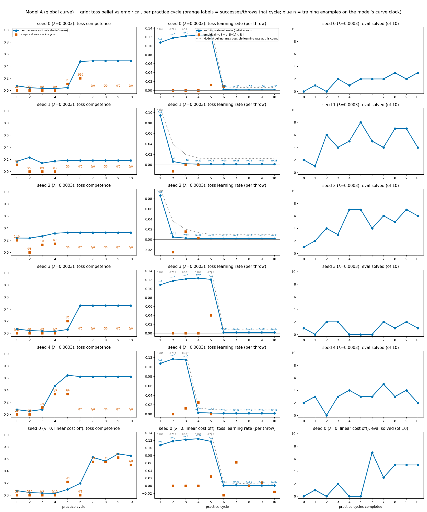
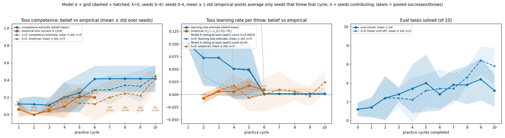
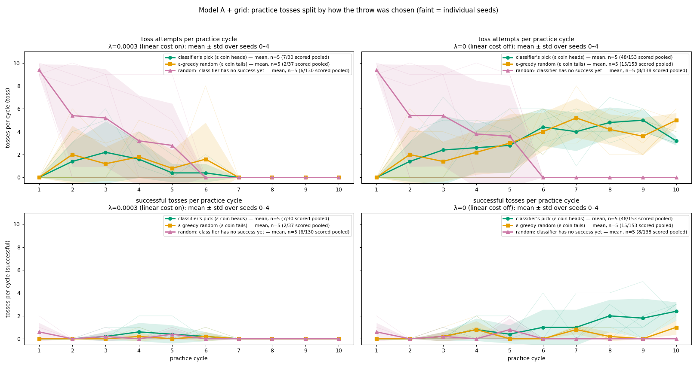
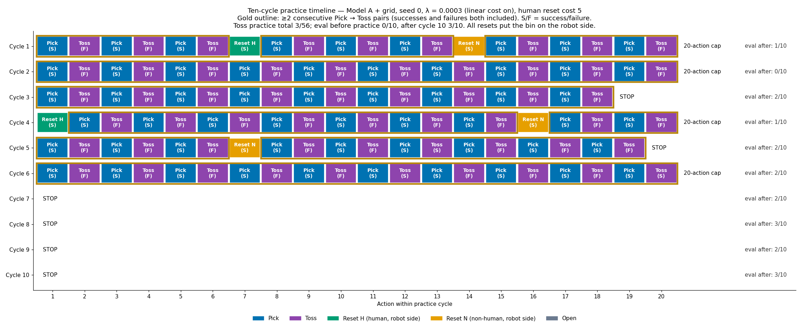
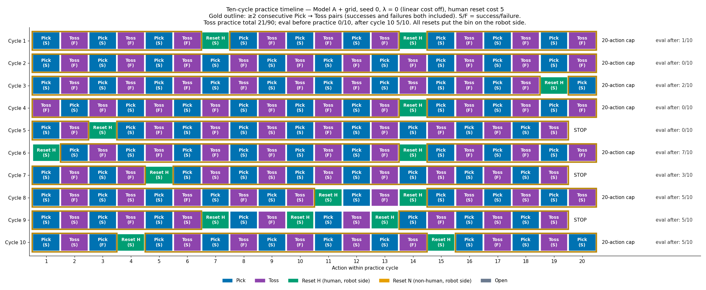
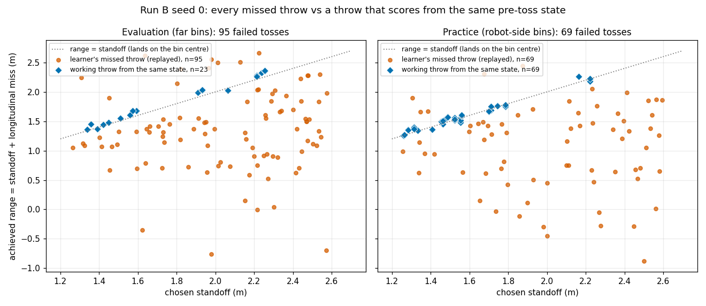
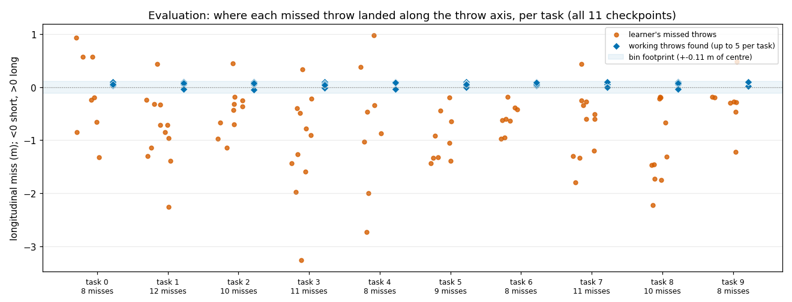

# Tossing3D EXP-06: why Model A stops practising (EXP-06a, 06b, 06c)

**TL;DR.** Three linked results on Model A (`global_curve`) + grid, the overnight 2x2 code
(#365/#366), 10 practice cycles of at most 20 actions, ε = 0.5, reset cost 5.

- **06a (mechanism).** Model A's toss learning-rate belief collapses from ~0.12 to
  ~0.001 in the one cycle where the toss training-example count starts moving. On seed 0
  that count sits at 0 until the classifier has both labels, then jumps 0 → 46 (cost on)
  or 0 → 47 (cost off), where every exponential on the φ2 grid has already flattened.
  *EXP-07a later showed the deferred count is not necessary for the collapse* (see the
  note under 06a); what survives is the ceiling that the φ2 grid puts on the learning
  rate at ~50 throws.
- **06b (does the cost turn the collapse into a halt?).** λ = 0 vs λ = 0.0003, paired
  seeds 0–4. Final eval 5, 5, 8, 3, 8 of 10 with λ = 0 against 3, 4, 6, 1, 2 with
  λ = 0.0003: higher on 5/5 seeds, 29/50 vs 16/50 tasks. **Exact Wilcoxon p = 0.0625**,
  the smallest a two-sided test can reach at n = 5, so not significant. With the cost on,
  every seed stops tossing after cycle 4–6; with it off, none does.
- **06c (is the environment solvable where the robot fails?).** On seed 0, λ = 0, every
  one of 164/164 missed tosses (95/95 eval, 69/69 practice) had a scoring throw from the
  same reconstructed state. 92/92 searches found one within two tries. This is an
  existence proof: the misses come from throw selection, not from the physics.

All numbers below were re-read from the run directories named in *Methods*; the figures
are snapshots (see *Figure provenance*).

## Question / goal

After the overnight 2x2 (EXP-05), Model A + grid with the linear practice cost
(λ = 0.0003) stopped practising after a few cycles and plateaued around 3/10. Three
questions:

1. **06a.** Why does Model A's toss learning-rate belief collapse right after the first
   successes?
2. **06b.** Is the practice cost what converts that collapse into a halt?
3. **06c.** For every missed toss, did a throw exist that would have scored from the same
   state?

## Background

The robot practises on its own side of a barrier and is evaluated on 10 far-side bins.
Each practice cycle, an expectimax planner (depth 6) chooses among the skills (Pick, Toss,
Open gripper, human reset, robot reset) or STOP. It scores each option with a per-skill
competence model. Model A is Tom's "global curve": competence rises along an exponential
in the number of training examples n, with a grid over (initial, plateau, rate φ2,
concentration). Its learning rate at count n is the derivative of that curve. The toss
parameters are chosen by a classifier over 100 candidate throws, with ε-greedy random
throws, and all throws are random until the classifier has seen one success.

In this code the toss training-example count was **deferred**: it read 0 until the toss
classifier had both labels, then took the whole backlog at once. The linear cost λ
charges λ per practice action against the modelled improvement, so a small learning-rate
belief makes STOP the best option.

## Hypothesis

- **06a.** Delayed-onset misspecification: an exponential curve cannot express "flat,
  then a jump", so when the count jumps to where the curve is flat, the learning-rate
  belief collapses.
- **06b.** The linear cost converts the collapsed learning-rate belief into a halt. With
  λ = 0 the robot keeps practising and ends higher.
- **06c.** The environment is solvable wherever the learner fails, so the misses come
  from selection, not physics.

All three were stated before the analyses were run. The 06b arms were run after the 06a
mechanism was found.

## Guidance given

Josh asked why Model A stops practising, and asked for the λ = 0 arm on the same seeds
so the cost's role could be isolated. He also asked for a counterfactual gallery: every
failed toss replayed next to one that scores from the same state. Report at the strength
warranted, with paired tests across shared seeds.

## Methods

- **Runs.** The cost-on arm is the overnight 2x2's Model A + grid arm, seeds 0–4. The
  λ = 0 arm uses the same argv with `--pomdp-linear-cost-lambda 0`. Each λ = 0 seed ran
  at its cost-on partner's commit: seeds 0, 3 and 4 at `e5423a45`, seeds 1 and 2 at
  `8bb9a337`. The cost-on seed 1 and 2 runs record `git_dirty: true`, and what the dirty
  tree contained is not recorded; their λ = 0 partners are clean. KINDER pins:
  kindergarden `6a42988`, kinder-models `427ad6c`. Settings: 10 cycles × 20 actions,
  ε = 0.5, reset cost 5, eval before practice and after every cycle.
- **Data.** Local only, paths under `.claude/worktrees/` of the main checkout:
  - cost on, seeds 0–4: `agent-ad5ec98ba1eef20d2/results/overnight-2x2-20260925/global_curve-grid/seed_0{0..4}`
  - λ = 0, seed 0: `agent-ad5ec98ba1eef20d2/results/gc-grid-seed0-lambda0-20260925`
  - λ = 0, seeds 1–4: `agent-a9c6bd880ec7d1759/results/gc-grid-lambda0-seeds1-4-20260925/seed_0{1..4}`
  - counterfactuals: `agent-a5d945f438fa48ca1/results/cf/` (`rows.json`: one row per
    miss; `replay_fidelity.json`: the replay check)
- **Beliefs** are each cycle's filtered toss competence and learning rate, with n, read
  from the last `smoothing` record in `pomdp_decisions.jsonl`. **Eval and practice
  counts** come from `stats.json`.
- **06b test.** Exact two-sided Wilcoxon signed-rank on the paired final eval (n = 5).
  With all five differences positive, 0.0625 is its floor. A paired t-test gives
  p = 0.041, but n = 5 gives no support for its normality assumption. The Wilcoxon is the
  test chosen in advance, and the headline uses it.
- **06c.** For each failed toss in the seed 0, λ = 0 run, the pre-toss state was rebuilt:
  from the episode seed for eval, from a restore for practice. The logged throw was
  replayed to confirm the same outcome. Throws that scored elsewhere in the run were then
  tried from that state until one scored. Replay fidelity: 95/95 eval and 61/69 practice
  states reproduce the logged outcome. The other 8/69 practice states are approximate.

### Figure provenance

The figures are snapshots copied from the working experiment log. No committed script
regenerates them. They were made by uncommitted scratch scripts:
`/tmp/claude-1000/percycle/{meanstd,tosscounts,empirical,timeline}.py` (06a/06b) and
`.claude/worktrees/agent-a5d945f438fa48ca1/results/cf/build_html.py` (06c). They predate
the house training-curve style: blue marks the belief and orange the empirical rate, not
an arm's role.

## Results

### EXP-06a: the learning-rate collapse and its mechanism

Toss belief per cycle (filtered), from the run logs:

| run | n per cycle | learning-rate belief per cycle |
| --- | --- | --- |
| seed 0, λ = 0.0003 | 0, 0, 0, 0, 0, **46**, 56, 56, 56, 56 | 0.108, 0.118, 0.122, 0.124, 0.123, **0.0014**, 0.001, … |
| seed 0, λ = 0 | 0, 0, 0, 0, 0, **47**, 56, 65, 74, 82 | 0.108, 0.118, 0.122, 0.124, 0.117, **0.0006**, 0.0012, 0.001, 0.001, 0.0009 |
| seed 3, λ = 0.0003 | 0, 0, 0, 0, 0, **39**, 39, … | 0.108 … 0.121, **0.0014**, … |
| seed 4, λ = 0.0003 | 0, 0, 0, **26**, 35, 41, … | 0.108, 0.117, 0.115, **0.0031**, 0.0022, 0.0016, … |
| seed 1, λ = 0.0003 | 0, **9**, 18, 27, 28, … | 0.095, **0.0061**, 0.0018, 0.0011, … |
| seed 2, λ = 0.0003 | 0, **10**, 18, 26, 33, … | 0.086, **0.0047**, 0.0026, 0.0019, 0.0015, … |

The grey dotted line in the figure is Model A's ceiling: the largest learning rate any
posterior can report at that count. At n ≈ 50 the φ2 grid caps it at about 0.008, so a
belief of ~0.001 is not far below what the model can express at all.

> **Note added with this log (not a change to any published number).** Seeds 1 and 2
> threw a success in cycle 1, so their count advanced from the first refit (9–10
> examples, not a deferred jump), and their learning-rate belief still fell by more than
> 10x in one cycle. So the EXP-06 data already showed that the deferred jump is not
> necessary for the collapse. EXP-07a then tested it directly, counting every attempt as
> the notebook does. The collapse came *earlier* (0.108 → 0.004 by cycle 2; see
> [the EXP-07a/b log](2026-09-25-tossing3d-notebook-abc.md)). The 06a hypothesis
> ("delayed-onset misspecification") is therefore at most part of the story. The surviving
> mechanism is the exponential with its φ2 grid, whose derivative at ~50 throws is small
> whatever the order of the data.

### EXP-06b: λ = 0 vs λ = 0.0003, paired seeds 0–4

| seed | final eval, λ = 0 | final eval, λ = 0.0003 | toss practice, λ = 0 | toss practice, λ = 0.0003 | last cycle with a toss, λ = 0.0003 |
| --- | --- | --- | --- | --- | --- |
| 0 | 5/10 | 3/10 | 21/90 | 3/56 | 6 |
| 1 | 5/10 | 4/10 | 12/89 | 1/28 | 4 |
| 2 | 8/10 | 6/10 | 14/88 | 4/33 | 4 |
| 3 | 3/10 | 1/10 | 11/91 | 1/39 | 5 |
| 4 | 8/10 | 2/10 | 13/86 | 6/41 | 5 |
| total | 29/50 | 16/50 | 71/444 | 15/197 | — |

- Final eval higher with λ = 0 on 5/5 seeds, mean 5.8 vs 3.2 of 10. **Exact Wilcoxon
  p = 0.0625: consistent direction, not significant at n = 5.** Paired t p = 0.041,
  reported for completeness, not as the headline.
- With the cost on, every seed makes its last toss in cycle 4, 5 or 6. From then on the
  planner STOPs at the start of every remaining cycle, so each cost-on seed practises
  none of cycles 7–10. With λ = 0, every cycle on every seed runs 18–20 of its 20
  actions.
- Eval is identical between the arms at checkpoints 0–2 on every seed, as expected from
  shared seeds and deterministic throws. It diverges by checkpoint 3–5, once the arms'
  decisions differ.

Seed 0 practice timelines, every action per cycle:

Video: [seed 0, λ = 0, practice cycle 7](2026-09-25-tossing3d-exp06-lambda0-seed0-practice-cycle07.mp4)
(the first cycle with 5/9 toss successes).

### EXP-06c: every miss had a scoring throw (seed 0, λ = 0)

| | misses | working throw found | state rebuilt faithfully |
| --- | --- | --- | --- |
| eval (10 tasks × 11 checkpoints) | 95 | 95/95 | 95/95 |
| practice (robot-side bins) | 69 | 69/69 | 61/69 |
| total | 164 | 164/164 | 156/164 |

- 92 searches ran. 69 were per practice miss. The other 23 covered eval: one per task
  shared by 82 eval misses, plus 13 eval misses searched individually. That is why the
  eval panel shows 23 working-throw markers for 95 misses. 82/92 searches scored on the
  first candidate tried and 10/92 on the second.
- Every working throw is one the learner itself scored with elsewhere in the run
  (164/164 `logged-scorer`). The robot had already found the throws it needed; it did not
  select them.
- Most misses land short: below the range = standoff line in the first figure, below
  zero in the second. The working throws sit on that line, at standoffs of about
  1.3–2.3 m. The learner's misses spread over about 1.25–2.6 m.
- This is an existence proof on one seed. It does not say how often the classifier
  *could* find these throws.

Counterfactual pairs (the logged miss, then the throw that scores from the same state):

- eval task 1, checkpoint 0: [miss](2026-09-25-tossing3d-exp06-cf-eval-task1-ckpt0-miss.mp4),
  [working throw](2026-09-25-tossing3d-exp06-cf-eval-task1-working.mp4)
- practice toss 15 (cycle 1, 2.3 m short): [miss](2026-09-25-tossing3d-exp06-cf-practice-toss015-miss.mp4),
  [working throw](2026-09-25-tossing3d-exp06-cf-practice-toss015-working.mp4)

The other 160 pairs, the per-cycle practice clips, the eval-sweep clips and the full-loop
video are not committed (about 400 MB). They are on the workstation under the
counterfactual results directory above and the scratch web server's
`tossing3d-baseline/{counterfactual-seed0,videos-seed0-lambda0}/`.

## Recommendation

1. **Treat the collapse as a property of Model A's curve, not of the count.** The count
   fix (EXP-07a) did not remove it. The open decision is whether to add slower rates to
   the φ2 grid (e.g. 0.005, 0.01), which is a model change.
2. **06b needs seeds 5–9 before anyone cites it as an effect.** At n = 5, 5/5 same-sign
   pairs is the Wilcoxon floor (p = 0.0625). A null result at this n cannot tell
   "no effect" from "too few seeds".
3. **The bottleneck is selection.** 06c shows the environment is solvable at every miss.
   Effort belongs in how the classifier ranks throws and in keeping practice going, not
   in the physics or the proposal.
4. Staleness: all of these runs predate the notebook alignment (#367) and the
   fixed-controller count (#370). EXP-07a showed λ = 0 behaviour is unchanged on seed 0.
   The λ = 0.0003 stopping cycles moved (EXP-07b: 3, 4, 4, 3, 7 vs 6, 4, 4, 5, 5 here).
