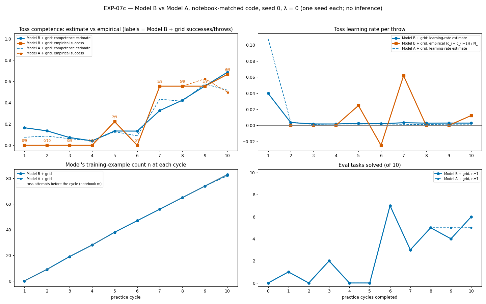
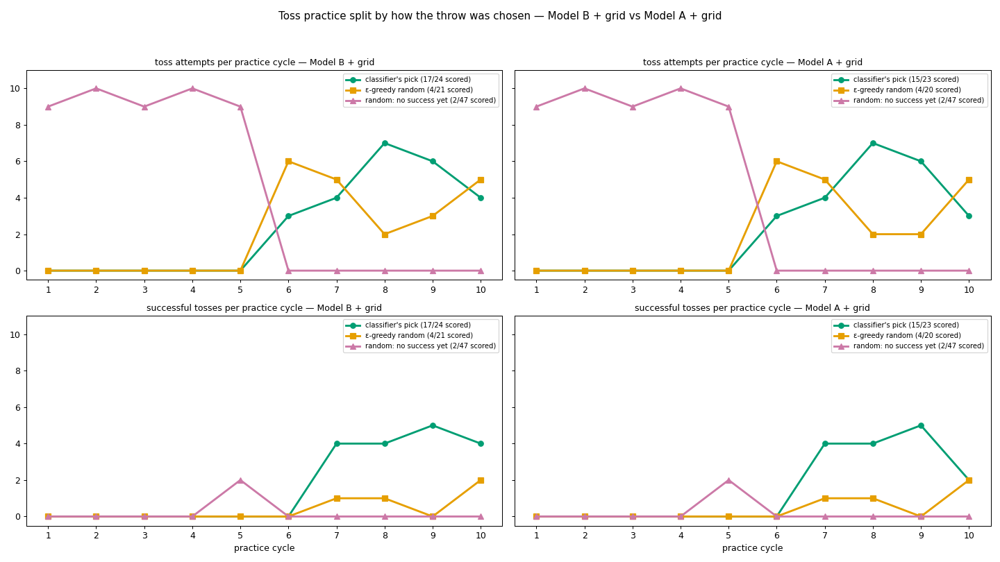
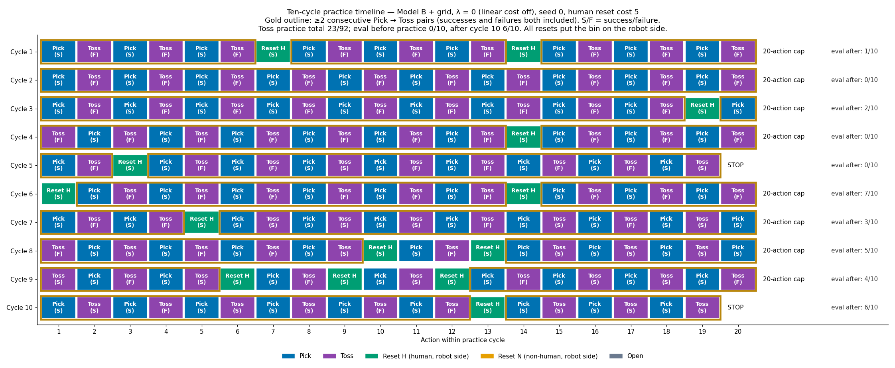
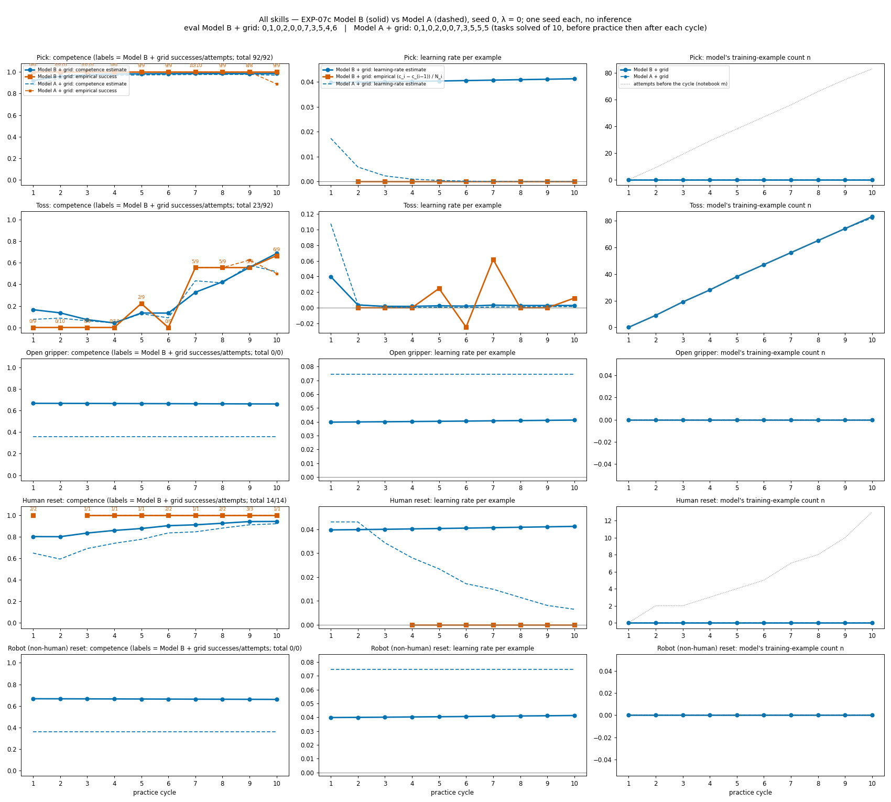
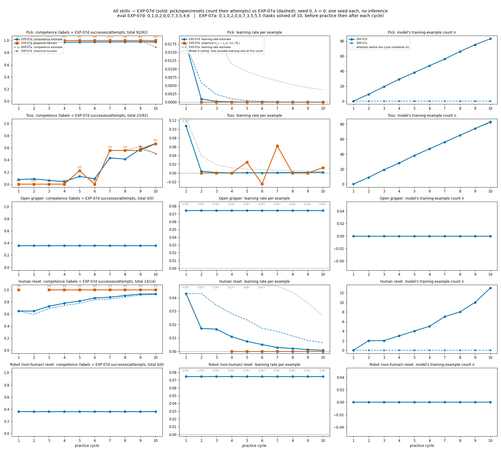
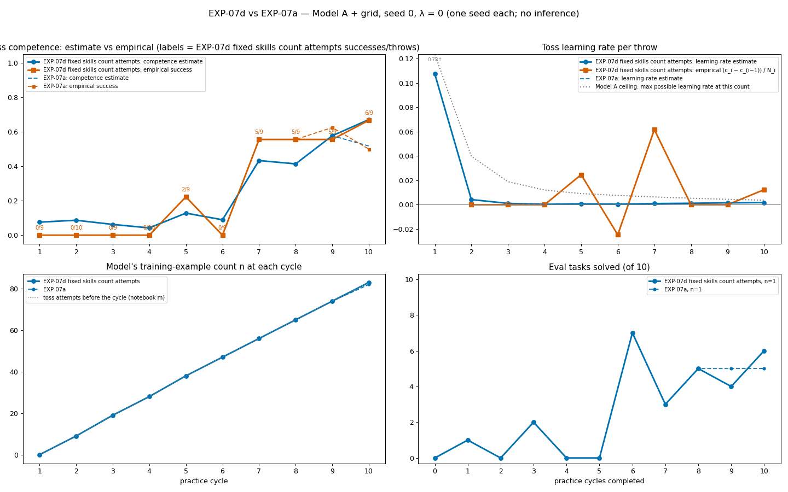
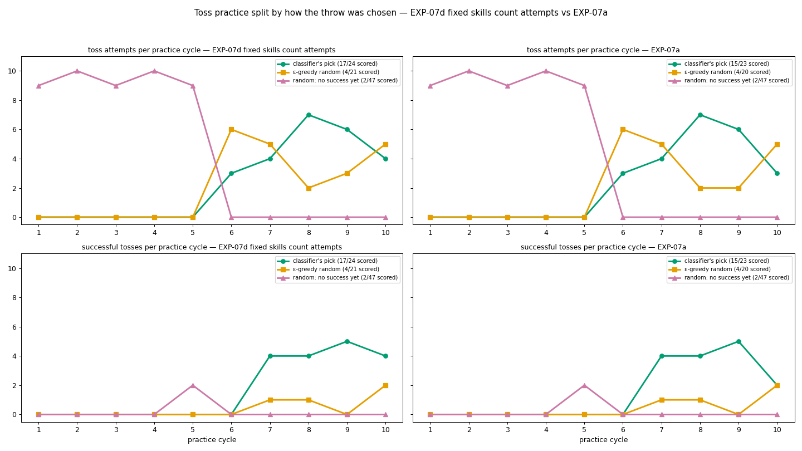
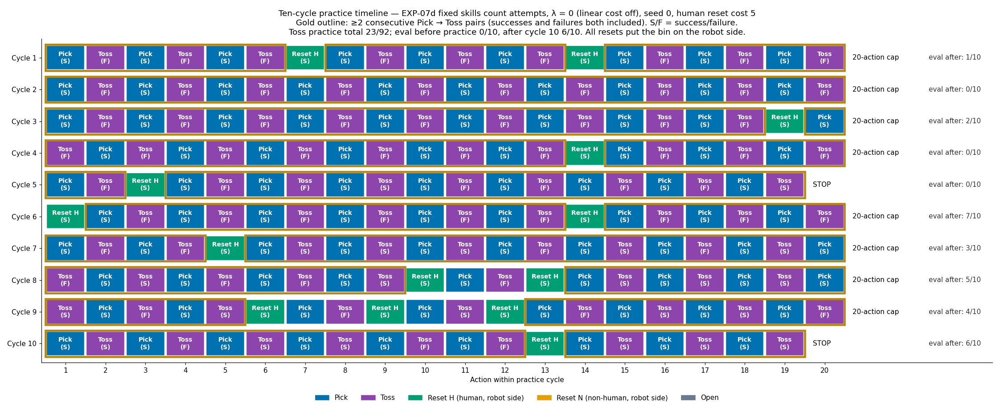

# Tossing3D EXP-07c and EXP-07d: Model B on the notebook-matched code, and fixed-controller skills that count their attempts

**TL;DR.** Two single-seed follow-ups (seed 0, λ = 0, Model A/B + grid) to EXP-07a/07b,
which are recorded in [the notebook-abc log](2026-09-25-tossing3d-notebook-abc.md) and not
repeated here. One seed per arm, so **no inference is supported**: these are raw numbers.

- **07c: mostly not supported.** Model B's (local trend) toss learning-rate estimate
  falls from 0.040 to 0.0018–0.0036 after the first cycle and stays there. That is 2–3x
  Model A's, but not "clearly above zero", and far below the +0.062 empirical jump at
  cycle 7. Its competence estimate tracks empirical at least as well (final 0.69 against
  6/9 that cycle; Model A 0.52).
- **07d: supported.** With pick / open gripper / reset counts advancing per attempt (PR
  #370), pick's count runs 0, 9, 19, … 83 and human reset's 0, 2, 2, … 13. Pick's
  learning-rate estimate reaches 0.0000 by cycle 5, so the robot never practises pick for
  its own sake. Eval 0,1,0,2,0,0,7,3,5,4,6 against EXP-07a's …,5,5,5.
- **The finding this log adds.** 07c and 07d are **action-for-action identical**
  (596/596 decision/dispatch/outcome records; byte-identical `stats.json`). Both depart
  from EXP-07a at the **same single decision**: the last action of practice cycle 7, where
  07a STOPs with one action left and both others Pick. So the eval difference both report
  against 07a (…,4,6 vs …,5,5) cannot be credited to Model B or to the fixed-skill
  counts. It is one near-tie STOP flipping, and any perturbation of the beliefs flips it
  the same way.

## Question / goal

- **07c.** Does Model B (local trend) keep a positive toss learning-rate estimate where
  Model A's collapses (EXP-06a, EXP-07a)?
- **07d.** Does advancing the pick / open gripper / reset training-example counts per
  attempt, as Tom's notebook does, change beliefs or behaviour?

## Background

EXP-06a found Model A's toss learning-rate belief collapsing from ~0.12 to ~0.001 (see
[the EXP-06 log](2026-09-25-tossing3d-exp06-model-a-stops-practising.md)). EXP-07a
(#367) aligned the code with Tom's notebook: the toss count advances with every attempt,
forecasts always cross the zero-example boundary, and Model B uses the notebook's
ρ = 0.9 (earlier runs passed 0.9^(1/16)). The collapse came earlier, not later, so it is
a property of Model A's exponential with its φ2 grid, whose learning rate at ~50 throws is
capped at about 0.008. EXP-07b (#368/#369) settled toss evidence on `non_epsilon`.

Model B models competence as a latent level plus a latent trend η, which drifts with
persistence ρ. It has no curve whose derivative must decay with n, so it was the natural
candidate for a learning-rate estimate that does not collapse.

Before #370, the controller skills (pick, open gripper, human and robot reset) have no
learned sampler, so their count stayed at 0 and their competence was redrawn at m = 0
every cycle. #370 counts every completed attempt instead. Resets always succeed; a failed
reset raises. Search advances the same counts in imagined branches.

## Hypothesis

Both stated before the runs.

- **07c.** Model B's latent η has no falling ceiling, so its learning-rate estimate stays
  clearly above zero after the first successes. At λ = 0 behaviour barely changes,
  because the planner practises to budget regardless.
- **07d.** The pick and human-reset competence estimates move along Model A's curve
  instead of being redrawn at m = 0, so their learning-rate estimates fall faster. Toss
  beliefs and behaviour at λ = 0 are unchanged (eval ≈ 07a's 0,1,0,2,0,0,7,3,5,5,5).

## Guidance given

Josh decided that fixed-controller skills should count attempts as the notebook does
(07d). He asked for Model B to be run on the notebook-matched code with the notebook's ρ
(07c). Both are single-seed checks against 07a, reported as raw numbers.

## Methods

- **Common config.** EXP-07a's argv: Model A/B + grid, expectimax depth 6, 10 cycles × 20
  actions, ε = 0.5, λ = 0, reset cost 5, `non_epsilon` evidence, seed 0. KINDER pins:
  kindergarden `6a42988`, kinder-models `427ad6c`.
- **Runs.** Local only, under `.claude/worktrees/agent-a87b4e694aed23e40/results/notebook-abc/`:

  | experiment | run dir | model | commit |
  | --- | --- | --- | --- |
  | 07a (reference) | `verify-gc-grid-seed0-lambda0` | global_curve | `d7b7ba30`, clean |
  | 07c | `verify-lt-grid-seed0-lambda0` | local_trend | `d7b7ba30`, **dirty** |
  | 07d | `verify-gc-grid-seed0-lambda0-fixedskills` | global_curve | `193b5b74` (#370 head), clean |

  07c's `config_snapshot.json` records `git_dirty: true`, and what the dirty tree held is
  not recorded. Its own smoothing history shows the pick and reset counts stuck at 0, so
  it did *not* contain 07d's counting change. Its logged belief config has
  `learning_rate_decay: 0.9`, confirming ρ = 0.9.
- **Beliefs** come from the last `smoothing` record in `pomdp_decisions.jsonl`, and
  **counts** from `stats.json`. **Decision sequences** are compared as the ordered
  (cycle, chosen skill), dispatch and outcome (skill, success) records in
  `pomdp_decisions.jsonl`.
- **Figure provenance.** The figures are snapshots from the working experiment log. No
  committed script regenerates them. They were made by uncommitted scratch scripts in
  `/tmp/claude-1000/percycle/` (`exp07.py`, `allskills.py`, `tosscounts.py`,
  `timeline.py`). Solid is the new run, dashed is EXP-07a. Blue marks the belief and
  orange the empirical rate, which predates the house arm-colour convention.

## Results

### EXP-07c: Model B vs Model A

| cycle | 1 | 2 | 3 | 4 | 5 | 6 | 7 | 8 | 9 | 10 |
| --- | --- | --- | --- | --- | --- | --- | --- | --- | --- | --- |
| toss successes / throws | 0/9 | 0/10 | 0/9 | 0/10 | 2/9 | 0/9 | 5/9 | 5/9 | 5/9 | 6/9 |
| Model B competence estimate | 0.165 | 0.136 | 0.073 | 0.042 | 0.134 | 0.134 | 0.327 | 0.424 | 0.557 | 0.687 |
| Model B learning-rate estimate | 0.0398 | 0.0036 | 0.0018 | 0.0018 | 0.0026 | 0.0021 | 0.0033 | 0.0029 | 0.0029 | 0.0029 |
| Model A (07a) learning-rate estimate | 0.1075 | 0.0042 | 0.0011 | 0.0003 | 0.0007 | 0.0004 | 0.0009 | 0.0012 | 0.0015 | 0.0016 |

The throw counts are 07c's own. 07a's match through cycle 8 and differ from cycle 9 on;
see the divergence section.

- **Mostly not supported (one seed).** Model B's learning rate settles at about
  0.002–0.003, 2–3x Model A's, far below the empirical +0.062 at cycle 7.
- Its competence estimate ends at 0.69 against 6/9 empirical that cycle. Model A (07a)
  ends at 0.52.
- Behaviour: eval 0,1,0,2,0,0,7,3,5,4,6 vs 07a's …,5,5,5. Toss practice 23/92 vs 21/90.
  *Neither difference can be attributed to Model B; see below.*

Model B's pick and reset learning-rate estimates drift up slowly (0.040 → 0.041), because
those counts stay at 0 on this commit and η has nothing to condition on.

### EXP-07d: fixed-controller skills count their attempts

| cycle | 1 | 2 | 3 | 4 | 5 | 6 | 7 | 8 | 9 | 10 |
| --- | --- | --- | --- | --- | --- | --- | --- | --- | --- | --- |
| pick count n | 0 | 9 | 19 | 29 | 38 | 47 | 56 | 66 | 75 | 83 |
| pick competence estimate | 0.879 | 0.947 | 0.964 | 0.970 | 0.973 | 0.975 | 0.976 | 0.976 | 0.977 | 0.977 |
| pick learning-rate estimate | 0.0174 | 0.0010 | 0.0002 | 0.0001 | 0.0000 | 0.0000 | … | | | 0.0000 |
| pick learning rate, 07a (n stuck at 0) | 0.0174 | 0.0059 | 0.0023 | 0.0010 | 0.0005 | 0.0002 | 0.0001 | 0.0000 | … | |
| human-reset count n | 0 | 2 | 2 | 3 | 4 | 5 | 7 | 8 | 10 | 13 |
| human-reset learning-rate estimate | 0.0432 | 0.0171 | 0.0166 | 0.0109 | 0.0074 | 0.0050 | 0.0029 | 0.0021 | 0.0013 | 0.0007 |
| human-reset learning rate, 07a | 0.0432 | 0.0432 | 0.0344 | 0.0281 | 0.0235 | 0.0172 | 0.0149 | 0.0115 | 0.0081 | 0.0065 |

- **Supported (one seed).** Pick and human-reset counts advance per attempt, and their
  learning-rate estimates fall faster than under 07a. Pick's competence estimate reaches
  0.964 by cycle 3 (max 0.977; empirical pick 92/92). Its learning rate is 0.0000 from
  cycle 5. Open gripper and robot reset were never attempted (0/0), so their beliefs are
  flat.
- Toss beliefs are identical to 07a through cycle 9 and differ only at cycle 10 (0.671 vs
  0.518), after the practice divergence below.
- Eval 0,1,0,2,0,0,7,3,5,4,6 vs 07a's 0,1,0,2,0,0,7,3,5,5,5. The first eval difference is
  at checkpoint 9.

### The divergence both runs share

Comparing the ordered decision, dispatch and outcome records:

- **07c vs 07d: identical, 596/596 records**, and `stats.json` is byte-identical.
- **07a vs either** first differs at the final slot of practice cycle 7. After a
  successful toss, 07a chooses STOP with one action left (19/20 actions). 07c and 07d
  choose Pick (20/20). The simulator trajectory then differs. Toss outcomes stay equal
  through cycle 8 (5/9) and differ in cycles 9–10 (07a 5/8 and 4/8; the others 5/9 and
  6/9).

Two different changes (Model B's toss belief; the pick and reset counts under Model A)
produce the same flip and then exactly the same run. The simplest reading is that this
STOP is a near tie at λ = 0, and any perturbation of the beliefs tips it toward Pick.
This is a reading, not a test. It does mean that **the 07c and 07d eval curves are one
data point, not two**, and neither eval difference from 07a is evidence about the change
that produced it.

## Recommendation

1. **Do not read Model B as fixing the collapse.** On this seed it is 2–3x Model A and
   still near zero. Whether it changes behaviour at λ > 0 is untested on this code
   (EXP-10/11 run Model B only at λ = 0).
2. **Keep #370's counting as the canonical setup.** It does what the notebook does and
   changes behaviour by one near-tie decision on this seed.
3. **Treat single-seed eval differences of ±1 task after cycle 8 as noise** at λ = 0.
   07c and 07d show that two unrelated changes produce the identical ±1 pattern. Any
   single-seed comparison in EXP-08–11 needs the same caution.
4. Videos: none committed for 07c/07d. Their practice timelines above carry the
   behaviour. The EXP-07a verification-run final-eval video is already in the
   notebook-abc log.
