# Tossing3D EXP-08 to EXP-12: exploration ε, practice budget, cycle length, Model B, and choosing λ

**TL;DR.** Seven experiments from 2026-09-25, copied from the live experiment log
(snapshot 2026-09-27 10:30). An HTML copy of the same log is in
[2026-09-25-tossing3d-exp08-12-html/index.html](2026-09-25-tossing3d-exp08-12-html/index.html).
EXP-08a to EXP-11 are **one seed per arm**, so no inference is supported for them: they
are raw numbers.

- **EXP-08a, exploration ε: no ε effect.** Final eval 5/10, 5/10, 4/10, 4/10 for
  ε = 0.5, 0.25, 0.1, 0. Random throws score 0/30 to 4/20, while the classifier's picks
  score 15/23 to 20/43.
- **EXP-08b, 30 cycles instead of 10: supported.** It ends at 8/10 against 5/10 at 10
  cycles. It reaches 10/10 at cycle 19 and scores 9/10 on 6 of the last 12 cycles.
- **EXP-08c, 100 actions per cycle: partly supported.** It has the best area under the
  curve of any 10-cycle run (71/110), but its final eval is 6/10, because eval swings
  between 6 and 9 from one cycle to the next.
- **EXP-09, actions per cycle: final eval does not rise steadily with cycle length.**
  Final eval is 5, 7, 4, 4 and 6 of 10 at 20, 30, 40, 50 and 100 actions. The 80-action
  run crashed when a pick dragged the bin.
- **EXP-10 and EXP-11, Model B: supported.** At λ = 0, Model B tracks Model A arm for arm.
- **EXP-12, choosing λ.** Model A falls off a cliff as λ rises, while Model B degrades
  smoothly. **λ = 3e-6 became the canonical practice-cost weight** (decision
  2026-09-25).
- **Read every result here with three caveats.** The code in force for all seven
  experiments forced practice onto the robot's side of the barrier (#366; reversed from
  EXP-13). Its search also dropped GraspClear after an imagined toss success (fixed in
  #375). And EXP-12's second, "automatic" reset skill was a relabelled human reset
  (disabled in #376).

## Background

This log continues the Tossing3D practice series. EXP-06 and EXP-07 are recorded in PR
#371, which sits on a sibling branch, so they are referred to here by name rather than
linked. The robot practises the `Tossing3D` KINDER task: it picks a cube and tosses it
over a barrier into a bin. Eval is 10 fixed tasks, all with the bin on the far side.
Between eval checkpoints, a belief-space expectimax planner decides what to practise,
when to stop, and when to pay for a human reset (cost 5). It trades each skill's
forecast competence gain against a linear practice cost weighted by λ. Two competence
models are compared:

- **Model A** (`global_curve`) is an exponential learning curve over a φ grid.
- **Model B** (`local_trend`, ρ = 0.9) is a latent level plus a drifting trend.

After EXP-07, the planner ran notebook-matched inference (#367) and updated toss
competence from non-ε throws only (#368's `non_epsilon`, chosen in EXP-07b). EXP-08 to
EXP-11 then swept the protocol knobs that had never been tested (ε, cycles, actions per
cycle) and repeated them on Model B. EXP-12 picked the canonical λ. Its runs also
validated "fix (b)" (#372): toss feasibility is now computed from the bin's *live* pose,
and an infeasible candidate is rejected rather than raising
`NoFeasibleTossDirectionError`. That fix exists because the EXP-09 and EXP-11 80-action
runs had crashed that way.

**Staleness notes.** These are also carried in the live log and copied per experiment
below.

- **Forced same-side practice.** EXP-05 to EXP-12 ran with practice resets forced onto the
  robot side (#366). Josh reversed this on 2026-09-25 at about 21:40: the planner must
  choose. Every number here is conditional on forced same-side practice.
- **GraspClear bias.** In EXP-05 to EXP-12, after an imagined successful toss the search
  dropped GraspClear, so it under-valued the pick that follows. #375 fixed this; it
  keeps GraspClear unchanged.
- **EXP-12's second reset skill** (`non_human_reset`) was executed by the human at cost 5.
  It was therefore a human intervention under another label, and #376 disabled it.
- **One near-tie decision can flip a single-seed ±1 difference.** EXP-07c and EXP-07d turned
  out to be action-for-action the same run, which departed from EXP-07a at one near-tie
  STOP. The same caution applies to single-seed ±1-task differences in EXP-08 to EXP-11.

## Code each experiment ran on

| experiment | code | stack position |
| --- | --- | --- |
| EXP-08a, 08b, 08c, 09, 10, 11 | `d7b7ba30` (#368 head) | ancestor of this branch's base |
| EXP-12 | `5c5a4b6f` (#372 head, fix (b) on #370) | this branch's base |

EXP-08 to EXP-11 were launched before #370, so the pick, open-gripper and reset counts
stay at 0 in those runs. EXP-07d found that this makes essentially no behavioural
difference.

## Experiments

Newest first, as in the live log. Every field below is copied verbatim from the live log's entry (snapshot 2026-09-27 10:30); nothing is recomputed here.

### EXP-12: Choosing λ — practice-cost weight sweep on both competence models (also validates fix (b))

*2026-09-25.* HTML page: [exp-12.html](2026-09-25-tossing3d-exp08-12-html/exp-12.html). Results sub-page: [exp12-lambda.html](2026-09-25-tossing3d-exp08-12-html/exp12-lambda.html).

- **Practice side.** Robot side only — FORCED by code, not chosen by the planner. From #366 (first commit 57196f0a, 2026-09-25 00:31; stack commits 47c30231 / fe73dc1c / 8bb9a337) practice resets could only put the bin on the robot side and every practice scene was rebuilt with the bin on the robot side. Josh reversed this on 2026-09-25 ~21:40 (the planner must choose); results here are conditional on forced same-side practice.
- **Question.** Which practice-cost weight λ should be canonical: the largest that saves practice without costing eval?
- **Hypothesis.** Pre-registered. As λ grows the robot stops practising earlier, cutting practice cost (1 per action, 5 per human reset) and eventually eval. Model A stops sooner than Model B at the same λ, because its learning-rate estimate collapses after the first successes (EXP-05/06). Decision rule, fixed before the runs: per model, the canonical λ is the largest one whose final eval is within 1 task of λ = 0's; if the two models disagree, both go to Josh.
- **Results TL;DR.** Model A has a cliff, Model B degrades smoothly (seeds 0–2; n = 3 is too few for firm inference). Mean of the last 5 evals over 3 seeds, paired against λ = 0 on the same seeds: Model A 8.8 at λ = 0; 8.3 (1e-6, −0.5, p = 0.49), 8.1 (3e-6, −0.7, p = 0.36), 7.1 (1e-5, −1.7, p = 0.20), 7.5 (3e-5, −1.3, p = 0.044); every λ ≥ 1e-4 quits before its first scoring throw (0.2–0.6, seed 0 only). Practice cost 1542 → 1114 / 982 / 743 / 555. Model B 8.9 at λ = 0; 9.0 (1e-5, +0.1, p = 0.18), 8.6 (1e-4, −0.3, p = 0.60), 7.9 (3e-4, −0.9, p = 0.47), 6.7 (1e-3, −2.2, p = 0.003), 4.3 (3e-3, −4.5, p = 0.037). Practice cost 1523 → 1122 / 1144 / 1014 / 378 / 100. Rule "largest λ within 1 task of λ = 0": pre-registered seed-0 final eval gives Model B 3e-4; the 3-seed last-5 mean gives Model A 3e-6 and Model B 3e-4. A single λ that passes for both is 3e-6 (Model B untested there but bracketed by 0 and 1e-5, both ~9.0). Fix (b): 0 NoFeasibleTossDirectionError crashes in 37 runs, but its rejection path never fired, so it is untested on a moved bin. One run (Model B 1e-5 seed 1) crashed at cycle 45 with BinPlacementViolationError: the reset could not place the bin because the robot stood in the reset region.
- **Validation.** These are also the validation runs for fix (b) (toss feasibility from the bin's live pose; infeasible candidates rejected instead of crashing): none of the 10 runs may raise NoFeasibleTossDirectionError. Each run's count of rejected no-feasible-direction candidates and of bin moves during practice is reported. The runs are stopped early if either check fails in the first cycles.
- **Arms.** λ ∈ {0, 1e-4, 3e-4, 1e-3, 3e-3} × {Model A (global_curve), Model B (local_trend, ρ = 0.9)}, plus Model A at λ ∈ {1e-6, 3e-6, 1e-5, 3e-5} (added 16:50 after every Model A λ ≥ 1e-4 arm quit practising in cycles 2–4 with 0 scoring throws — testing whether a smaller cost only delays the quit); grid engine, 50 cycles × 20 actions, ε = 0.5, human reset cost 5, non_epsilon evidence, seed 0 only (one run per arm: no inference supported). Code: fix (b) on #370.
- **Status.** Done (21:00) — 36/37 runs finished, 1 crashed (bin-placement bug; since fixed in #374).
- **Decisions after this experiment.**
  - 2026-09-25: Practice starts with the bin on the far side, and the planner chooses whether to reset and to which side. Nothing is forced: the planner must choose intelligently, not be made to make the right decision. (Reverses #366's forced same-side practice.)
  - 2026-09-25: Canonical practice-cost weight λ = 3e-6 for all methods (from EXP-12).

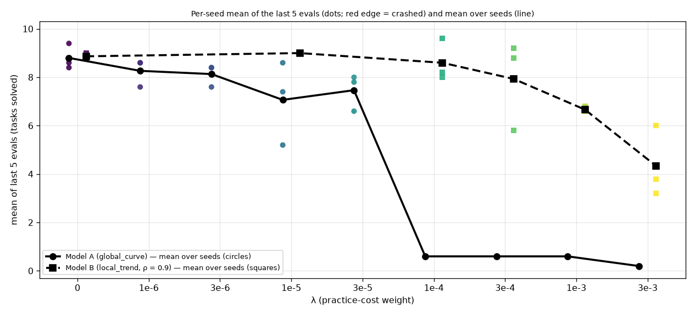

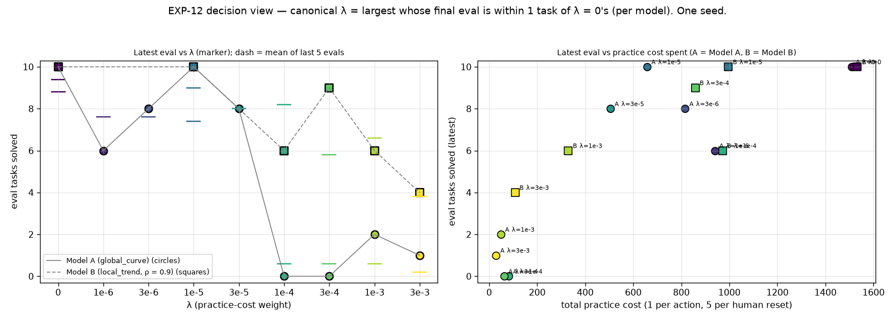

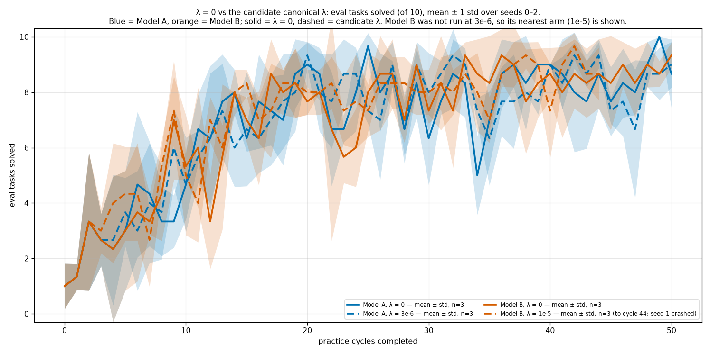

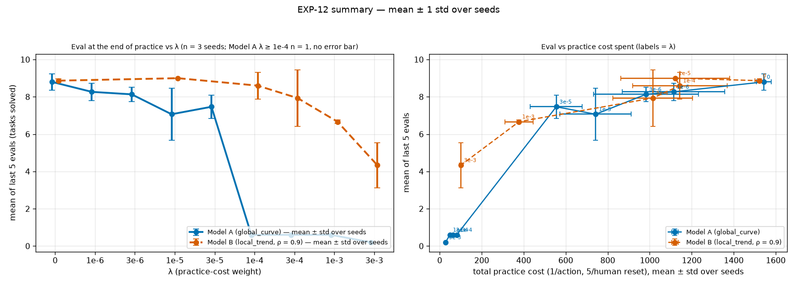

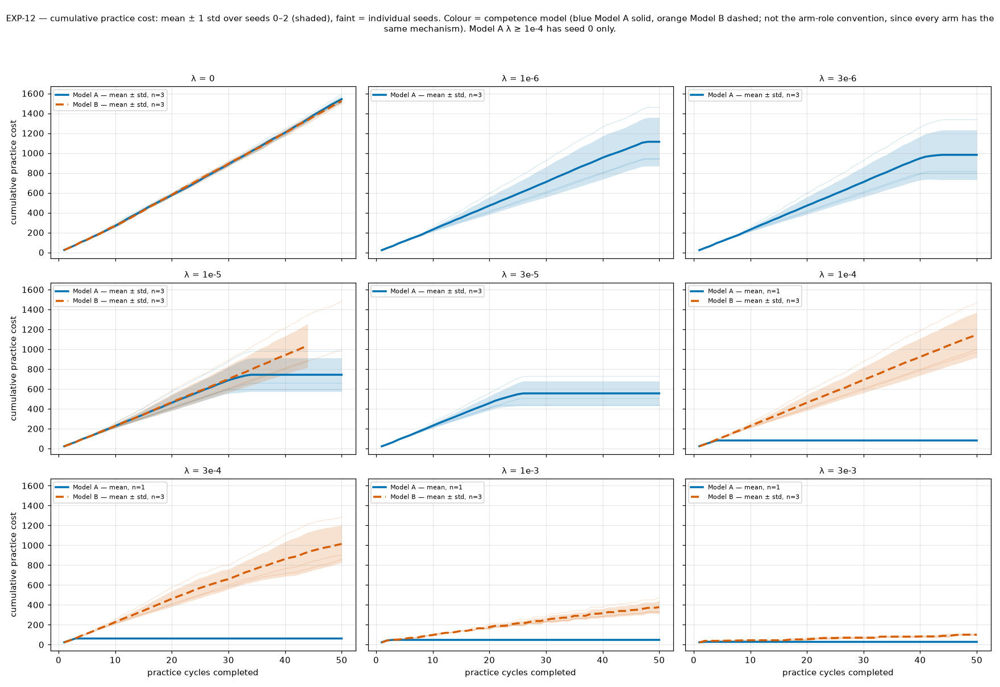

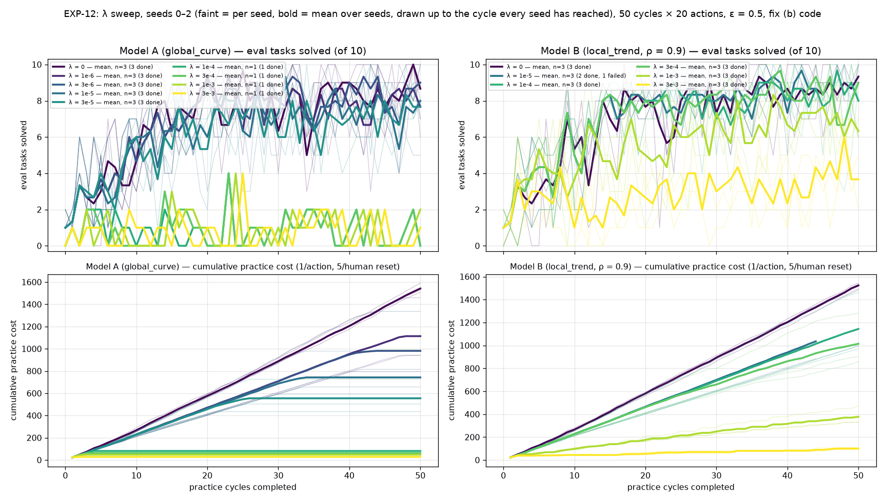

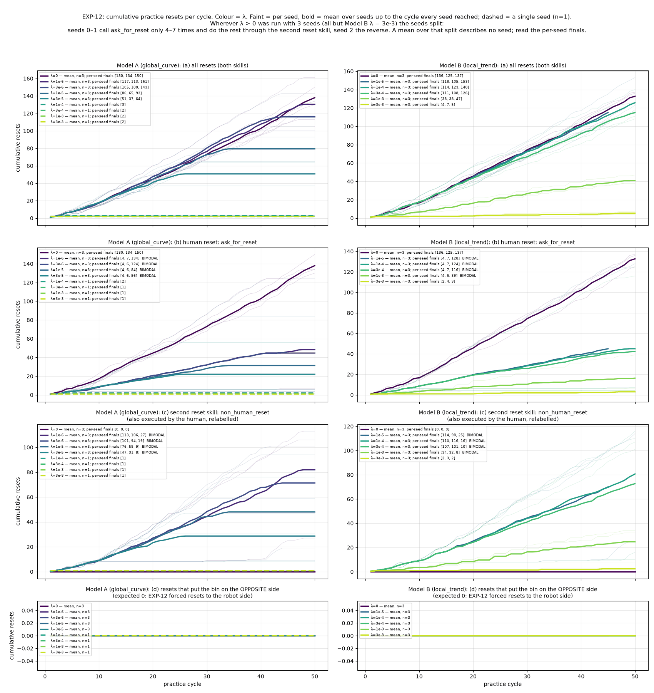

- Video: [EXP-12 Model A, λ = 3e-6, seed 0, practice cycle 15; re-encoded at lower quality](2026-09-25-tossing3d-exp12-model-a-lam3e-6-s0-practice-cycle15.mp4)

Not committed from the live page: EXP-12 practice timelines — all 37 runs (37/37 files); EXP-12 practice videos — Model A, λ = 0 vs λ = 3e-6, seeds 0–2 (12/12 files).

### EXP-11: Practice cycle length on Model B + grid — EXP-09 repeated with the local-trend model

*2026-09-25.* HTML page: [exp-11.html](2026-09-25-tossing3d-exp08-12-html/exp-11.html). Results sub-page: [exp11-modelb-cycle-length.html](2026-09-25-tossing3d-exp08-12-html/exp11-modelb-cycle-length.html).

- **Practice side.** Robot side only — FORCED by code, not chosen by the planner. From #366 (first commit 57196f0a, 2026-09-25 00:31; stack commits 47c30231 / fe73dc1c / 8bb9a337) practice resets could only put the bin on the robot side and every practice scene was rebuilt with the bin on the robot side. Josh reversed this on 2026-09-25 ~21:40 (the planner must choose); results here are conditional on forced same-side practice.
- **Question.** Does practice cycle length affect Model B the same way it affects Model A?
- **Hypothesis.** Pre-registered. At λ = 0 the competence model does not choose throws (the classifier does) and the planner practises to budget regardless, so Model B's eval curves track Model A's EXP-09 counterparts closely at every cycle length (as in EXP-07c, where they differed only in the last two checkpoints).
- **Results TL;DR.** Supported (one seed, no inference): Model B tracks Model A arm for arm. 40 and 50 actions are identical to Model A every cycle (final 4/10 each); 20 actions identical until the final cycle (3/10 vs 5/10); 30 actions diverge from cycle 4 (final 8/10 vs 7/10). 80 actions: FAILED mid-practice: a pick dragged the bin 14–21 cm and turned it, so at the sampled standoff no collision-free toss pose existed (toss-pose feasibility check, not the arm motion planner); plotted up to its last eval (6/10 after cycle 5; video below). 100 actions (shared with EXP-10): final 7/10 vs Model A 6/10.
- **Code note.** Launched on d7b7ba30, before EXP-07d's change (pick/open/reset counts stay at 0). EXP-07d found that makes essentially no behavioural difference.
- **Arms.** --pomdp-competence-model local_trend, notebook ρ = 0.9, λ = 0, ε = 0.3, 10 cycles, --max-steps-per-interaction ∈ {20, 30, 40, 50, 80, 100} (100 shared with EXP-10), seed 0. Model B + grid, notebook-matched code, evidence non-ε. One seed per arm: no inference.
- **Status.** Done — 5/6 finished, 1 failed (80 actions, bin-movement crash).

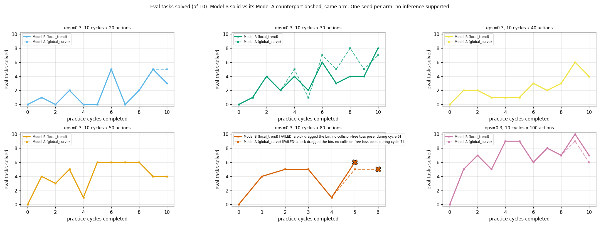

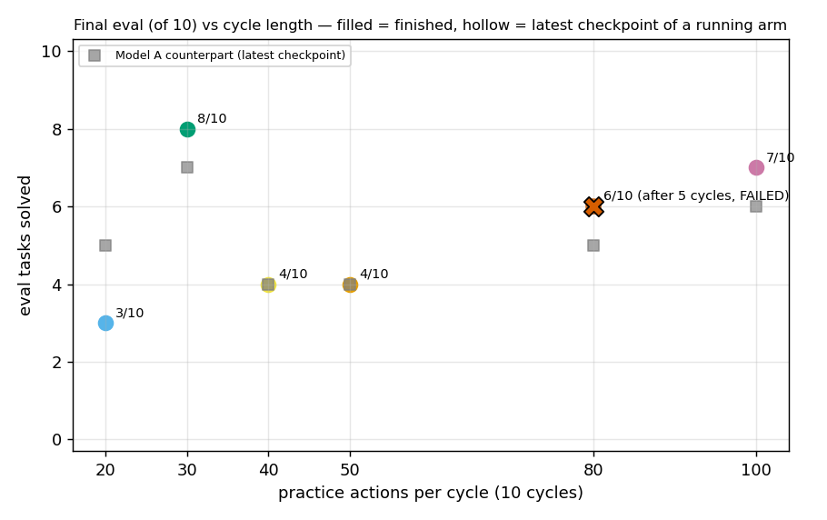

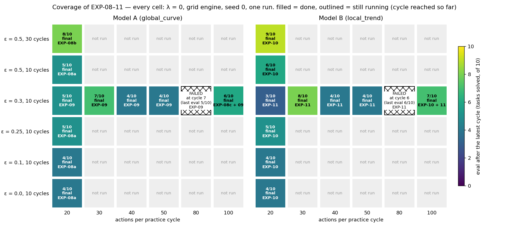

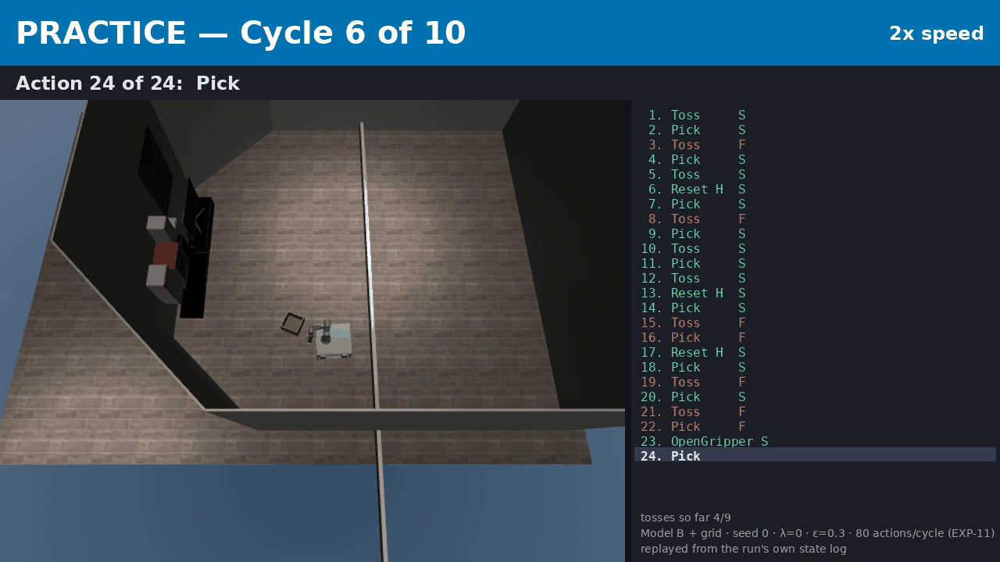

- Video: [EXP-11 80-action run, practice cycle 6, ending in the crash; re-encoded at lower quality](2026-09-25-tossing3d-exp11-s80-practice-cycle06-crash.mp4)

Not committed from the live page: Practice timelines — which skill was chosen at each action of each cycle (6/6 files).

### EXP-10: Exploration ε and practice budget on Model B + grid — EXP-08 repeated with the local-trend model

*2026-09-25.* HTML page: [exp-10.html](2026-09-25-tossing3d-exp08-12-html/exp-10.html). Results sub-page: [exp10-modelb-eps-budget.html](2026-09-25-tossing3d-exp08-12-html/exp10-modelb-eps-budget.html).

- **Practice side.** Robot side only — FORCED by code, not chosen by the planner. From #366 (first commit 57196f0a, 2026-09-25 00:31; stack commits 47c30231 / fe73dc1c / 8bb9a337) practice resets could only put the bin on the robot side and every practice scene was rebuilt with the bin on the robot side. Josh reversed this on 2026-09-25 ~21:40 (the planner must choose); results here are conditional on forced same-side practice.
- **Question.** Do ε and practice budget affect Model B the same way they affect Model A?
- **Hypothesis.** Pre-registered. As for EXP-11: at λ = 0 the competence model affects neither which throw is chosen nor whether practice continues, so each Model B arm's eval curve tracks its Model A counterpart in EXP-08 closely; the difference shows up in the beliefs (Model B's learning-rate estimate has no falling ceiling).
- **Results TL;DR.** Supported: Model B behaves like Model A at λ = 0 (one seed, no inference). The 10 × 20 arms end 4, 4, 5, 6 of 10 for ε = 0, 0.1, 0.25, 0.5 vs Model A's 4, 4, 5, 5 — identical cycle by cycle until one flip at cycle 9 of ε = 0.5. 30 × 20: final 9/10 (Model A 8/10), again byte-identical to its 10-cycle run for the first 10 cycles. 10 × 100: final 7/10 (5,7,5,9,9,6,8,7,10,7; identical to Model A through cycle 8, Model A ended 6/10).
- **Code note.** Launched on d7b7ba30, before EXP-07d's change (pick/open/reset counts stay at 0). EXP-07d found that makes essentially no behavioural difference.
- **Arms.** EXP-08's six arms (ε ∈ {0.5, 0.25, 0.1, 0} at 10 × 20; ε = 0.5 at 30 × 20; ε = 0.3 at 10 × 100) with --pomdp-competence-model local_trend and notebook ρ = 0.9, λ = 0, seed 0. One seed per arm: no inference.
- **Status.** Done.

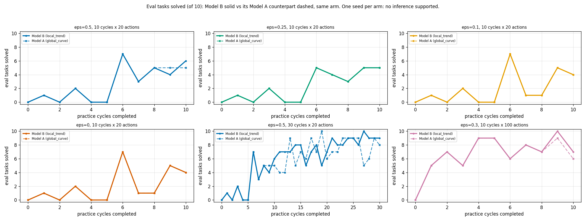

Not committed from the live page: Practice timelines — which skill was chosen at each action of each cycle (6/6 files).

### EXP-09: Practice cycle length — 20 / 30 / 40 / 50 / 80 / 100 actions per cycle at ε = 0.3

*2026-09-25.* HTML page: [exp-09.html](2026-09-25-tossing3d-exp08-12-html/exp-09.html). Results sub-page: [exp09-cycle-length.html](2026-09-25-tossing3d-exp08-12-html/exp09-cycle-length.html).

- **Practice side.** Robot side only — FORCED by code, not chosen by the planner. From #366 (first commit 57196f0a, 2026-09-25 00:31; stack commits 47c30231 / fe73dc1c / 8bb9a337) practice resets could only put the bin on the robot side and every practice scene was rebuilt with the bin on the robot side. Josh reversed this on 2026-09-25 ~21:40 (the planner must choose); results here are conditional on forced same-side practice.
- **Question.** How does eval scale with the number of practice actions per cycle, holding 10 cycles (10 classifier refits) and ε fixed?
- **Hypothesis.** Pre-registered. Toss learning is success-starved, so more actions per cycle reach the first success sooner and give the classifier more successes per refit: eval improves with cycle length, with diminishing returns once each cycle already yields several successes (expected knee around 40–50 actions).
- **Results TL;DR.** No monotone effect of cycle length on final eval (one seed, no inference): 20 → 5/10, 30 → 7/10, 40 → 4/10, 50 → 4/10, 100 → 6/10; 80: FAILED mid-practice: a pick dragged the bin 14–21 cm and turned it, so at the sampled standoff no collision-free toss pose existed (toss-pose feasibility check, not the arm motion planner); plotted up to its last eval (5/10 after cycle 6). What does change: every length ≥ 30 gets its first practice success in cycle 1 (20 actions: cycle 5), and area under the curve grows with length (20/110 at 20 actions, 45/110 at 30 and 50, 71/110 at 100). Eval swings 3–4 tasks between consecutive cycles, which swamps the final-cycle comparison.
- **Code note.** Launched on d7b7ba30, before EXP-07d's change (pick/open/reset counts stay at 0). EXP-07d found that makes essentially no behavioural difference.
- **Arms.** λ = 0, ε = 0.3, 10 cycles, --max-steps-per-interaction ∈ {20, 30, 40, 50, 80}, seed 0; the 100-action point is EXP-08c's run (reused). Model A + grid, notebook-matched code, evidence non-ε. One seed per arm: raw numbers only, no inference.
- **Status.** Done — 5/6 finished, 1 failed (80 actions, bin-movement crash).

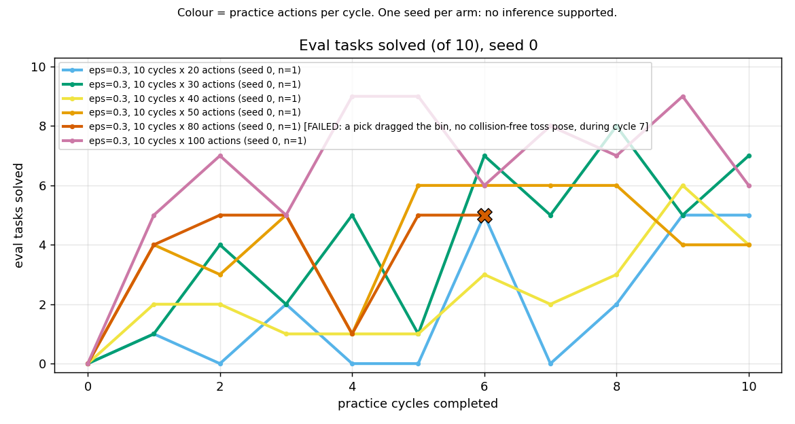

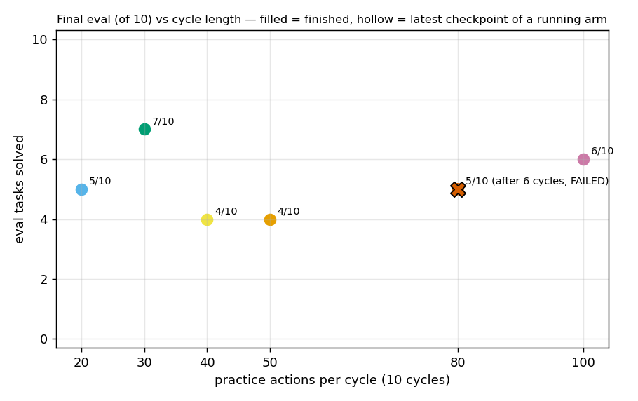

Not committed from the live page: Practice timelines — which skill was chosen at each action of each cycle (5/6 files).

### EXP-08c: More actions per cycle at lower ε — 100 actions × 10 cycles, ε = 0.3

*2026-09-25.* HTML page: [exp-08c.html](2026-09-25-tossing3d-exp08-12-html/exp-08c.html). Results sub-page: [exp08-eps-budget.html](2026-09-25-tossing3d-exp08-12-html/exp08-eps-budget.html).

- **Practice side.** Robot side only — FORCED by code, not chosen by the planner. From #366 (first commit 57196f0a, 2026-09-25 00:31; stack commits 47c30231 / fe73dc1c / 8bb9a337) practice resets could only put the bin on the robot side and every practice scene was rebuilt with the bin on the robot side. Josh reversed this on 2026-09-25 ~21:40 (the planner must choose); results here are conditional on forced same-side practice.
- **Question.** Does a much bigger per-cycle budget (with the same 10 classifier refits) beat more cycles?
- **Hypothesis.** Pre-registered. The largest budget (~1,000 actions) collects the most successes and scores best. If it does not beat 30 cycles × 20 actions (~600 actions, 30 refits), refitting often matters more than raw throw count. (Confounded with ε = 0.3 by design; compare against EXP-08a's ε curve.)
- **Results TL;DR.** Partly supported (one seed, no inference): 100 actions per cycle gets the first practice success in cycle 1 (vs cycle 5 at 20 actions) and the best area under the curve of any 10-cycle run (71/110 vs 20–28/110), peaking at 9/10 on cycles 4, 5 and 9. But final eval is only 6/10 — eval swings 6 ↔ 9 between cycles.
- **Code note.** Launched on d7b7ba30, before EXP-07d's change (pick/open/reset counts stay at 0). EXP-07d found that makes essentially no behavioural difference.
- **Arms.** ε = 0.3, λ = 0, --max-steps-per-interaction 100, 10 cycles, seed 0, Model A + grid, notebook-matched code, evidence non-ε. One seed: no inference.
- **Status.** Done.

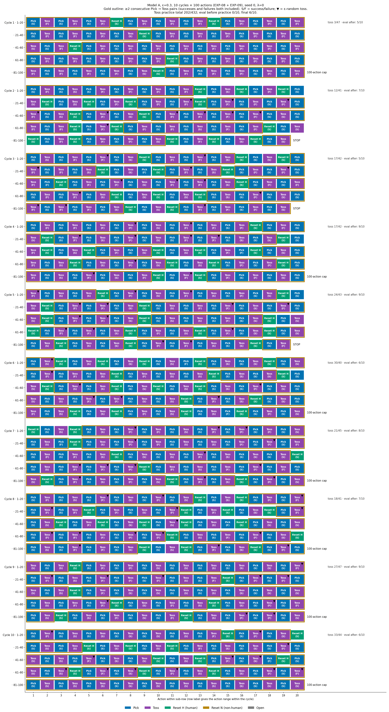

### EXP-08b: More practice cycles — 30 cycles at ε = 0.5

*2026-09-25.* HTML page: [exp-08b.html](2026-09-25-tossing3d-exp08-12-html/exp-08b.html). Results sub-page: [exp08-eps-budget.html](2026-09-25-tossing3d-exp08-12-html/exp08-eps-budget.html).

- **Practice side.** Robot side only — FORCED by code, not chosen by the planner. From #366 (first commit 57196f0a, 2026-09-25 00:31; stack commits 47c30231 / fe73dc1c / 8bb9a337) practice resets could only put the bin on the robot side and every practice scene was rebuilt with the bin on the robot side. Josh reversed this on 2026-09-25 ~21:40 (the planner must choose); results here are conditional on forced same-side practice.
- **Question.** Does toss learning keep improving with more practice, or plateau by cycle 10?
- **Hypothesis.** Pre-registered. Toss learning is success-starved, so eval keeps climbing past cycle 10 instead of plateauing (surrogate replay predicted ~+1.7/10 for 3× budget). Check: the 30-cycle run's first 10 cycles replay the 10-cycle run exactly.
- **Results TL;DR.** Supported (one seed, no inference): 30 cycles end at 8/10 vs 5/10 at 10 cycles. It replays the 10-cycle run exactly (byte-identical draws and traces) through cycle 10, then climbs to 10/10 at cycle 19; 9/10 on 6 of the last 12 cycles. Classifier picks score 90/112 over the whole run.
- **Code note.** Launched on d7b7ba30, before EXP-07d's change (pick/open/reset counts stay at 0). EXP-07d found that makes essentially no behavioural difference.
- **Arms.** ε = 0.5, λ = 0, 20 actions per cycle, 30 cycles, seed 0 (plus the best ε from EXP-08a at 30 cycles if time allows). One seed: no inference.
- **Status.** Done.

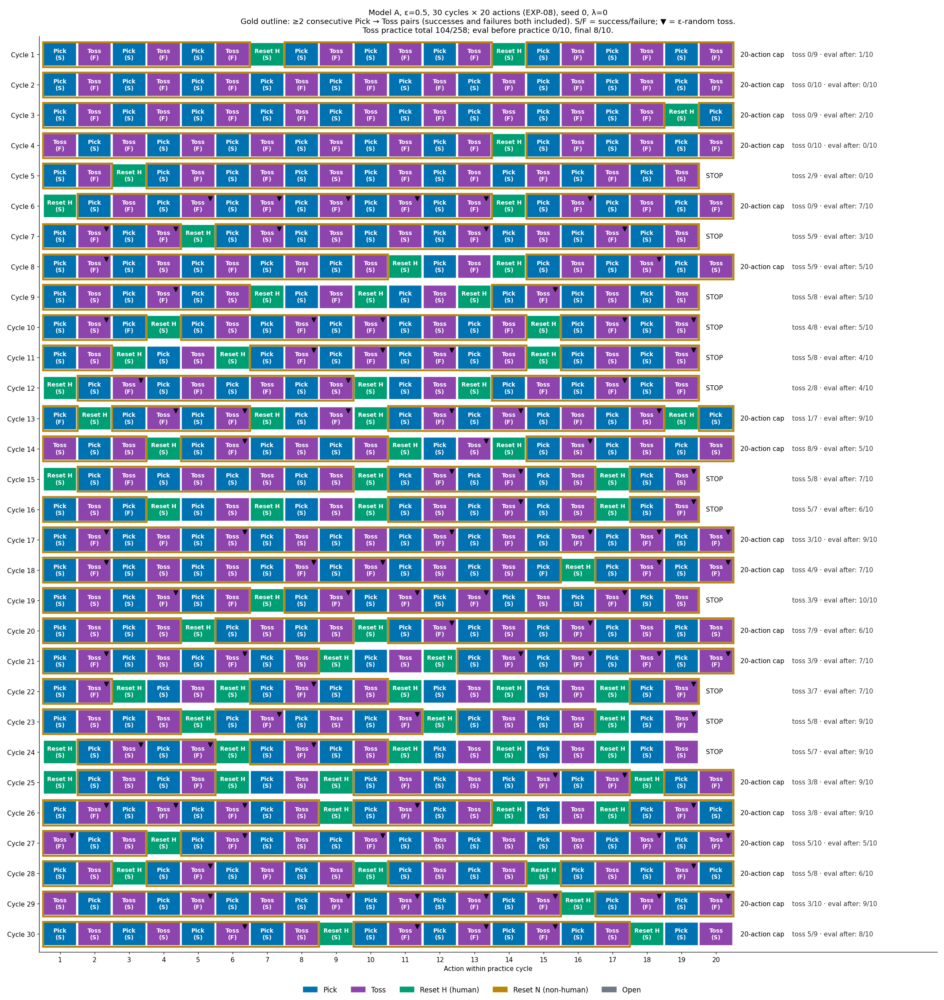

- Video: [EXP-08b practice cycle 19 (the eval after it was the first 10/10); re-encoded at lower quality](2026-09-25-tossing3d-exp08b-eps0.5-c30-practice-cycle19.mp4)

Not committed from the live page: Practice video — all 30 cycles (Model A, ε = 0.5, seed 0, λ = 0) (2/3 files).

### EXP-08a: Exploration ε — 0.5 vs 0.25 vs 0.1 vs 0 at 10 cycles

*2026-09-25.* HTML page: [exp-08a.html](2026-09-25-tossing3d-exp08-12-html/exp-08a.html). Results sub-page: [exp08-eps-budget.html](2026-09-25-tossing3d-exp08-12-html/exp08-eps-budget.html).

- **Practice side.** Robot side only — FORCED by code, not chosen by the planner. From #366 (first commit 57196f0a, 2026-09-25 00:31; stack commits 47c30231 / fe73dc1c / 8bb9a337) practice resets could only put the bin on the robot side and every practice scene was rebuilt with the bin on the robot side. Josh reversed this on 2026-09-25 ~21:40 (the planner must choose); results here are conditional on forced same-side practice.
- **Question.** Is ε = 0.5 (the paper's fixed EES value, never annealed) too high for our wide proposal, where only ~1 in 10 random throws score?
- **Hypothesis.** Pre-registered. Lowering ε gives the classifier more successes per cycle and so improves eval, best around ε = 0.1–0.25; ε = 0 risks locking into its own biases (e.g. under-throwing). Competing null: no eval change, because eval already uses the classifier's pick (the surrogate replay predicted ~0).
- **Results TL;DR.** No ε effect (one seed, no inference): final 5, 5, 4, 4 of 10 for ε = 0.5, 0.25, 0.1, 0. ε does fire (0.5: 20 random throws, 4 scored; 0.25: 7, 0 scored; 0.1: 3, 0 scored), but random throws score 0/30 to 4/20 while the classifier's picks score 15/23 to 20/43, so ε mostly trades good throws for bad ones. All four arms are identical until the first success (cycle 5); ε = 0.1 and ε = 0 give the same eval every cycle despite ε = 0.1's three random throws.
- **Code note.** Launched on d7b7ba30, before EXP-07d's change (pick/open/reset counts stay at 0). EXP-07d found that makes essentially no behavioural difference.
- **Arms.** ε ∈ {0.5, 0.25, 0.1, 0}, λ = 0, 20 actions × 10 cycles, seed 0, Model A + grid, notebook-matched code, evidence non-ε. One seed per arm: raw numbers only, no inference.
- **Status.** Done.

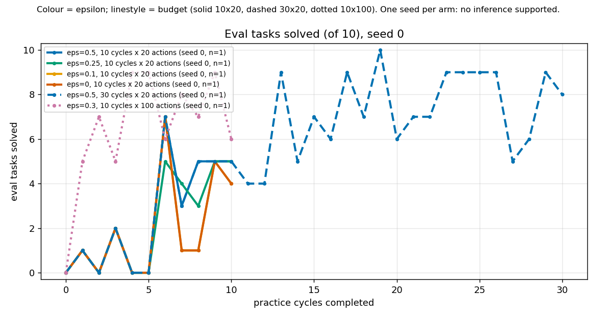

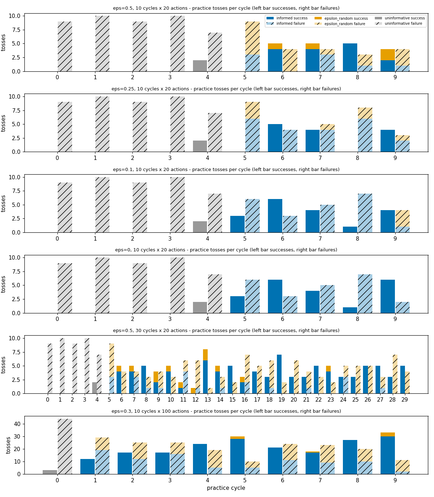

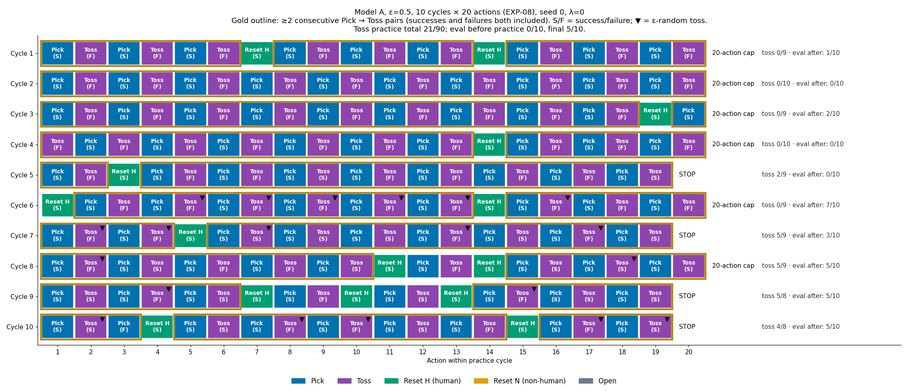

Not committed from the live page: Practice timelines — which skill was chosen at each action of each cycle (3/4 files).

## Decisions log

Every decision in the live log, with the experiment it followed (all of them, including those after experiments outside this log).

| date | after | decision |
| --- | --- | --- |
| 2026-09-25 | EXP-12 (Choosing λ) | Practice starts with the bin on the far side, and the planner chooses whether to reset and to which side. Nothing is forced: the planner must choose intelligently, not be made to make the right decision. (Reverses #366's forced same-side practice.) |
| 2026-09-25 | EXP-12 (Choosing λ) | Canonical practice-cost weight λ = 3e-6 for all methods (from EXP-12). |
| 2026-09-25 | EXP-07b (Which throws update toss competence) | Toss competence is updated only from non-ε throws (non_epsilon evidence), matching the paper's code. |
| 2026-09-26 | EXP-13 (Letting the planner choose the practice reset side) | The duplicate 'automatic' reset (a relabelled human reset) is disabled, and the planner no longer prunes resets that wouldn't change the state (#376, #377). |
| 2026-09-26 | EXP-14 (Sanity check + 2x2) | No special-casing of skills with knowledge the planner couldn't have: no stationary competence for fixed controllers, no side-dependent toss competence, and no model that learns a skill 'isn't improving' — the robot cannot know which skills will improve before practising them. |
| 2026-09-26 | EXP-14 (Sanity check + 2x2) | The search's random-toss success rate stays fixed at 0.25 (observed 7.9%); accepted as is. |
| 2026-09-26 | EXP-14 (Sanity check + 2x2) | Grid engine matches Tom's notebook discretisation exactly (#378). |
| 2026-09-27 | EXP-17 (Baselines) | No scheduled (free, every-cycle) resets for EES: it gets the same far-side starts and planner-chosen human resets as our method. EES is fixed to work under that protocol (EXP-18). |

## Open decisions

1. Review the draft PR stack #356 → #379, plus lab kinder-baselines#174.
2. Fix C (#375): after an imagined successful toss, the search now keeps GraspClear unchanged (optimistic in 197/430 real successes; the old code was wrong in 233/430). Keep it, or learn a per-context success model?
3. EES baseline: its reset-cost check only accepts a reset priced at most its largest skill cost (−log competence ≈ 0.095 at the prior), so a cost-5 reset is never used (EXP-17). EXP-18 tests costs 0.05 and 0; then a cost sweep, and how to put both methods' human-reset cost on one scale.
4. The poster's 'robot can reset, but it's easier for the robot' environment: needs a genuine robot-executed reset skill with its own cost — not designed yet.
5. Model A's φ2 grid caps late learning rates. Add slower rates?
6. kinder-baselines#174 (lab repo): its Test plan has one unsupported sentence; fixing it needs Josh's OK.

## Untested hypotheses

1. More seeds would firm up EXP-14's and EXP-15's null eval differences (n = 5 and 3).
2. An annealed ε beats a fixed ε.
3. Slower φ2 rates keep Model A practising at larger λ.
4. A learned success/failure-effect model per context sharpens the same-side preference.
5. A warm-started classifier removes the cold start (on hold).

## Overview snapshot (2026-09-27 10:30)

The live log's overview at the time of the snapshot. It describes the whole project, so it refers to experiments on either side of this log.

**Main goal.**

- The planner decides what to practise, when to pay for a human reset, and which side to put the bin on. Nothing is forced.
- Practice scenes start with the bin far-side; eval is far-side.
- Target: 10/10 eval.

**Canonical setup.**

- *Code:* f68a29dd: draft PRs #376 → #377 on #375 → … → #356
- *Cost weight λ:* 3e-6 (chosen from EXP-12)
- *Models:* A = global_curve; B = local_trend (ρ = 0.9)
- *Budget:* 50 cycles × 20 actions, ε = 0.5, grid engine
- *Competence:* non-ε evidence; every skill counts its attempts
- *Resets:* human only (cost 5); the planner picks the side; no pruning

**Where we are.**

- 50 × 20 practice reaches about 8–9/10 eval (mean of the last 5 evals) for both models (EXP-12, EXP-14, EXP-15). Doubling to 100 cycles adds about +0.6 and plateaus near 9 (EXP-16). Model B hits 10/10 in about a third of late cycles, but never holds it for more than 6 in a row.
- λ = 3e-6 cuts Model A's practice cost and human resets, mostly because Model A quits practising for good around cycles 31–45; it has no detectable effect on Model B (EXP-14, EXP-15, EXP-16).
- The planner sends the bin to the robot's side for about 93% of resets on its own (EXP-13 to EXP-15). Far-side tosses score 45/93 against 2744/4177 robot-side, and eval is all far-side.
- Unnecessary resets: all 187 'gave up a held cube' resets in EXP-14 come from OpenGripper's forecast learning value (#370's clocks); 18 optional resets come from sparse far-side failure data.

**Caveats on older results.**

- EXP-05 to EXP-12 ran with same-side practice forced (#366; reversed from EXP-13).
- EXP-05 to EXP-12: the search dropped GraspClear after imagined toss successes (fixed in #375).
- EXP-12: the 'automatic' reset was a relabelled human reset (disabled in #376).

## Provenance and what is not committed

- **Source.** Every experiment field, decision, open question and overview line above is
  generated from the data structures in the live log's generator. That generator is an
  uncommitted scratch script, `/tmp/claude-1000/percycle/home.py`. The snapshot was
  taken 2026-09-27 10:30. The HTML copy is the same generator's output, with every link
  rewritten to be repo-relative. A link to a file that is not committed becomes plain
  text marked "not committed".
- **Figures** are snapshots from the live log. No committed script regenerates them; they
  come from uncommitted scratch scripts beside `home.py`. Any PNG over 300 KB was
  palette-quantised, and downscaled only where that was not enough. The three clips were
  re-encoded with H.264 at CRF 32, and their content is unchanged.
- **Colour.** The EXP-12 λ figures colour by λ on a sequential scale, not by the house
  arm-role colours: every arm has the same mechanism, and λ is the only thing that
  differs.
- **Not committed.**
  - The per-cycle practice clips: `videos-exp08b-c30/`, 30 clips, 461 MB; and
    `videos-exp12/`, 6 runs of 50 clips plus the all-cycles videos, 3.9 GB.
  - Most practice timelines: 37 of 37 for EXP-12, and 19 of 22 for EXP-08 to EXP-11.
  - The remaining sub-page figures (learning rate, competence, landing error).
  - Two final-eval clips from EXP-08.
  - The original, full-quality versions of the three re-encoded clips.
- **Two percentages appear without their counts.** Both come from the live log's
  project-wide text and are copied verbatim.
  - The overview's "about 93% of resets" to the robot side is 2367/2546 in EXP-14 and
    460/494 in EXP-13, the counts those entries report.
  - The decisions log's "observed 7.9%" random-toss success rate appears without its
    count in the live log, and the count is not recovered here.
- **Run data** lives outside the repo in the local results trees (`hitl-pmp-results/`)
  and is not committed.
