# Tossing3D EXP-13 to EXP-18: the planner chooses the reset side, the canonical 2x2, longer practice, and baselines

**TL;DR.** Six experiments from 2026-09-25 to 2026-09-27, copied from the live experiment
log (snapshot 2026-09-27 10:45). An HTML copy of the same log is in
[2026-09-25-tossing3d-exp13-18-html/index.html](2026-09-25-tossing3d-exp13-18-html/index.html).
From EXP-13 on, practice scenes start with the bin on the far side, and the planner itself
chooses whether to reset and to which side. **Nothing is forced.** EXP-18 was still
running at the snapshot, so its numbers are interim and marked as such.

- **EXP-13: the planner picks the robot's side on its own** (seed 0 only, so no inference).
  It sent the bin to the robot's side in 460/494 resets.
- **EXP-14, the 2x2 of competence model × λ (5 seeds, paired): all three pre-registered
  hypotheses hold.**
  - At λ = 0 the two models end at similar eval: 8.28 vs 8.84, t p = 0.46.
  - λ = 3e-6 cuts Model A's practice cost by 279 (t p = 0.001; Wilcoxon p = 0.0625, the
    smallest n = 5 allows), with no detectable eval cost.
  - Resets go to the robot's side in 2367/2546 cases.
  - All 187/187 "gave up a held cube" resets trace to OpenGripper's forecast learning
    value.
- **EXP-15, EXP-14 re-run on the notebook-exact grid (#378): mostly holds**, but with
  low power (3 seeds; the smallest possible Wilcoxon p at n = 3 is 0.25).
- **EXP-16, 100 cycles instead of 50: eval plateaus below a sustained 10/10.** The last-5
  mean rises by +0.57 from cycle 50 to cycle 100 (paired t p = 0.064; suggestive, not
  significant). At λ = 3e-6, Model A stops practising altogether.
- **EXP-17, baselines.**
  - (a) Supported: without the human reset, our planner gets stuck, at a last-5 mean of
    0.73/10 against 7.87 and 8.33 with the reset (paired t p = 0.004 and < 0.001).
  - (b) Not answerable from this run: EES never used the cost-5 reset, because its
    reset-cost check rejects it. Its with-reset arm is therefore identical to its
    no-reset arm.
- **EXP-18, EES with a cheap human reset: interim.** At reset cost 0.05, EES reached 8/10
  at cycle 8 (seed 0). The runs are continuing to 50 cycles, and this PR will be updated
  with the final numbers.

## Background

This log continues the EXP-08 to EXP-12 log (`2026-09-25-tossing3d-exp08-12.md`, draft
PR #380). That PR sits on a sibling branch, so this log names it without linking to it. EXP-05 to EXP-12
ran with practice resets **forced** onto the robot side (#366). On 2026-09-25 Josh
reversed that: every practice scene starts with the bin on the far side, like eval, and
the planner must choose the reset side itself (#373). The same stack also fixed four
defects in the code EXP-05 to EXP-12 ran on:

- **#374:** reset placement no longer fails when the robot stands in the reset region;
  it moves the robot clear first.
- **#375:** the search keeps GraspClear through an imagined toss success, and starved
  parameter pools are cleared on every reset.
- **#376:** the duplicate "automatic" reset, a relabelled human reset, is disabled.
- **#377:** resets that would not change the symbolic state are no longer pruned.

**#378** makes the grid engine discretise exactly as Tom's notebook does, and **#379**
adds `--no-human-reset` for EXP-17's baseline arms.

- **Models.** Model A is `global_curve`, and Model B is `local_trend` with ρ = 0.9.
- **Canonical budget.** 50 cycles × 20 actions, ε = 0.5, grid engine, human reset cost 5,
  and `non_epsilon` toss evidence. λ = 3e-6 comes from EXP-12.
- **KINDER pins.** EXP-14 records no bump: kindergarden `6a42988` and kinder-baselines
  `427ad6c`.

## Code each experiment ran on

| experiment | code | PR |
| --- | --- | --- |
| EXP-13 | `94bf3207` | #375 (on #374, #373, #372) |
| EXP-14 | `f68a29dd` | #377 (on #376) |
| EXP-15, EXP-16 | `4d045c1f` | #378 |
| EXP-17 | `4d045c1f` for the with-reset arms; `98f91497` (#379, `--no-human-reset`) for the no-reset arms | #378, #379 |
| EXP-18 | `4d045c1f` | #378 |

This branch is based on `claude/no-human-reset-flag` (#379, `98f91497`), and every SHA in
the table is an ancestor of it. #379 records that with the flag *on*, `stats.json` is
byte-identical to `4d045c1f` for both our planner and EES.

**Caveats carried by the log.**

- EXP-13 is one seed per arm, so no inference.
- EXP-15 and EXP-16 have 3 seeds, so read directions rather than significance.
- In EXP-17, EES is the paper's method as published, not an ablation of ours: it scores
  practice against the eval tasks it has seen, and it has no λ.
- The "gave up a held cube" resets (#370's OpenGripper clock) persist through EXP-16.
  Josh decided not to special-case fixed controllers.

## Experiments

Newest first, as in the live log. Every field below is copied verbatim from the live log's entry (snapshot 2026-09-27 10:45); nothing is recomputed here.

### EXP-18: Getting EES to practise again — human reset priced under its reset-cost check

*2026-09-27.* HTML page: [exp-18.html](2026-09-25-tossing3d-exp13-18-html/exp-18.html).

- **Question.** With far-side practice starts, does EES learn (to at least 8/10) when its human reset is cheap enough for its own reset-cost check to accept it?
- **Hypothesis.** Pre-registered. EES stopped practising in EXP-17 because our port only accepts a planned reset whose cost is at most its largest skill cost (−log competence, ≈ 0.095 at the prior), so a cost-5 reset is always declined and EES strands after its first far-side toss. At cost 0.05 (under that limit from cycle 1) or 0, EES resets whenever it strands, keeps practising, and learns — as it did in August when nothing stranded it.
- **Changes vs EXP-17.** --human-reset-practice-cost 0.05 (one run) and 0 (one run); everything else identical: far-side practice starts, --practice-reset-policy never, 50 cycles × 20 actions, ε = 0.5, seed 0, code 4d045c1f.
- **Results TL;DR.** Supported so far (seed 0, runs continuing to 50 cycles): with the reset cheap enough to pass its check, EES practises normally and learns — at cost 0.05 it reached 8/10 at cycle 8 (evals 0, 0, 1, 0, 0, 1, 1, 6, 8; 118 practice actions by then), and cost 0 follows the same trajectory so far (…, 6 at cycle 7; 102 actions). In EXP-17, with the reset at cost 5, EES took 2–4 practice actions in the whole run.
- **Status.** Running — reached the ≥ 8/10 target at cycle 8 (cost 0.05); both runs continue to 50 cycles (~12:30). Next: the reset-cost sweep.

### EXP-17: Baselines — is the human reset needed, and is our planner better than EES?

*2026-09-27.* HTML page: [exp-17.html](2026-09-25-tossing3d-exp13-18-html/exp-17.html).

- **Question.** (a) Does practice need the human reset skill at all? (b) Does our belief-space planner beat the paper's EES method on the same task?
- **Hypothesis.** Pre-registered. (a) Without the human reset, both methods get stuck: once the cube is stranded far-side or lands in the bin there is no way out, so eval stops improving early (by construction, which is the point to show). (b) With the reset available, our planner (EXP-15, λ = 3e-6) reaches a similar or higher eval than EES at lower human-reset cost, because it chooses reset sides and when to stop; EES has no cost trade-off.
- **Arms.** 1: EES with the human reset. 2: EES without it. 3: our planner without it, Model A and Model B at λ = 3e-6. Reference: our planner with it = EXP-15's λ = 3e-6 arms (reused). Seeds 0–2 paired; 50 cycles × 20 actions, ε = 0.5, far-side practice start, human reset cost 5, practice-reset-policy never. Code 4d045c1f (#378) for the with-reset arms; the no-reset arms use a new --no-human-reset flag (draft PR #379 on #378, 98f91497; with the flag on, stats.json is byte-identical to 4d045c1f for both pomdp and EES).
- **EES with-reset arm is invalid (found 09:55).** EES never uses the human reset here, so its with-reset arm is identical to its no-reset arm (same evals and transitions, seed for seed). Our EES port only accepts a planned reset if its cost (5) is at most the largest skill cost, and EES's skill costs are −log(competence) ≈ 0.05–1.8, so a cost-5 reset is always declined; after its first toss strands the cube past the barrier, EES stops practising for the rest of the run (1–2 tosses per run). This ceiling came from #273 and is our addition; predicators has no human reset and resets the scene every cycle (our --practice-reset-policy scheduled). Question (a) for EES and question (b) need re-running once this is resolved.
- **Comparability caveat.** EES is the paper's method as published, not an ablation of ours: it scores practice by planning progress on the evaluation tasks it has seen (the far-side eval distribution), has its own competence model, and has no practice-cost weight λ; our planner never sees the eval tasks.
- **Results TL;DR.** (a) Supported: without the human reset, our planner gets stuck — 2–12 practice actions per 50-cycle run, eval (mean of the last 5) 0.73/10 vs 7.87 (Model A) and 8.33 (Model B) with the reset (EXP-15, same seeds): +7.1 and +7.6, paired t p = 0.004 and < 0.001. Models A and B are identical without the reset: they strand before the model matters. (b) Not answerable from this run: EES never used the reset at cost 5 (its reset-cost check rejects it), so its with-reset arm is identical to its no-reset arm (1.80/10, 2–4 practice actions per run). Our planner with the reset beats this EES by +6.5 (p < 0.001), but that EES isn't really using resets — see EXP-18 for EES with a usable reset.
- **Status.** Done (10:30) — 12/12 runs finished, 0 failures. (b) continues in EXP-18.
- **Decisions after this experiment.**
  - 2026-09-27: No scheduled (free, every-cycle) resets for EES: it gets the same far-side starts and planner-chosen human resets as our method. EES is fixed to work under that protocol (EXP-18).

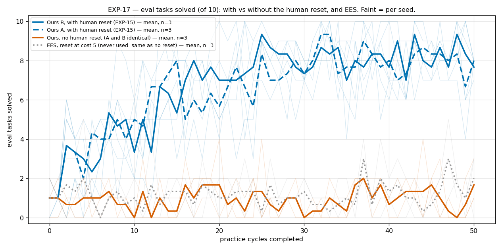

### EXP-16: Longer practice — 100 cycles × 20 actions at the canonical λ

*2026-09-26.* HTML page: [exp-16.html](2026-09-25-tossing3d-exp13-18-html/exp-16.html). Results sub-page: [exp16-100cycles.html](2026-09-25-tossing3d-exp13-18-html/exp16-100cycles.html).

- **Question.** Does doubling practice from 50 to 100 cycles get eval to a sustained 10/10, or does it plateau?
- **Hypothesis.** Pre-registered. Eval (mean of the last 5 evals) keeps rising past cycle 50 for both models but plateaus below a sustained 10/10 (around 9/10), because the toss classifier's far-side accuracy, not the amount of practice, is the limit (far-side greedy tosses scored 45/93 vs 2744/4177 robot-side in EXP-14). Model A at λ = 3e-6 may stop practising in late cycles, as it did after cycle ~42 in EXP-14.
- **Arms.** {Model A (global_curve), Model B (local_trend, ρ = 0.9)} at λ = 3e-6, seeds 0–2; 100 cycles × 20 actions, otherwise identical to EXP-15. Code 4d045c1f (#378, on #377).
- **Results TL;DR.** Plateaus below a sustained 10/10, as predicted — and Model A stops practising altogether. Mean of the last 5 evals rises from cycle 50 to 100 by +0.57 on average (6/6 runs pooled; paired t p = 0.064, Wilcoxon p = 0.094 — suggestive, not significant): Model A 7.87 → 8.47, Model B 8.33 → 8.87. Model B practises every cycle (≈ 990 actions in cycles 51–100) and scores 10/10 in 14, 17 and 19 of cycles 51–100 (mean 8.7–9.0 over that span; longest run of consecutive 10/10s: 3, 3, 6). Model A at λ = 3e-6 did 0 practice actions in cycles 51–100 on all 3 seeds (it had quit by cycles ~31–45), yet its eval kept drifting (7.4–8.5 mean over 51–100), so part of the cycle-to-cycle eval swing is evaluation noise, not learning. Neither model holds 10/10: the remaining gap looks like the far-side toss accuracy the classifier reaches, not the amount of practice.
- **Status.** Done (20:32) — 6/6 runs finished, 0 failures.

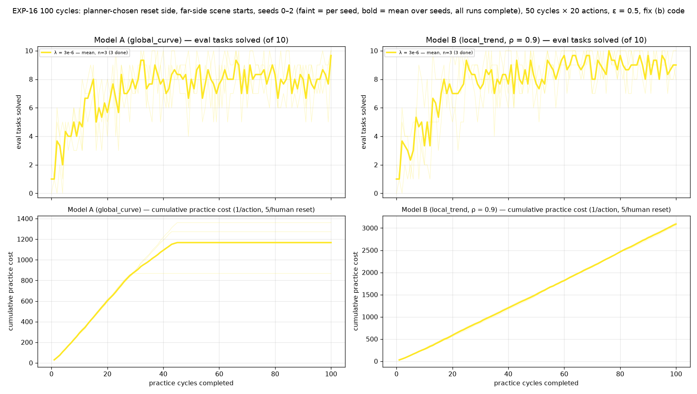

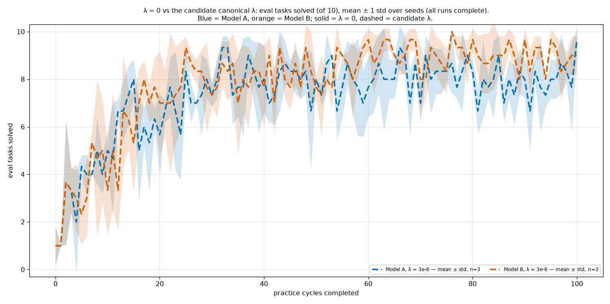

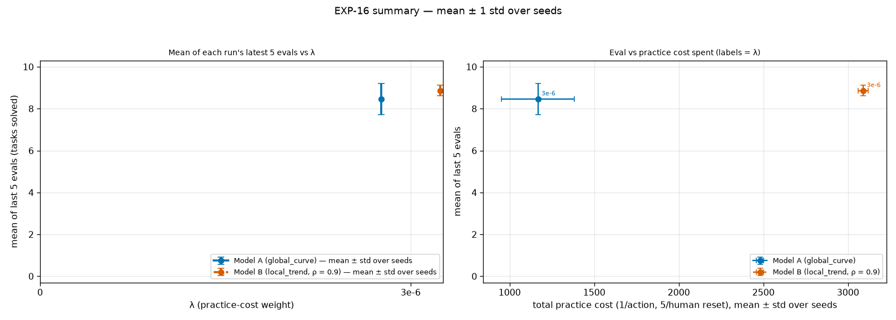

- Video: [EXP-16 Model B, λ = 3e-6, seed 0, practice cycle 84 (4x)](2026-09-25-tossing3d-exp16-model-b-lam3e-6-s0-practice-cycle84.mp4)

Not committed from the live page: EXP-16 practice videos — all 6 runs (100 cycles) (12/12 files); EXP-16 cumulative counts (interactive) (2/2 files); EXP-16 interactive practice charts — all 6 runs (1/1 files).

### EXP-15: Re-baseline on the final code — EXP-14's 2x2 on the notebook-exact grid (#378)

*2026-09-26.* HTML page: [exp-15.html](2026-09-25-tossing3d-exp13-18-html/exp-15.html). Results sub-page: [exp15-rebaseline.html](2026-09-25-tossing3d-exp13-18-html/exp15-rebaseline.html).

- **Question.** Do EXP-14's results hold on the final code, where the grid engine discretises exactly as Tom's notebook does (#378)?
- **Hypothesis.** Pre-registered. #378 shifts Model B's competence estimate by up to 0.014 and Model A's by ≤ 0.0005, mostly in the prior, so EXP-14's conclusions hold: similar eval for A and B at λ = 0; λ = 3e-6 cuts Model A's practice cost with no detectable eval loss and leaves Model B unchanged; resets go predominantly to the robot side. Model B's early cycles may differ slightly.
- **Changes vs EXP-14.** Draft PR #378: the grid engine evaluates densities at grid points (notebook-exact) instead of integrating over bins. Nothing else changed.
- **Arms.** {Model A, Model B} × λ ∈ {0, 3e-6}, seeds 0–2 (paired); 50 cycles × 20 actions, ε = 0.5, grid engine, human reset cost 5, non-ε evidence, far-side practice start, planner-chosen reset side. Code 4d045c1f, pinned checkout hitl-pmp-runs-4d045c1f.
- **Results TL;DR.** Mostly holds, with low power (3 seeds, paired; the smallest possible Wilcoxon p at n = 3 is 0.25, so read the directions, not significance). Mean of the last 5 evals: Model A 8.93 (λ = 0) → 7.87 (3e-6), −1.07, t p = 0.34; Model B 7.80 → 8.33, +0.53, t p = 0.46. λ = 3e-6 again cuts Model A's practice cost (−384, lower on 3/3 seeds, t p = 0.13) and human resets (−36, 3/3 lower), and leaves Model B unchanged (cost −0.3, t p = 0.99). At λ = 0, Model B is 1.13 below Model A (t p = 0.41; no detectable difference), whereas in EXP-14 it was 0.56 above — on the same seeds, Model B's λ = 0 last-5 mean fell from 8.87 (EXP-14) to 7.80, which may be #378's prior shift (Model B moved up to 0.014) or run-to-run divergence; with n = 3, not resolved. Model A λ = 3e-6 again stops practising in late cycles (seed 2 raced ahead), and the 'gave up a held cube' resets remain (Model A ~18/run at λ = 0, ~8 at 3e-6; Model B 2–4) — #378 does not touch the OpenGripper clock.
- **Status.** Done (19:48) — 12/12 runs finished, 0 failures.

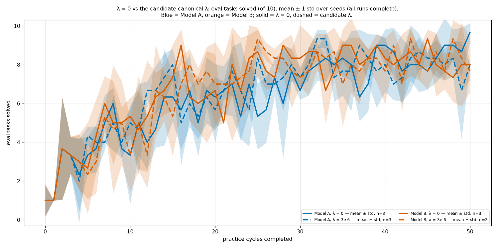

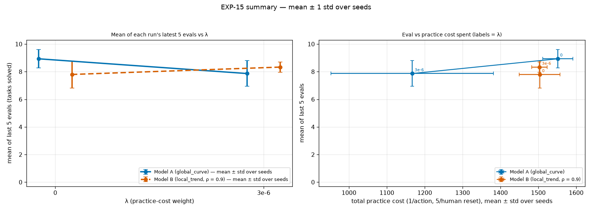

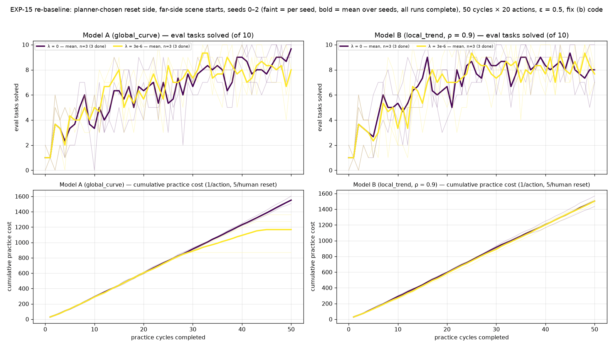

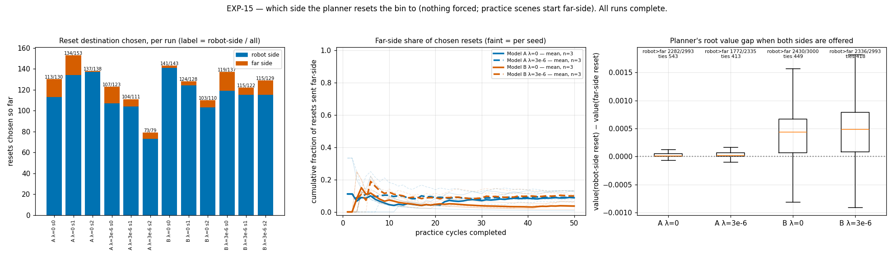

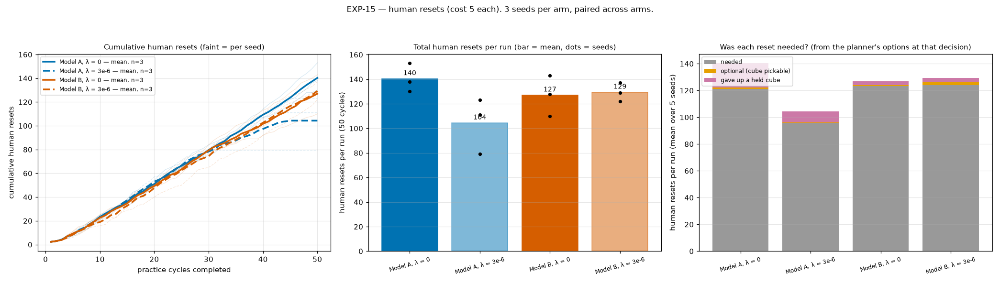

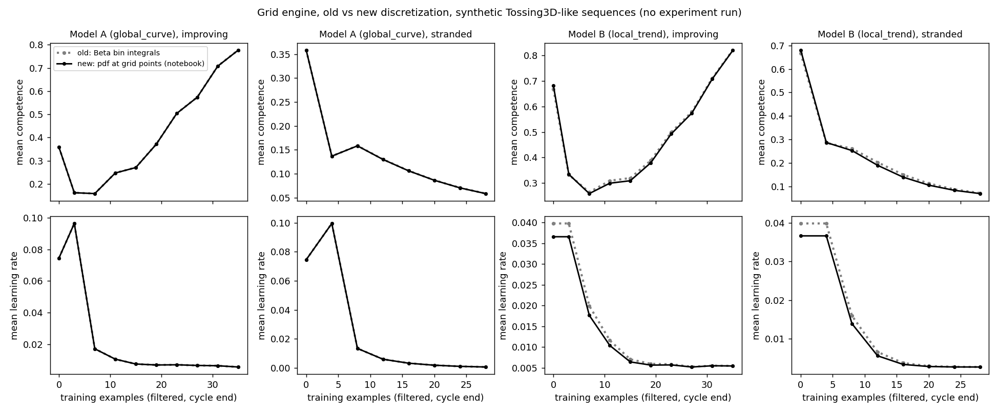

Not committed from the live page: EXP-15 practice videos — all 12 runs (24/24 files); EXP-15 cumulative counts (interactive) (1/1 files); EXP-15 interactive practice charts — all 12 runs (1/1 files).

### EXP-14: Sanity check + 2x2 — competence model × practice cost, 5 seeds, on the cleaned-up planner and the latest KINDER

*2026-09-25.* HTML page: [exp-14.html](2026-09-25-tossing3d-exp13-18-html/exp-14.html). Results sub-page: [exp14-2x2.html](2026-09-25-tossing3d-exp13-18-html/exp14-2x2.html). Results sub-page: [exp14-unnecessary-resets.html](2026-09-25-tossing3d-exp13-18-html/exp14-unnecessary-resets.html).

- **Question.** Does the competence model (A vs B) and the practice cost (λ = 0 vs the canonical 3e-6) change eval, practice cost and human resets, when the planner chooses what to practise, when to reset and to which side — with only one (human) reset skill, no pruning of resets, and the latest kindergarden + kinder-baselines?
- **Hypothesis.** Pre-registered. (1) At λ = 0 the two models end at similar eval. (2) λ = 3e-6 cuts Model A's practice cost at a cost of under 1 eval task and barely changes Model B, so any model × λ interaction mostly reflects that difference in sensitivity. (3) Resets go predominantly to the robot's side in every arm, as in EXP-13 — now without the duplicate reset skill or reset pruning shaping the choice.
- **Changes vs EXP-13 (Josh, 23:45).** Draft PR #376: the duplicate reset skill (non_human_reset, a relabelled human reset) is disabled (offer_non_human_reset defaults to False). Draft PR #377: the planner no longer prunes resets that would not change the symbolic state (root search grows ~20–40%, still terminates at depth 6). KINDER pins: no bump — kindergarden 6a42988 and kinder-baselines 427ad6c are already the newest commits on any branch (the default branches are strictly older), so geometry is unchanged. Code f68a29dd; full gate passed (1043 + 1558 tests).
- **Results TL;DR.** All three pre-registered hypotheses hold (5 seeds, paired; with n = 5 the smallest possible two-sided Wilcoxon p is 0.0625). (1) At λ = 0 the models end at similar eval: mean of the last 5 evals 8.28 ± 1.33 (Model A) vs 8.84 ± 0.51 (Model B), difference +0.56, paired t p = 0.46 — no difference detected. (2) λ = 3e-6 cuts Model A's practice cost by 279 (1538 → 1259, −18%; paired t p = 0.001, Wilcoxon p = 0.0625, all 5 seeds lower) and its human resets by 27 (136 → 108; t p = 0.010), at no detectable eval cost (8.28 → 7.96, t p = 0.71). For Model B it changes nothing detectable (cost +23, t p = 0.25; eval −0.40, t p = 0.38) — so the model × λ interaction is Model A's sensitivity to the cost, as predicted. (3) The planner sends the bin to the robot's side for 2367/2546 resets (93%), without being forced: Model A 617/679 (λ = 0) and 486/542 (3e-6); Model B 617/646 and 647/679. Where both sides were offered, the robot side valued higher in most root evaluations (gap small, +0.0001 to +0.0008). Human resets per run: Model A 136 → 108 with the cost on (all 5 seeds lower), but mostly because Model A stops practising entirely in its last ~8 cycles, not because it resets more carefully; Model B 129 → 136 (no detectable change). About 1 reset per run was optional (the cube was pickable); 2–20 per run gave up a held cube instead of tossing it (Model A λ = 0: ~18; λ = 3e-6: ~9; Model B: 2–10); the rest had no pick or toss available. Unnecessary-reset analysis (205 resets, every decision rebuilt offline and matched to the log exactly): all 187 resets that gave up a held cube are caused by OpenGripper's forecast learning value, since #370 gives the fixed controller a training clock and the reset path unlocks an OpenGripper attempt (freezing that clock flips 187/187 to toss); the 18 optional resets come from sparse failure-effect data on the far side. Josh (2026-09-26): don't special-case fixed controllers — the planner can't know a priori which skills are static. 0 crashes in 20 runs. Model A at λ = 3e-6 has cycles where the planner STOPs at its first decision (0 practice actions): 5, 8, 8, 6 and 7 of 50 cycles for seeds 0–4; no other arm does this. Final evals (per seed): A λ = 0 8/4/9/7/9, A 3e-6 8/8/10/6/7, B λ = 0 9/8/10/8/10, B 3e-6 7/8/10/9/8.
- **Superseded.** A first 2x2 on EXP-13's code (seeds 1–4, launched 22:40) was cancelled at 23:45 at cycles 8–19 when the design changed; its partial data stays in hitl-pmp-results/exp13/results (pomdp/1–4) and is not part of any result.
- **Arms.** Sanity check first: {Model A, Model B} × λ ∈ {0, 3e-6}, seed 0. If healthy, seeds 1–4 of the same four arms (paired, seed-first). 50 cycles × 20 actions, ε = 0.5, grid engine, human reset cost 5, non_epsilon evidence, practice scenes start far-side, the planner chooses the reset side.
- **Status.** Done (04:00) — 20/20 runs finished, 0 failures. Figures and per-seed table: exp14-2x2/index.html.
- **Decisions after this experiment.**
  - 2026-09-26: No special-casing of skills with knowledge the planner couldn't have: no stationary competence for fixed controllers, no side-dependent toss competence, and no model that learns a skill 'isn't improving' — the robot cannot know which skills will improve before practising them.
  - 2026-09-26: The search's random-toss success rate stays fixed at 0.25 (observed 7.9%); accepted as is.
  - 2026-09-26: Grid engine matches Tom's notebook discretisation exactly (#378).

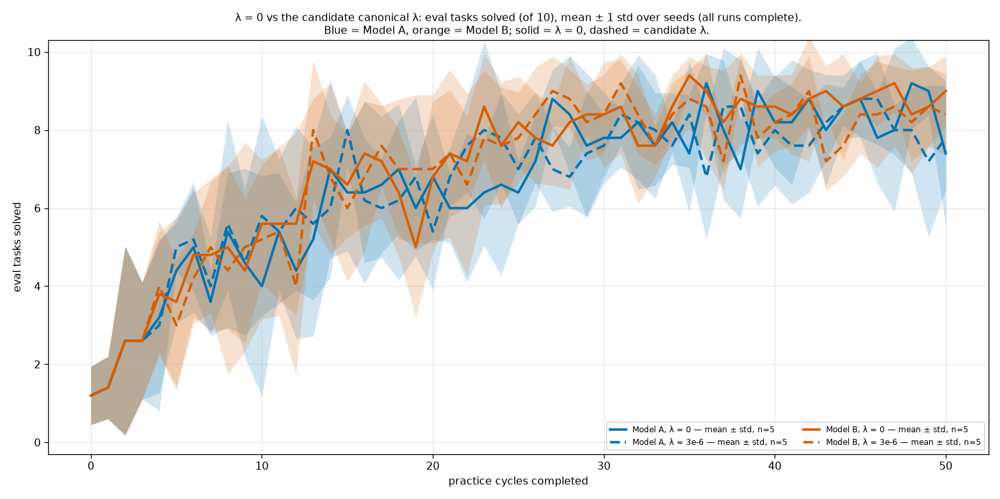

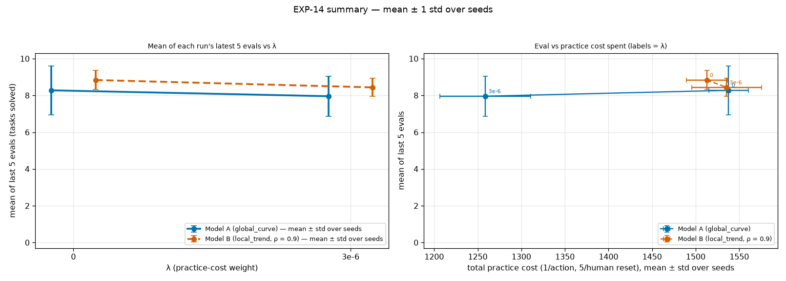

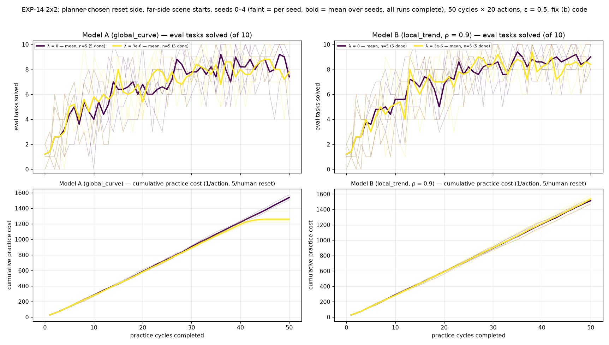

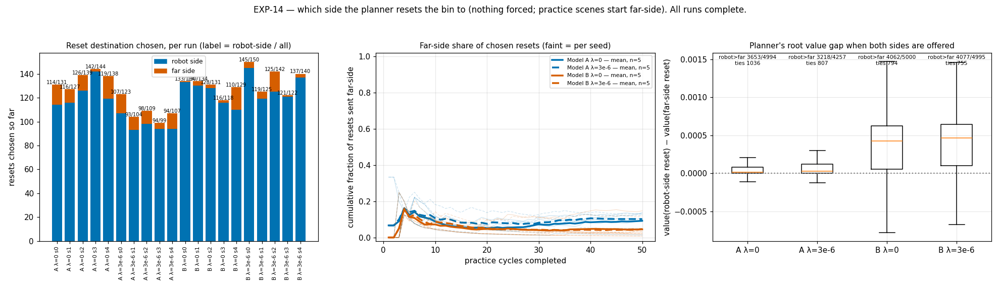

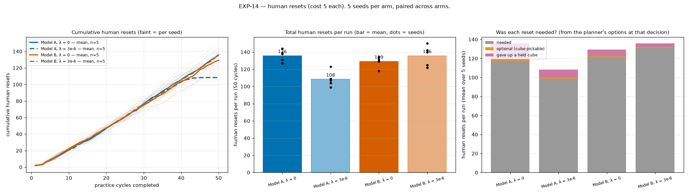

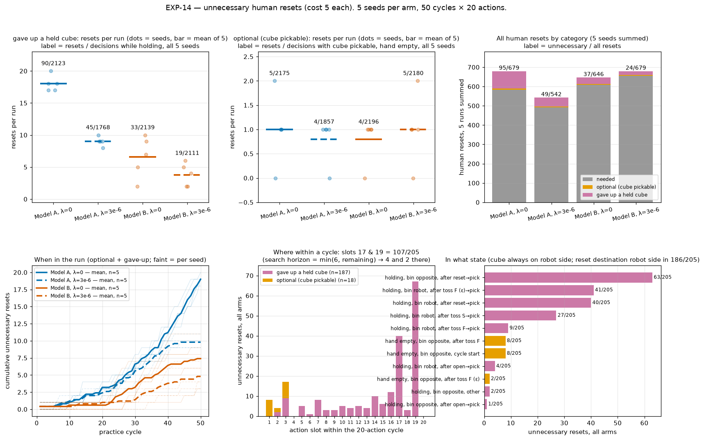

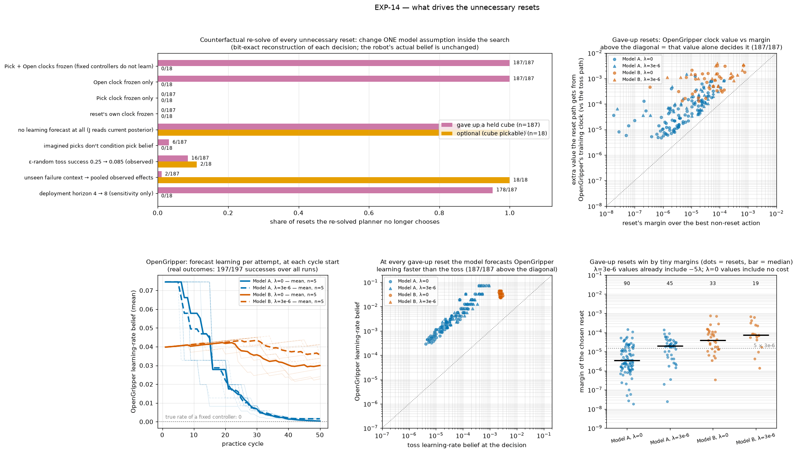

- Video: [EXP-14 an unnecessary reset: Model A, λ = 0, seed 0, cycle 17, decision 341](2026-09-25-tossing3d-exp14-unnecessary-reset-model-a-lam0-s0-c17-d0341.mp4)
- Video: [EXP-14 Model A, λ = 0, seed 0, practice cycle 38 (4x)](2026-09-25-tossing3d-exp14-model-a-lam0-s0-practice-cycle38.mp4)

Not committed from the live page: EXP-14 practice timelines — all 20 runs (20/20 files); EXP-14 practice videos — all 20 runs (40/40 files); EXP-14 cumulative counts (interactive) (1/1 files); EXP-14 interactive practice charts — all 20 runs (1/1 files).

### EXP-13: Letting the planner choose the practice reset side — does it choose the robot's side on its own?

*2026-09-25.* HTML page: [exp-13.html](2026-09-25-tossing3d-exp13-18-html/exp-13.html).

- **Question.** When the practice reset may put the bin on either side of the barrier (the planner picks the grounding), which side does it choose, and does practice still transfer to far-side eval?
- **Hypothesis.** Pre-registered. With no side preference built in (no extra cost, no side-aware competence — Josh: "don't force it"), the planner has no model-based reason to prefer a side, because toss is one skill with robot-relative features and both reset groundings cost 5. Prediction: the side it chooses is set by tie-breaking or incidental feasibility, not predominantly the robot's side. Josh's target behaviour is "able to choose either side, predominantly the same side"; this run measures how far the unbiased planner is from that.
- **Results TL;DR.** Supported — with the reset side left to the planner, it sends the bin to the robot's side predominantly on its own (seed 0, 50 cycles): Model A 114/131 (λ = 0) and 88/103 (3e-6); Model B 133/134 and 125/126 — 460/494 overall (93%). Where both sides were offered, the robot-side reset valued higher in 3932/4994 root evaluations, far side in 222, ties 840 (gap small, +0.0001 to +0.0004). Final eval 8, 8, 9, 8 of 10 (mean of the last 5 evals 8.2, 7.0, 8.8, 8.8). 0 crashes. Note: at λ = 0 the EXP-14 seed-0 runs are identical to these (same choices and evals), so removing the duplicate reset and the reset pruning changed nothing at λ = 0; the λ = 3e-6 runs differ. Correction kept from 22:25: an early check claimed the far side was never offered; that was an analysis-script bug, withdrawn.
- **Arms.** {Model A (global_curve), Model B (local_trend, ρ = 0.9)} × λ ∈ {0, 3e-6}; seed 0 only (one run per arm: no inference supported); 50 cycles × 20 actions, ε = 0.5, grid engine, human reset cost 5, non_epsilon evidence. Code: 94bf3207 (draft PRs #373 side choice + far-side scenes → #374 placement/far-band fixes → #375 GraspClear/starved-pool fixes, stacked on #372; full gate 2597 passed) — reset side is the planner's choice, every practice scene starts with the bin far-side, plus bug fixes: bin placement relocates a blocking robot, a far-bin band error becomes a rejection, the search keeps GraspClear after an imagined toss success, starved pools clear on every reset. Runs use a pinned checkout (hitl-pmp-runs-94bf3207).
- **Measures.** Per run: count and fraction of practice resets to each side per cycle, eval per cycle, practice tosses by bin side, and practice cost.
- **Status.** Done — 4/4 seed-0 runs finished (Model A last, ~04:30). Seeds 1–4 of this code were cancelled and superseded by EXP-14.
- **Decisions after this experiment.**
  - 2026-09-26: The duplicate 'automatic' reset (a relabelled human reset) is disabled, and the planner no longer prunes resets that wouldn't change the state (#376, #377).

## Decisions log

Every decision in the live log, with the experiment it followed (all of them, including those after experiments outside this log).

| date | after | decision |
| --- | --- | --- |
| 2026-09-25 | EXP-12 (Choosing λ) | Practice starts with the bin on the far side, and the planner chooses whether to reset and to which side. Nothing is forced: the planner must choose intelligently, not be made to make the right decision. (Reverses #366's forced same-side practice.) |
| 2026-09-25 | EXP-12 (Choosing λ) | Canonical practice-cost weight λ = 3e-6 for all methods (from EXP-12). |
| 2026-09-25 | EXP-07b (Which throws update toss competence) | Toss competence is updated only from non-ε throws (non_epsilon evidence), matching the paper's code. |
| 2026-09-26 | EXP-13 (Letting the planner choose the practice reset side) | The duplicate 'automatic' reset (a relabelled human reset) is disabled, and the planner no longer prunes resets that wouldn't change the state (#376, #377). |
| 2026-09-26 | EXP-14 (Sanity check + 2x2) | No special-casing of skills with knowledge the planner couldn't have: no stationary competence for fixed controllers, no side-dependent toss competence, and no model that learns a skill 'isn't improving' — the robot cannot know which skills will improve before practising them. |
| 2026-09-26 | EXP-14 (Sanity check + 2x2) | The search's random-toss success rate stays fixed at 0.25 (observed 7.9%); accepted as is. |
| 2026-09-26 | EXP-14 (Sanity check + 2x2) | Grid engine matches Tom's notebook discretisation exactly (#378). |
| 2026-09-27 | EXP-17 (Baselines) | No scheduled (free, every-cycle) resets for EES: it gets the same far-side starts and planner-chosen human resets as our method. EES is fixed to work under that protocol (EXP-18). |

## Open decisions

1. Review the draft PR stack #356 → #379, plus lab kinder-baselines#174.
2. Fix C (#375): after an imagined successful toss, the search now keeps GraspClear unchanged (optimistic in 197/430 real successes; the old code was wrong in 233/430). Keep it, or learn a per-context success model?
3. EES baseline: its reset-cost check only accepts a reset priced at most its largest skill cost (−log competence ≈ 0.095 at the prior), so a cost-5 reset is never used (EXP-17). EXP-18 tests costs 0.05 and 0; then a cost sweep, and how to put both methods' human-reset cost on one scale.
4. The poster's 'robot can reset, but it's easier for the robot' environment: needs a genuine robot-executed reset skill with its own cost — not designed yet.
5. Model A's φ2 grid caps late learning rates. Add slower rates?
6. kinder-baselines#174 (lab repo): its Test plan has one unsupported sentence; fixing it needs Josh's OK.

## Untested hypotheses

1. More seeds would firm up EXP-14's and EXP-15's null eval differences (n = 5 and 3).
2. An annealed ε beats a fixed ε.
3. Slower φ2 rates keep Model A practising at larger λ.
4. A learned success/failure-effect model per context sharpens the same-side preference.
5. A warm-started classifier removes the cold start (on hold).

## Overview snapshot (2026-09-27 10:45)

The live log's overview at the time of the snapshot. It describes the whole project, so it refers to experiments on either side of this log.

**Main goal.**

- The planner decides what to practise, when to pay for a human reset, and which side to put the bin on. Nothing is forced.
- Practice scenes start with the bin far-side; eval is far-side.
- Target: 10/10 eval.

**Canonical setup.**

- *Code:* f68a29dd: draft PRs #376 → #377 on #375 → … → #356
- *Cost weight λ:* 3e-6 (chosen from EXP-12)
- *Models:* A = global_curve; B = local_trend (ρ = 0.9)
- *Budget:* 50 cycles × 20 actions, ε = 0.5, grid engine
- *Competence:* non-ε evidence; every skill counts its attempts
- *Resets:* human only (cost 5); the planner picks the side; no pruning

**Where we are.**

- 50 × 20 practice reaches about 8–9/10 eval (mean of the last 5 evals) for both models (EXP-12, EXP-14, EXP-15). Doubling to 100 cycles adds about +0.6 and plateaus near 9 (EXP-16). Model B hits 10/10 in about a third of late cycles, but never holds it for more than 6 in a row.
- λ = 3e-6 cuts Model A's practice cost and human resets, mostly because Model A quits practising for good around cycles 31–45; it has no detectable effect on Model B (EXP-14, EXP-15, EXP-16).
- The planner sends the bin to the robot's side for about 93% of resets on its own (EXP-13 to EXP-15). Far-side tosses score 45/93 against 2744/4177 robot-side, and eval is all far-side.
- Unnecessary resets: all 187 'gave up a held cube' resets in EXP-14 come from OpenGripper's forecast learning value (#370's clocks); 18 optional resets come from sparse far-side failure data.

**Caveats on older results.**

- EXP-05 to EXP-12 ran with same-side practice forced (#366; reversed from EXP-13).
- EXP-05 to EXP-12: the search dropped GraspClear after imagined toss successes (fixed in #375).
- EXP-12: the 'automatic' reset was a relabelled human reset (disabled in #376).

## Provenance and what is not committed

- **Source.** Every experiment field, decision, open question and overview line above is
  generated from the data structures in the live log's generator. That generator is an
  uncommitted scratch script, `/tmp/claude-1000/percycle/home.py`, and the snapshot was
  taken 2026-09-27 10:45. The HTML copy is the same generator's output, with every link
  rewritten to be repo-relative. A link to a file that is not committed becomes plain
  text marked "not committed".
- **EXP-18 is interim.** Its runs were still going at the snapshot, and this entry will
  be regenerated when they finish.
- **EXP-13 has no figures**, because the live log attached none to it.
- **Figures** are snapshots from the live log. No committed script regenerates them; they
  come from uncommitted scratch scripts beside `home.py`. Any PNG over 300 KB was
  palette-quantised, and downscaled only where that was not enough. The three clips are
  committed as rendered, each ≤ 3 MB.
- **Colour.** The EXP-14 to EXP-16 figures colour by λ on a sequential scale, not by the
  house arm-role colours: every arm has the same mechanism, and λ is the only thing that
  differs.
- **Not committed.**
  - The per-cycle practice clips and all-cycles videos: `videos-exp14/`, 7.8 GB;
    `videos-exp15/`, 4.6 GB; `videos-exp16/`, 3.4 GB.
  - The 20 EXP-14 practice timelines, 17 MB.
  - The interactive Plotly practice charts and cumulative-count pages, several MB each
    including the bundled `plotly.min.js`. **No PNG version of the cumulative counts
    exists**, so none is committed.
  - Of the 32 unnecessary-reset examples on the EXP-14 analysis page, 31 clips, plus all
    the decision-tree images and JSON.
- **Two percentages appear without their counts.** Both come from the live log's
  project-wide text and are copied verbatim.
  - The overview's "about 93% of resets" to the robot side is 2367/2546 in EXP-14 and
    460/494 in EXP-13, the counts those entries report.
  - The decisions log's "observed 7.9%" random-toss success rate appears without its
    count in the live log, and the count is not recovered here.
- **Run data** lives outside the repo, in the pinned run checkouts and the local results
  trees (`hitl-pmp-results/`), and is not committed.
