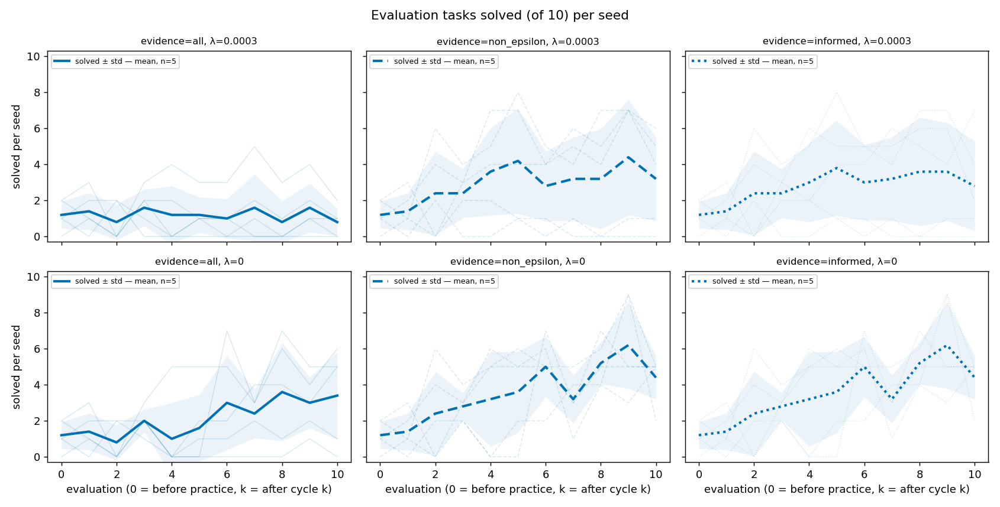
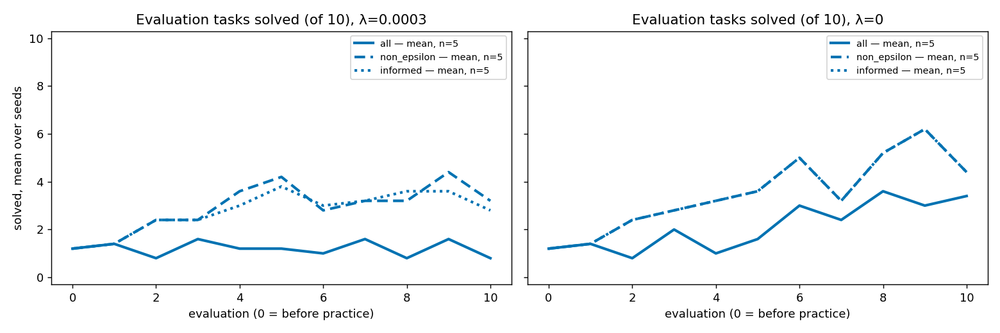
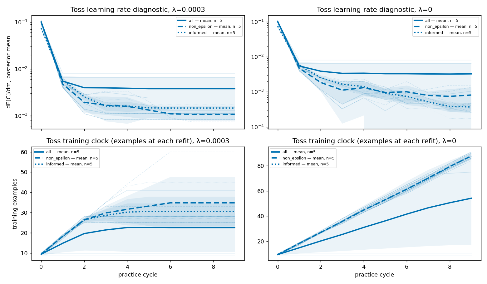
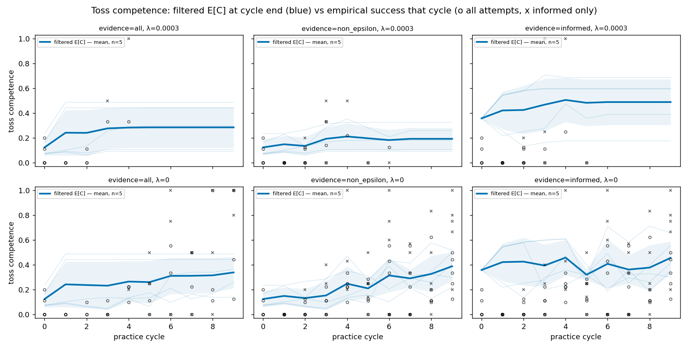
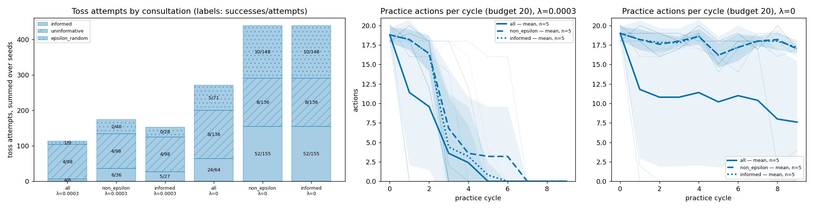

# Tossing3D: which practice outcomes should condition competence (notebook-aligned Model A + grid)

After aligning the competence filter with Tom's notebook (the training clock counts
every attempt, the search forecast predicts across a zero-example boundary, and
particles resample once per cycle), this compares three rules for which toss practice
outcomes condition the competence posterior, at two cost coefficients, over five fixed
seeds:

- `all`: every attempt;
- `non_epsilon`: every attempt except epsilon-greedy random picks. This is the default
  and was already the behaviour before this change;
- `informed`: only the classifier's argmax picks.

**Headline: null result at n=5.** No evidence comparison reaches p < 0.05 on the final
evaluation or on the area under the evaluation curve. The largest effect is `all`
performing worse than `non_epsilon` at λ=0.0003: 4/50 against 16/50 final tasks solved,
paired t p=0.080. Three mechanisms matter more than the headline:

1. **Literal `all` strands the robot through search.** Once the toss sampler has a
   mixed-class fit, search conditions its imagined epsilon branch on outcomes drawn at
   `random_toss_competence` (0.25). When the belief sits above that, the forecast says
   practice lowers competence. Practice then looks worthless and the robot STOPs for good.
2. **At λ=0.0003 every arm quits practising by cycle 3–7**, whatever the evidence rule.
3. **At λ=0, `informed` and `non_epsilon` produce identical evaluations on 5/5 seeds
   despite different beliefs.** At λ=0 the planner practises to the 20-action budget
   regardless of what the belief says.

## Protocol

- Code: #368 head `d7b7ba30` (on #367 `caed9161`, on #366 `8bb9a337`). KINDER pins are
  kindergarden `6a42988` and kinder-models `427ad6c`, imported from this worktree's own
  `reference/`.
- Six arms, each run as one `scripts/run_sweep.py --methods pomdp --num-seeds 5
  --max-workers 2` inside a systemd user service (MemoryMax 7G, OOMPolicy=continue), 12
  concurrent runs. 30/30 runs exited 0.
- Settings are identical to EXP-06 (`gc-grid-seed0-lambda0-20260925/launch_argv.json`)
  except `--pomdp-linear-cost-lambda {0.0003, 0}` and `--pomdp-competence-evidence
  {all, non_epsilon, informed}`: Model A (`global_curve`) + grid, expectimax depth 6, the
  barrier layout, 10 cycles of at most 20 practice actions each, no free practice resets,
  reset cost 5, epsilon 0.5, and 10 evaluation tasks before practice and after every
  cycle. `--pomdp-learning-rate-decay 0.9934366` and `--pomdp-num-particles 1024` are
  carried over from that argv; neither affects Model A + grid competence.
- Analysis: `analysis/tossing3d_notebook_abc.py`, which writes the figures, the per-run
  summaries (`2026-09-25-tossing3d-notebook-abc-runs.json`) and the paired tests
  (`…-tests.json`). The per-seed conditioning, belief and stranding numbers below are in
  `…-per-seed.json`.
- Paired tests across the shared seeds 0–4 (n=5): a paired t-test, plus scipy's default
  Wilcoxon signed-rank test, which with n=5 cannot go below p≈0.06 two-sided. AUC is the
  trapezoid over the 11 evaluations, so its range is 0–100.

## Verification run (before the sweep)

This was Model A + grid, seed 0, λ=0, `non_epsilon` (today's behaviour), with EXP-06's
argv. It differs from EXP-06 only in the notebook alignment and one rebased #365 commit,
`0c1b75e5`, which bounds far-bin standoffs.

- Toss clock at each refit: 9, 19, 28, 38, 47, 56, 65, 74, 82, 90. EXP-06 read 0, 0, 0,
  0, 47, …, because one-class credit was deferred.
- Evaluations: 0, 1, 0, 2, 0, 0, 7, 3, 5, 5, 5, **identical to EXP-06**. Toss outcome
  counts (17/70 non-random, 4/20 epsilon-random) and decisions per cycle are also
  identical except one STOP in cycle 9.
- Filtered toss E[C] ends at 0.518 (EXP-06: 0.652). The learning-rate diagnostic falls
  from 0.108 to 0.004 by cycle 1. That is the collapse the notebook clock was predicted
  to cause, not a defect.
- **No sign of the spurious-practice-value pathology** after removing the `refit(0)`
  identity. The maximum improvement of a non-toss action over STOP was PickCube 0.041 and
  resets 0.026 (EXP-06: 0.047 and 0.038). No loud errors.
- `non_epsilon`/λ=0/seed 0 in the sweep reproduces this run exactly.

## Results

Final tasks solved per seed (seeds 0–4) and AUC. All arms start from the same
pre-practice evaluation, 0, 2, 1, 1, 2, which is 6/50.

| arm | final per seed | final total | AUC per seed |
| --- | --- | --- | --- |
| all, λ=0.0003 | 0, 0, 1, 1, 2 | 4/50 | 7, 5, 13, 6, 30 |
| non_epsilon, λ=0.0003 | 0, 4, 6, 1, 5 | 16/50 | 7, 50, 48.5, 6, 37.5 |
| informed, λ=0.0003 | 0, 4, 2, 1, 7 | 14/50 | 7, 50, 43.5, 6, 35.5 |
| all, λ=0 | 6, 0, 1, 5, 5 | 17/50 | 26, 5, 13, 22, 39.5 |
| non_epsilon, λ=0 | 5, 5, 2, 5, 5 | 22/50 | 25.5, 50.5, 41.5, 22, 39.5 |
| informed, λ=0 | 5, 5, 2, 5, 5 | 22/50 | 25.5, 50.5, 41.5, 22, 39.5 |

Paired tests, n=5:

| λ | comparison | metric | mean Δ | paired t p | Wilcoxon p |
| --- | --- | --- | --- | --- | --- |
| 0.0003 | all − non_epsilon | final | −2.40 | 0.080 | 0.109 |
| 0.0003 | all − non_epsilon | AUC | −17.6 | 0.137 | 0.109 |
| 0.0003 | informed − non_epsilon | final | −0.40 | 0.704 | 0.655 |
| 0.0003 | informed − non_epsilon | AUC | −1.4 | 0.226 | 0.180 |
| 0.0003 | all − informed | final | −2.00 | 0.129 | 0.109 |
| 0.0003 | all − informed | AUC | −16.2 | 0.151 | 0.109 |
| 0 | all − non_epsilon | final | −1.00 | 0.394 | 0.414 |
| 0 | all − non_epsilon | AUC | −14.7 | 0.196 | 0.285 |
| 0 | informed − non_epsilon | final, AUC | 0 (identical) | undefined | 1.0 |
| 0 | all − informed | final | −1.00 | 0.394 | 0.414 |
| 0 | all − informed | AUC | −14.7 | 0.196 | 0.285 |

No comparison supports an effect at n=5.

### 1. Literal `all` strands the robot

A run is stranded when practice actions drop to 0 from a given cycle onward. Under
`all`, stranding sets in only once the toss sampler has a mixed-class fit, since only
then does search give the epsilon branch any weight; in seed 1 it came at the very next
boundary. The table compares the first decision of that cycle across the two
arms. In λ=0 seed 1 and λ=0.0003 seeds 1 and 2, the state and toss belief at that
decision are identical under both rules, so the difference in value is the search rule
alone. In the other two rows the runs had already diverged earlier.

| λ | seed | `all` stranded from cycle | `all` max improvement | `non_epsilon` max improvement, same decision | `non_epsilon` quits |
| --- | --- | --- | --- | --- | --- |
| 0 | 1 | 1 | 0.0 | +0.0124 | never |
| 0 | 2 | 2 | −2.8e-16 | +0.0049 | never |
| 0.0003 | 1 | 1 | −0.0006 | +0.0104 | cycle 4 |
| 0.0003 | 2 | 1 | −0.0006 | +0.0083 | cycle 4 |
| 0.0003 | 4 | 5 | −0.0007 | +0.0038 | cycle 7 |

At these decisions no toss was applicable, because the cube was not held; a toss was
at least one pick, and in λ=0 seed 1 a reset and a pick, deeper in the tree. In the
remaining seeds, `all` either
never reached a mixed-class fit before quitting (λ=0.0003 seeds 0 and 3, identical to
`non_epsilon`), or kept practising (λ=0 seeds 3 and 4). λ=0 seed 0 kept going until
cycle 8 and then practised only 2 and 4 actions.

The mechanism is the search rule for `all`, not a coding error. The epsilon branch
(weight 0.5 after a mixed-class fit) conditions the toss belief on an outcome drawn at
`random_toss_competence` = 0.25. When the belief is above 0.25, for example E[C] = 0.443
in λ=0 seed 1, the forecast after practice is lower, so practice is worth ≤ 0 over STOP.
The forecast is self-consistent: under `all` those outcomes really would lower the
belief. But it is a spurious negative practice value, the mirror image of the old
pathology. Because of stranding, the `all` arms made only 113 (λ=0.0003) and 271 (λ=0)
toss attempts in total, all of which conditioned the belief, against 439 attempts per
arm under the other two rules at λ=0.
[Seed 1, `all`, λ=0: final evaluation after stranding](2026-09-25-tossing3d-notebook-abc-all-lambda0-seed1-stranded-final-eval.mp4)
· [Same seed, `non_epsilon`](2026-09-25-tossing3d-notebook-abc-non_epsilon-lambda0-seed1-final-eval.mp4)

### 2. λ=0.0003: practice ends by cycle 3–7 in every arm

Practice actions reach 0 by cycle 3–4 in `non_epsilon` (seeds 0, 1, 2, 3), with seed 4
quitting at cycle 7. The pre-alignment overnight Model A + grid λ=0.0003 runs (commit
`e5423a45`) also quit, but later: cycles 6, 4, 4, 5, 5 for seeds 0–4, against 3, 4, 4, 3,
7 here. Seed 1's practice actions and evaluations are identical to before. This fits the learning-rate diagnostic
collapsing by cycle 1 under the notebook clock: expected improvement per example drops
below the per-action cost.

### 3. `informed` versus `non_epsilon`: different beliefs, identical behaviour at λ=0

Uninformative draws occur only before the sampler's first mixed-class fit. That can be
one cycle or five: in λ=0 seed 0 it covers cycles 0–4. So `informed` drops a lot of
evidence. At λ=0, `non_epsilon` conditioned on 291/439 toss attempts across seeds and
`informed` on 155/439. Per seed at λ=0, `informed` dropped 67, 43, 46, 66 and 62
outcomes (uninformative and epsilon-random combined), of which 6, 3, 3, 4 and 2 were
successes. The beliefs differ accordingly. With
no evidence at all, `informed`'s filtered E[C] rises from 0.358 to about 0.6 by cycle 3
on the notebook clock alone, because Model A's prior favours improving curves; seed 0
reads 0.358, 0.544, 0.583, 0.600 against `non_epsilon`'s 0.076, 0.087, 0.062, 0.042.

At λ=0 the planner practises to the budget whatever the belief, so the evaluations are
identical on 5/5 seeds. At λ=0.0003 the stopping decision does depend on the belief:
seed 2 ran to cycle 6 under `informed` against cycle 4, and seed 4 stopped at cycle 4
against cycle 7. The evaluations differ accordingly.
[Seed 4, `informed`, λ=0.0003: final evaluation](2026-09-25-tossing3d-notebook-abc-informed-lambda0.0003-seed4-final-eval.mp4)

### Attempts by consultation, and practice volume

Toss successes/attempts summed over seeds, by consultation:

| arm | informed | uninformative | epsilon-random | practice actions |
| --- | --- | --- | --- | --- |
| all, λ=0.0003 | 4/6 | 4/98 | 1/9 | 229 |
| non_epsilon, λ=0.0003 | 6/36 | 4/98 | 2/40 | 351 |
| informed, λ=0.0003 | 5/27 | 4/98 | 0/28 | 309 |
| all, λ=0 | 24/64 | 8/136 | 5/71 | 555 |
| non_epsilon, λ=0 | 52/155 | 8/136 | 10/148 | 890 |
| informed, λ=0 | 52/155 | 8/136 | 10/148 | 890 |

[Verification run's final evaluation (seed 0, λ=0, `non_epsilon`)](2026-09-25-tossing3d-notebook-abc-verify-non_epsilon-lambda0-seed0-final-eval.mp4).
Each clip replays the first three final-evaluation tasks from the run's state log
(`analysis/render_tossing3d_state_log.py` on a slice cut out by the episode-trace
timestamps).

## Limitations

- n=5 per arm. The Wilcoxon test cannot reach p<0.05 two-sided at this n, and the t-test
  assumes normal paired differences on counts out of 10. Only the stranding mechanism is
  established, and it is established by inspecting individual decisions, not by the
  tests.
- Under `informed`, search treats a greedy draw after a mixed-class fit as informed. The
  tie-fraction fallback is not modelled.
- The verification run's `config_snapshot.json` records `git_commit` `d7b7ba30`: the
  snapshot records HEAD at write time, and PR2 was committed mid-run. The process ran
  PR1's `caed9161`, whose behaviour equals PR2's default.
- Grid-only, Model A only. Model B and the particle engine were not re-run under the
  alignment.
