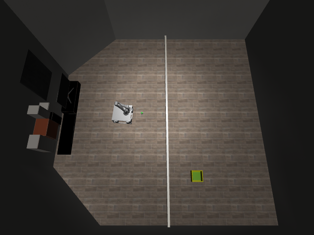
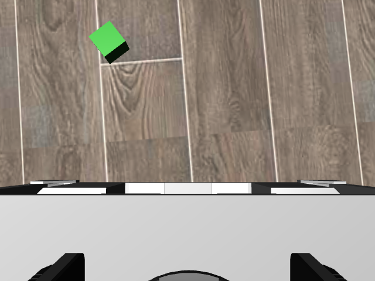

# Native Tossing3D bridge verification

This is an interface check with trusted numeric actuator commands. It is **not**
a generated-policy, skill-success, learning, or human-intervention experiment.

The seed-125 world was initialized once. One registered probe option sent one
18-dimensional joint-space command and one 100-by-18 control schedule through the
Unix-socket robot relay. Both control periods completed: **2/2** requested periods,
charged to **1/1** option slot. The base x position changed from
`-0.027972321542299262` to `-0.023620206204228205` metres. These are deterministic
probe observations; they support no statistical performance inference.

The relay returned rendered pixels, robot proprioception and a control-step count.
It did not return native rewards, goal verdicts, object poses, or predicate atoms.
The action specification reported 10 Hz control, 1 ms schedule rows, and finite
actuator bounds. Both KINDER imports resolved inside the probe worktree's pinned
submodules. The process ran in a 6 GB memory-capped systemd scope.

| Before the probe | After two control periods |
| --- | --- |
|  |  |

[Machine-readable result](result.json) records the native action specification,
observation schema, dependency paths and action accounting.

The first probe exposed an observation-quality issue: the cube and gripper are
small in the room camera. The bridge now supplies **two actual views**: the room
overview and robot wrist camera, with their names in `image_views`. The accepted
actuator specification is also included in every observation. A repeat of the
same probe passed with this complete envelope; [the separate result](multiview-result.json)
preserves that revision without overwriting the first record.

| Wrist view before the probe | Wrist view after two control periods |
| --- | --- |
|  |  |

Reproduce from a worktree with its pinned submodules and scene assets populated:

```bash
scripts/with_env.sh systemd-run --user --scope -p MemoryMax=6G \
  -p OOMPolicy=continue python scripts/probe_agentic_tossing3d.py \
  --through-relay --output-dir artifacts/agentic-bridge-relay-smoke
```

The script selects the current worktree's simulator sources without changing
shared editable installs. Scene meshes/textures may be reused as read-only assets;
the simulator source and task definition remain pinned to the worktree.

The isolated generated-code launcher and live model calls are separate checks.
Passing this native probe does not establish that those integrations run or that
the learned skills solve Tossing3D.

## Agentic experiment protocol

**Current runtime: Docker.** This supersedes the earlier Apptainer setup and its
pending host-profile request. No AppArmor policy was installed or changed.

Build the strict image from the configured, audited Robocode checkout:

```bash
scripts/with_env.sh docker build --memory 4g --tag hitl-agentic-strict:latest \
  --file /absolute/path/to/robocode-with-isolated-transport/docker/Dockerfile.strict-blackbox \
  /absolute/path/to/robocode-with-isolated-transport
```

The older installed image failed Robocode's package-isolation guard; rebuilding
from the audited checkout passed it. The launcher uses `--network none`, drops
all capabilities, sets no-new-privileges, runs as the non-root host UID, and mounts
only the run workspace and explicit sockets. The container root filesystem is
read-only; memory, CPU and process limits apply. It uses the local Docker daemon,
never pulls during execution, and snapshots the immutable image ID.

The coding agent reaches only Robocode's validating host model broker through a
Unix socket; provider credentials remain on the host. The policy container gets
only the bounded robot relay. Neither gets repository source, reset access, the
Docker socket, or general network access. The image's network/firewall entrypoint
is replaced by the trusted namespace and strict-package verifier. A named
container is explicitly removed on completion, error or timeout so killing the
Docker client cannot leave the container running.

### Host Python environment

The audited Robocode checkout requires Python **3.11 or 3.12**. The repository's
ordinary Python 3.10 environment remains suitable for the existing methods, but
does not satisfy that dependency. Use a separate environment for this experiment:

```bash
scripts/with_env.sh uv venv --python 3.11 .venv-agentic
scripts/with_env.sh uv pip install --no-sources \
  --python .venv-agentic/bin/python --torch-backend cpu \
  --editable '.[dev,tossing3d]' \
  --editable reference/kindergarden \
  --editable reference/kinder-baselines/kinder-models \
  --editable /absolute/path/to/robocode-with-isolated-transport
scripts/with_env.sh uv pip check --python .venv-agentic/bin/python
```

`--no-sources` keeps the explicitly supplied worktree dependencies instead of
following Robocode's optional local-source overrides into other submodules. The
PyTorch CPU build is sufficient for the host belief model; simulator rendering
still uses EGL. This setup does not change the shared conda environment.

Run the protocol with the explicit `.venv-agentic/bin/python` interpreter. It
passes that interpreter into the sweep, while keeping worktree-local imports.

### Runtime configuration and execution

[The example runtime configuration](runtime.example.json) contains placeholders,
not selected models or credentials. Set the Docker image and Robocode checkout,
and choose the coding model. The coding backend can be `codex` or `claude`; its
model, budget and turn limit are explicit experiment settings.

Vision's `robocode_broker` provider inherits that backend and model unless
explicitly overridden. It sends inline images through Robocode's fixed inference
broker using the existing host login; no additional API key or arbitrary endpoint
is needed. This image-preserving adapter is distinct from Robocode's default CLI
text-completion client, which cannot accept these multimodal messages unchanged.
The host retains exact request/response evidence for each visual judgment.

For a separately configured multimodal service, the original `openai_compatible`
provider remains available with `model`, `base_url`, and `api_key_env`. An empty
`api_key_env` is for a keyless local server; for a hosted endpoint, supply the
**name** of an existing credential environment variable. Do not put secret values
in the JSON.

The protocol first hashes and snapshots the runtime configuration and external
input bundle. It then invokes the exact disconnected policy launcher with a
trusted marker program. Robocode's namespace and strict-image checks execute
before that marker. This preflight makes **zero model calls** and does not
initialize the simulation.

```bash
scripts/with_env.sh .venv-agentic/bin/python scripts/agentic_tossing3d_experiment.py \
  --runtime-config /absolute/path/to/runtime.json \
  --inputs experiment_inputs/agentic_tossing3d \
  --results-root artifacts/agentic-tossing3d-first-run \
  --max-workers 1 --num-seeds 1 --num-cycles 2 \
  --max-steps-per-interaction 10 --num-test-tasks 2 \
  --human-reset --human-reset-practice-cost 5 --memory-max 8G
```

Add `--preflight-only` to check infrastructure without generation or experiment
execution. Use a fresh results directory for each attempt; the protocol refuses
to overwrite a previous provenance snapshot. A saved generated library can be
provided using `--library /absolute/path/to/library.json`.

After a successful preflight, the script launches `scripts/run_sweep.py` inside
a systemd scope with the requested memory cap and `OOMPolicy=continue`. It uses
`--method agentic-options`, fixed simulator seeds `0..num_seeds-1`, an explicit
worker limit, and `--practice-reset-policy never`. Evaluation uses its own
environment. A paired comparison can run a second fresh protocol directory with
`--no-human-reset` and the same seed count and initial library. Initial generated
code, judgments, revisions, `stats.json`, and `timing.json` remain separate
artifacts; fixed simulator seeds do not imply deterministic model completions.

### Earlier Apptainer attempt (superseded)

The original workstation preflight failed before the trusted marker with
`Failed to create container process: Operation not permitted`, including when
run outside the agent filesystem sandbox. [Recorded failure](preflight.json)
and [input/image hashes](digests.json) preserve the exact invocation. The protocol
returned exit status 2, made zero model calls, and did not start a sweep. There
is no host-code or network-enabled fallback.

That attempt led to the host diagnosis below. The subsequent Docker run removes
this namespace blocker; generated-policy and VLM results are still unmeasured.

### Follow-up diagnosis on October 2

A host-level diagnostic run isolated the denial to AppArmor:

```text
profile="unprivileged_userns" comm="starter" capname="sys_admin"
execpath="/usr/lib/x86_64-linux-gnu/apptainer/bin/starter"
```

The system-wide unprivileged-user-namespace restriction is enabled, and the
installed Apptainer package lacks its application-specific AppArmor profile.
The prepared profile follows Apptainer's installation instructions with these
system-owned executable paths. It passed a parser check without loading any
policy. Installation was pending explicit approval because it changes host
security policy. The user subsequently selected Docker, so the profile was not
installed and the system-wide restriction has not been changed.

The separate Python 3.11.15 environment successfully imports the configured
Robocode launcher and VLM client, this worktree's project code, and both pinned
simulator checkouts. Dependency validation passes, as do **53/53 focused tests**.
The native relay probe also completed **2/2 control periods** charged as **1/1
option action** in the new environment. Its before/after position and all four
camera images match the earlier probe. The [separate result](python311-result.json)
records package versions and image hashes; the images above also illustrate this
repeat. This remains trusted numeric execution, with no generated-policy result.

At this stage Robocode could load the existing coding-provider login. That did not supply the
separate OpenAI-compatible VLM client with API credentials: none were configured,
and neither local endpoint checked (ports 8000 and 11434) was serving a model.
An explicit VLM configuration was still required. No inference request or
generated-code execution had been performed by this setup follow-up.

### Docker validation on October 2

The production [Docker preflight passed](docker-preflight.json): the strict
supervisor completed before the trusted marker, without model calls. A
[native policy-container probe](docker-native-result.json) then completed **2/2
control periods** charged as **1/1 option action**. It received both actual camera
views and moved the base by the same amount as the previous trusted host probe.
The controller used its full two-step budget, so its `controller_done` flag is
false; no VLM success claim is inferred. This was hand-written numeric probe
code, not a generated skill or a demonstration of learning. **54/54 focused tests**
pass after the Docker switch, including the broker-only client configuration.

A genuine generation attempt was prepared with the external task, robot API,
generation prompt and resolved input bundle, capped at $2 and 20 turns. Automatic
approval review rejected launching it because explicit permission is required
for sending that experiment content to the fixed Codex inference destination.
The user was asked to approve that payload and destination. No model call ran
before that approval.

### Approved generation and Robocode vision follow-up

After approval, the first launch failed during Codex CLI startup: Docker had
created its configuration directory as a root-owned parent of the sessions bind
mount. Mounting a fresh user-owned CLI configuration directory fixes startup,
preserves the existing session logs for accounting, and retains the strict
isolation checks. The [offline before/after probe](docker-cli-startup.json)
shows the CLI initialization handshake succeeds after this change.

The corrected launch reached the model. It returned a
[generation limitation](generation-limitation.json), not a valid policy library:
actual sample observations, camera calibration and robot geometry were missing.
The [recorded result](generation-result.json) distinguishes this from a working
generated skill. No robot execution, visual judgment or code-learning result was
obtained, and no second paid generation attempt was started.

The `robocode_broker` vision provider now reuses the chosen coding backend's host
authentication while preserving images. Both supported request protocols pass
Robocode's real request validator with an actual simulator image; this was offline
validation, not a live VLM call. The combined focused suite passes **73/73 tests**.
The next generation requires a documented sensor/robot-specification bundle;
RGB versus RGB-D is an explicit pending input-contract decision.
