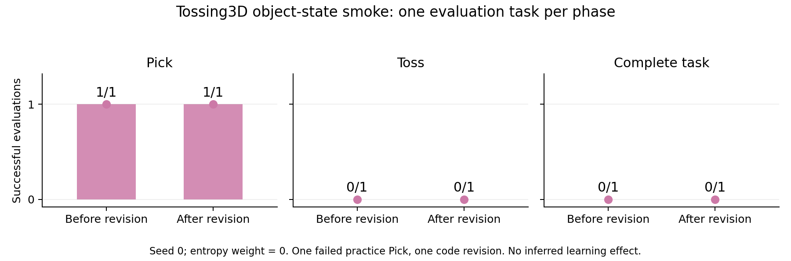

# Tossing3D: generated extended options and skill-chain practice planning

Latest result (2026-10-03): the object-state smoke test completed one real
practice attempt, a coding-agent revision, and separate evaluation without a
practice reset. Task success remained 0/1 before and 0/1 after. The smoke test
explicitly disables the optional observation-entropy penalty; the unchanged
default chose STOP with no practice. This proves the cycle, not learning effectiveness.

## Question / goal

Can the existing belief-space practice search operate over natural-language state
clusters and generated Python skills, with a VLM checking observed state and option
contracts and a coding learner improving skills between practice sessions?

## Background

The poster is complete and printed. This is new algorithm work. The current
Tossing3D method uses predicate transitions and a learned numerical toss sampler.
This implementation replaces physical search transitions with a skill-chain and
executes full generated low-level controllers. It retains the existing competence,
learning-rate and cost inference, training clock, refit forecast and deployment
objective. Raw observations, trajectories and source code stay outside search.

## Hypothesis

The same search can select useful human interventions when skill-chain clusters
preserve recoverability and bin-side distinctions. Whether the current learning
forecast is adequate for code revisions remains an empirical question.

## Guidance given

Josh requested four stacked draft PRs, in order:

1. Reusable infrastructure: validated option/library contracts, VLM interface,
   disconnected coding/execution runtime and native Tossing3D control bridge.
2. Experiment inputs: generation/judging/improvement prompts and domain API guidance,
   outside the method implementation.
3. Method: skill-chain adapter to existing search, shared learner/belief interface,
   persistent execution and session-boundary learning.
4. Experiments: reproducible probes, evidence and this log.

No sweeping work is resumed. Packed-4 is a separate investigation.

## Methods

Descriptions and success contracts are frozen while policy code is improved.
Search never calls a VLM or coding agent on hypothetical branches. VLM ambiguity
is an unresolved observation, not a fabricated failure. Physical transitions are
conditioned on both the source cluster and skill success/failure. Human reset
mechanisms and accounting remain host controlled; generated policies have no reset
RPC. Practice uses a persistent world and evaluation uses a separate world.

Each abstract state has a generated natural-language membership definition and a
set of possible successor states. The manifest stores the definitions in
`clusters` and the successors as skill/outcome-labeled `edges`. A state's outgoing
skills declare candidate initiation; observed membership and the skill's actual
initiation contract are checked separately by the VLM. The graph does not define
membership by predicting what the previous action should have accomplished.

The native control space is 18-dimensional: three base position deltas, seven arm
joint-position deltas, one gripper command and seven joint-velocity targets. The
host validates controls and execution limits. Policies are not restricted to
choosing the legacy toss parameters.

## Results

The four implementation layers are complete as drafts. **53/53 focused tests**
pass: 18 runtime, 11 native-interface boundary and 24 method/configuration tests.
Ruff, formatting, mypy, import boundaries and document-link checks pass.
The repository regression run completed with **2812/2815 cases passing**, two
skipped and one expected failure (exit status 0). Review fixes made while that
run was in progress were subsequently checked by the final 53-test focused suite.

Independent reviews identified and fixed session-cost carryover, practice
initiation rejections leaking into evaluation, missing actuator metadata in
observations, sandbox seed propagation, generated skill-role reassignment,
controller-error/trajectory propagation, and trusted runtime-file collisions.
Provider failures after execution retain the paid attempt and raw evidence;
they do not fabricate a skill failure. VLM termination/success are checked at
controller completion or its execution limit; `done` alone is not success.

The native MuJoCo probe executed **2/2 control periods** through the Unix relay,
charged as **1/1 option action**, without a reset after initialization. It used
trusted numeric commands and proves the control/observation integration only.
Both global and wrist camera images are real simulator observations. See the
[probe evidence and reproduction instructions](2026-10-02-agentic-bridge/README.md).

No generated-policy learning or task-success result is established. The original exact
disconnected Apptainer preflight fails with `Operation not permitted` before
entering the container, including an escalated probe. The recorded preflight
made zero model calls and launched no sweep. The configured modern Robocode
checkout also needed installation in the runtime environment. The follow-ups
below resolve these installation and namespace blockers. There is no
host-execution fallback. Native bridge and offline tests do not establish live
VLM/coding-agent feasibility.

## Recommendation

**Current status — Docker:** at the user's request, both policy execution and
coding-agent execution now use disconnected Docker containers. The rebuilt
strict image passes the production preflight. The native Docker policy probe
completed **2/2 control periods** as **1/1 option action**, with no model calls or
generated code; **54/54 focused tests** pass. The host AppArmor profile is no
longer needed and was not installed. Details and provenance are in the
[Docker validation record](2026-10-02-agentic-bridge/README.md).

The next live step is genuine skill generation. Automatic approval review
initially rejected its launch pending explicit authorization for sending the
external experiment inputs to the fixed Codex inference destination. Josh then
approved one attempt capped at $2, 20 turns and 15 minutes. Its first Docker CLI
launch failed before inference with an app-server permission error; the missing
token-usage error was a consequence of the CLI not starting. No generated library,
learning or human-benefit result is established by that launch.

Josh requested the existing Robocode setup for vision as well. Its default CLI
completion client flattens multimodal content into text, so it cannot be used
unchanged for visual judgments. An image-preserving adapter to the same fixed
inference broker now preserves PNG content and keeps provider credentials on the
host. Both Codex Responses and Claude Messages payloads pass the real Robocode
request validator. Live visual judgments remain untested.

**Approved live-generation follow-up:** the Docker startup failure was traced to
a root-owned CLI configuration directory created as the parent of a nested
session-log mount. A fresh, user-owned per-run configuration directory fixes
startup while preserving the original budget-accounting log path and all strict
isolation checks. The corrected launcher reached the configured model.

The model returned an explicit limitation report instead of a valid skill
library: the input describes RGB images and robot joints but supplies no example
observation, calibrated camera geometry, arm kinematics, or documented perception
features. It declined to invent pick/toss geometry. The host rejected this as a
generation failure; no generated policy was executed, no task-success result was
obtained, and no further paid generation attempt was started. See the
[actual model diagnostic](2026-10-02-agentic-bridge/generation-limitation.json),
[run result](2026-10-02-agentic-bridge/generation-result.json), and
[offline startup evidence](2026-10-02-agentic-bridge/docker-cli-startup.json).

The next generation input must provide actual example observations and documented
perception/control geometry while retaining the ban on hidden object poses, oracle
skills and free resets. The declared $2 limit is Robocode's per-response stop
threshold, not an exact billing cap; an in-flight response can overshoot it. The
15-minute Docker timeout is enforced independently.

**Validation after this follow-up:** **73/73 focused tests** pass, including
startup permissions, VLM image preservation/error handling, and broker configuration
inheritance. Ruff, formatting, the repository's canonical mypy invocation, import
boundaries and documentation checks pass. The separate Python 3.11 environment's
full mypy run additionally reports a SciPy scalar/array return-type warning in the
unchanged `curve_cycle_mass`; that warning does not occur under the repository's
canonical typing environment. No unrelated competence-model code was changed.

The minimum next input bundle is the real initial practice observation, the two
permitted cameras' calibration, and a filtered robot-only kinematic chain. Capture
must not step or reset the world. A practical sensor choice remains open: calibrated
RGB-D simplifies localization; keeping RGB-only requires generated depth inference.
Neither permits native object poses or complete scene meshes. Controller testing
belongs to the existing accounted practice loop, with revision at session boundaries.

**October 2 runtime follow-up:** the Robocode dependency is now installed in a
separate Python 3.11.15 environment, with this worktree's pinned simulator sources.
Both live integration modules import successfully, dependency validation passes,
and **53/53 focused tests** pass under that interpreter. The native relay probe
also repeats successfully: **2/2 control periods**, charged as **1/1 option action**,
with identical before/after camera images. The host kernel log
identifies AppArmor's `unprivileged_userns` profile denying Apptainer's `starter`
the namespace capability it needs. An application-specific profile was prepared
and syntax-checked; the later Docker decision supersedes its installation. A VLM endpoint/model and its
credential configuration are also still needed. See the
[runtime setup and diagnosis](2026-10-02-agentic-bridge/README.md).

With the Docker preflight passing, validate genuine generated-library and VLM execution, persistent
sessions with actual code revisions, and finally paired fixed-seed comparisons.
The [experiment protocol](../../scripts/agentic_tossing3d_experiment.py) snapshots
inputs and hashes, checks isolation before model calls, and launches the existing
sweep runner with explicit worker and memory limits. No optional sweeping or
Packed-4 work is included.

## 2026-10-03: reproducible human intake and object-state generation

Josh approved the next implementation stage and requested an AI-written human
response as an editable constant. The fixed question and `HUMAN_TASK_RESPONSE`
now live in [human_input.json](../../experiment_inputs/agentic_tossing3d/human_input.json),
outside the method. This is the privileged object-state condition; the top-down
and robot-camera conditions remain future stages.

The practice world is initialized before generation. The harness saves and stages
`human_input.json`, `initial_observation.json`, and `robot_spec.json`, prints the
resulting generated skill/state catalog, and passes that same initialized world
to practice without another reset. Revision receives the same context together
with the real practice trajectories. Evaluation retains its independent world.
A generic observation provider replaces direct domain observation construction
inside search. Deployment skill order is an external experiment input. The
competence, learning-rate, cost and session-refit models are unchanged.

Object-state observations contain named, typed physical measurements rather than
native predicates or task-outcome flags. The model judges generated language
contracts numerically through the existing Robocode broker. Robot specifications
come from the actual compiled robot-only kinematic chain. An independent
forward-kinematics check matches the MuJoCo tool pose within 1e-9, without stepping,
resetting, rendering or changing state. Generated grasp contracts also require
physical temporal evidence: judges receive bounded observed trajectory samples
and the robot's forward-kinematics tool pose, not an invented grasp label.

Validation and live outcomes for this follow-up are recorded below. Raw run files are retained locally under
`artifacts/agentic-object-state-cycle/`; selected evidence is promoted into this
log rather than committing the coding client's runtime state.

### Recorded outcomes

| Condition | Practice | Code revision | Evaluation before → after |
| --- | --- | --- | --- |
| Initial generation | Valid 10-state, 5-option, 59-edge library; first judgment exposed a broker-stream parser bug, now fixed | Not reached | Not reached |
| Unchanged default, entropy weight 0.1 | STOP, 0 actions | No data / no change | 0/1 → 0/1 |
| Explicit smoke setting, entropy weight 0 | 1 failed Pick, 230 control periods; unknown destination ends the session | 1 trajectory; `policies/pick.py` changed | 0/1 → 0/1 |

Recorded videos: [failed practice Pick](2026-10-03-agentic-object-state/practice.mp4),
[evaluation before revision](2026-10-03-agentic-object-state/evaluation-before.mp4),
and [evaluation after revision](2026-10-03-agentic-object-state/evaluation-after.mp4).

The completed smoke has **0 practice resets after initialization** and **0 human
interventions**. Pick succeeded in the evaluation scene both before and after
revision (174 versus 94 control periods); Toss failed both times. These are raw
single-scene observations, not evidence of general improvement. The revision
received only the failed practice Pick trajectory; evaluation trajectories did
not enter its training evidence. All generation, revision and execution used
disconnected Docker and the existing fixed Robocode broker. This run used its
configured Codex backend, not a switch to Claude Code.

The default STOP result is preserved. Offline search diagnostics found an expected
Pick/refit improvement of 0.016247, outweighed by the 0.100638 penalty from the 0.1
observation-entropy weight. Depths 3, 4 and 6 all choose STOP. Setting only this
existing weight to zero selects Pick (depth-3 value 0.539057 versus STOP 0.490322),
with the same hard budget and forecast. The protocol now exposes
`--observation-probability-weight`; its default remains 0.1. This explicit smoke
setting is not a forced action or a claimed new research result.

Validation: **2,892/2,895 repository cases passed**, with two skips and one expected
failure, using the worktree-pinned dependencies. Subsequent protocol/temporal
follow-ups passed **246/246 focused tests**. A native FK/timestamp check passed
**1/1**. Ruff, formatting, mypy, import boundaries and documentation links pass.
The first broad attempt was interrupted after generated-client linting and a
shared KINDER checkout caused failures; local generated artifacts were excluded
from lint and the regression was rerun with isolated dependencies.

The live run also motivated finalized-SSE-item parsing, measured robot FK poses,
bounded physical history, and a shared simulation timestamp. These retain unknown
outcomes and do not expose simulator success or predicate labels. A separate
review found the incompatible per-bridge step-counter issue; a composition test
now verifies shared physical time across observing and executing bridges.

Reviewable evidence:

- [Summary and limits](2026-10-03-agentic-object-state/summary.json)
- [Generated initial library and full controller source](2026-10-03-agentic-object-state/initial_library.json)
- [Actual policy-code revision](2026-10-03-agentic-object-state/policy-revision.json)
- [Practice judgments](2026-10-03-agentic-object-state/practice-judgments.json)
- [Evaluation judgments](2026-10-03-agentic-object-state/evaluation-judgments.json)
- [Default-objective search diagnosis](2026-10-03-agentic-object-state/search-diagnostic.json)

Next scientific issues are generated-state coverage after failures, controller
reliability, and the choice of uncertainty penalty. The complete-cycle smoke does
not resolve these. Top-down-plus-robot and robot-only camera conditions remain
unimplemented. Packed-4 remains with the separate agent.
