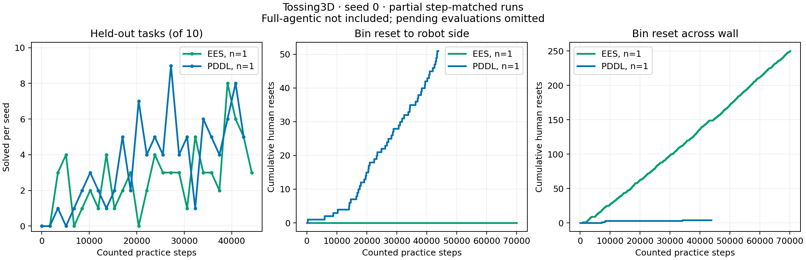

# Human-reset competence correction and Della restart — 2026-10-07

Human-reset forecasts in the POMDP practice planner previously used success
probability 1 even though the method maintained a posterior over human competence
κ and learning rate η. The planner now branches with success probability E[κ]
and failure probability 1 − E[κ]. Each hypothetical branch conditions its own
human-skill belief, charges the same estimated invocation cost, and advances its
training-example count once. The actual belief remains unchanged during search.
The existing learning/refit model makes η affect subsequent reset forecasts.

This is a planner correction. It does not add random failures to the simulator's
human helper or alter its physical implementation. Failure effects use the
existing empirical model, whose fallback for unseen failures leaves atoms
unchanged. The optional non-human reset retains its deterministic transition.
Inference remains local-trend **grid** in these experiments; particle inference
was not enabled. Tests cover both inference engines.

## Original runs stopped at the user's request

Both jobs were cancelled on 2026-10-07 at 11:33:55 EDT: EES 15178962 and
POMDP/PDDL 15178972. Their remote source, snapshots, results and logs remain at
`/scratch/gpfs/TSILVER/jr2860/experiments/step-matched-20261007`.
The [stop record](2026-10-07-reset-competence/stopped/stop-record.json) distinguishes
scheduler cancellation from raw status files, which retain the last `running`
phase. Endpoints below are the last persisted counters at interruption.



| Original method | Recorded practice steps | Latest completed evaluation | Best observed evaluation | Human resets: robot side / across wall | Completed measurements |
| --- | ---: | --- | --- | --- | ---: |
| EES | 70,100 | 3/10 at 44,200 steps | 8/10 | 0 / 250 | 27 |
| POMDP/PDDL, reset success=1 | 43,800 | 5/10 at 42,500 steps | 9/10 | 51 / 4 | 26 |

At the latest common evaluation checkpoint, 42,500 counted practice steps,
both methods solved **5/10** held-out tasks. These are single-seed descriptive
curves; they do not support statistical inference. The performance panel stops
at the last completed evaluation rather than extending scores to the practice
endpoint. EES had 15 captured measurement snapshots without a completed
10-task result; those evaluations were omitted when the job was cancelled.
The reset panels include all recorded human invocations up to the persisted
practice endpoint. The blue PDDL curve refers to the POMDP practice method
with PDDL deployment planning.

[Normalized curves](2026-10-07-reset-competence/stopped/curves.json) and
[raw captured data](2026-10-07-reset-competence/stopped/data) preserve this later
capture separately from the earlier published
[step-matched experiment capture](2026-10-07-step-matched.md).

Reproduce the figure from the repository root:

```bash
scripts/with_step_env.sh python -m analysis.step_matched \
  --ees docs/experiment-logs/2026-10-07-reset-competence/stopped/data/ees/0 \
  --pddl docs/experiment-logs/2026-10-07-reset-competence/stopped/data/pomdp/0 \
  --output /tmp/stopped-della-curves
```

## Replacement runs

Both arms restart from seed 0 and their original initial policies, in a new
output directory. EES remains the unchanged baseline. The shared budget remains
85,000 counted practice steps, evaluation snapshots every 1,700 steps,
1 counted step per human skill, 10 held-out tasks per evaluation, and a
500-controller-step evaluation limit. Learning boundaries remain independent
of measurement boundaries. No full-agentic workstation experiment was launched.

Frozen code revision: `c0e8f10028fa9a45ffdc43a50c2d6af03011eb7f`.
Remote root: `/scratch/gpfs/TSILVER/jr2860/experiments/step-reset-kappa-20261007`.
All 6,138 recorded source/dependency files were hash-verified before submission.
The KINDER dependency bytes match the previous frozen experiment.

| Method | Replacement Della job | Seed | Practice budget |
| --- | ---: | ---: | ---: |
| EES | 15180759 | 0 | 85,000 |
| POMDP/PDDL, success=E[κ] | 15180760 | 0 | 85,000 |

[Launch receipt](2026-10-07-reset-competence/launch/launch-receipt.json),
[source manifest](2026-10-07-reset-competence/launch/source-manifest.json),
[hash verification](2026-10-07-reset-competence/launch/verification.json),
[EES arguments](2026-10-07-reset-competence/launch/ees-arguments.json),
[POMDP arguments](2026-10-07-reset-competence/launch/pddl-arguments.json),
[Slurm script](2026-10-07-reset-competence/launch/run.sbatch), and
[launch helper](2026-10-07-reset-competence/launch/run_della_arm.py.txt)
record the exact launch. Both jobs were verified running after their
11:43 a.m. EDT startup. Each verified its frozen local import paths and passed
78/78 measurement and reset-model startup tests before starting its sweep.

## Validation

Six regression cases failed against the old deterministic-reset branch before
the implementation changed. The resulting planner/inference, measurement and
analysis suite passed **378/378** tests. Coverage includes κ=0 and κ=1,
intermediate probabilities, branch-specific posterior updates, an immutable
prior, one training example per invocation, η-dependent refit forecasts,
legacy particle beliefs, Bayesian grid and particle engines, and preservation
of the optional deterministic non-human reset. Ruff, formatting, source mypy,
and import-layer checks passed. Replacement experimental results will be
reported in a later capture; the graph above is exclusively the stopped runs.
