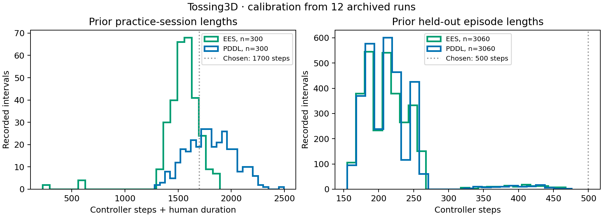
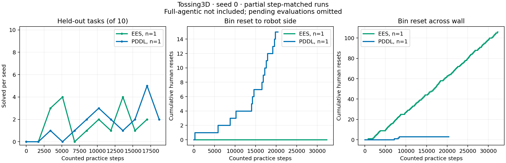
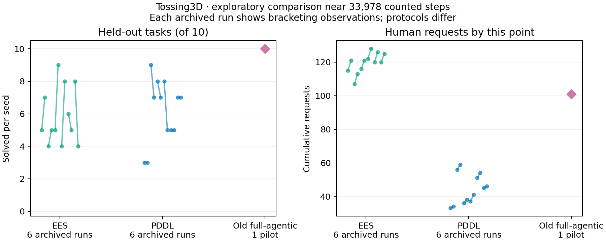

# Tossing3D: controller-step-matched practice, seed 0

EES and PDDL are running on Della under the common physical-experience protocol.
The new full-agentic workstation arm is implemented but **not launched**, as requested.
These are preliminary observations, not final results or a claim about method efficacy.

## Protocol and calibration

| Setting | Selected value | Evidence |
| --- | --- | --- |
| Measurement spacing | 1,700 counted practice steps | Prior 600 sessions: mean 1,672.79, median 1,634 |
| Practice budget | 85,000 counted steps | About 50 prior-size intervals; prior mean totals were 77,083.83 EES and 90,195 PDDL |
| Human duration | 1 configurable step per invocation | Counted separately from reset mechanics; existing objective cost remains five |
| Held-out horizon | 500 low-level steps | Prior 6,120 episodes: maximum 476, median 211, 95th percentile 258 |
| Evaluation set | Ten tasks, seed 0 | Same task generator and simulator source bundle across arms |
| Learning boundaries | Existing EES/PDDL session boundaries; agent-selected for full-agentic | Measurement does not trigger learning |
| Full-agentic model budget | $20 | Original bootstrap, no learned pilot policy; launch withheld |

One controller step is one low-level control period, not a physics substep or a
whole skill invocation. Human reset execution may advance internal physics but
is charged once. Evaluations use an independent environment, immutable deployment
snapshots, and their own RNG state; they do not reset or abort practice. A final
incomplete controller is stopped only to enforce the physical budget.

The calibration reconstructs each archived episode's skill blocks by timestamps
and action labels, excludes held-out physics, and checks practice action/human
counts against recorded stats. It includes three seeds on each of two hosts for
each method. These twelve archives calibrate the measurement protocol; the new
experiment has **one seed per arm** and supplies no uncertainty bands or no-human
comparison.



The [calibration evidence](2026-10-07-step-matched/summary.json) and twelve per-run
records are committed. Reconstruct them from the original archives with:

```bash
scripts/with_step_env.sh python -m analysis.calibrate_step_protocol \
  --workstation-root PATH_TO_EXP22C --della-root PATH_TO_EXP22C_DELLA \
  --output NEW_CALIBRATION_DIRECTORY
```

## Della launch and source provenance

| Arm | Slurm job | Node at startup | State in this capture |
| --- | --- | --- | --- |
| EES | 15178962 | della-h14n1 | Running |
| PDDL | 15178972 | della-h14n4 | Running |
| Full-agentic | None | Workstation reserved | Not launched |

Both structured jobs passed the seven startup accounting tests and verified that
imports resolve inside the frozen source directory. All 5,884 source/dependency
files matched their SHA256 manifest before submission. Della credentials worked;
no refresh was required at launch. Each job has two CPUs, 12 GB RAM, and an
eight-hour scheduler limit. This limit is not an estimated completion time.

The measurement implementation is commit
`c650f08e50eb9b46b7ab4bf8a915e35a89870175`. Dependency files come from the frozen
full-agent pilot bundle, independently hashed rather than inferred from the parent
checkout's submodule pins. The remote root is
`/scratch/gpfs/TSILVER/jr2860/experiments/step-matched-20261007`.

The [source manifest](2026-10-07-step-matched/source-manifest.json),
[Slurm script](2026-10-07-step-matched/run.sbatch),
[launch helper](2026-10-07-step-matched/run_della_arm.py.txt), and resolved
[EES](2026-10-07-step-matched/ees-arguments.json) /
[PDDL](2026-10-07-step-matched/pddl-arguments.json) arguments are archived here.
The helper is stored as text to preserve the exact launched bytes; restore its
`.py` filename when reproducing. It delegates seed scheduling to `run_sweep.py`.
Poster configuration values that differ from current defaults are explicit,
including PDDL's grid inference and zero observation-probability weight.

## Captured partial results

Evidence was copied at **2026-10-07 15:09:28 UTC**. Each arm's status file supplies
its physical cutoff; events appended after that cutoff are excluded. A score is
placed at the snapshot's practice counter, never the counter at which evaluation
happened to finish. Only complete ten-task evaluations appear below.

| Arm | Practice steps | Latest evaluated snapshot | Score | Human resets: robot / opposite side | Completed evaluations |
| --- | --- | --- | --- | --- | --- |
| EES | 32,300 / 85,000 | 17,000 | 2/10 | 0 / 106 | 11 |
| PDDL | 20,400 / 85,000 | 18,700 | 2/10 | 15 / 3 | 12 |
| Full-agentic | Not launched | — | — | — | — |

Both baselines scored 0/10. EES has nine pending snapshots and PDDL has one in
this capture. The lag between practice and completed evaluations is expected:
practice continues while a single independent evaluation worker drains its queue.
No later score is filled forward or extrapolated. Human side refers to the **bin's
destination after the reset**; both interventions place the cube in the pickup area.



The [normalized curve data](2026-10-07-step-matched/curves.json), compact raw results,
configuration snapshots, event logs, and [capture hashes](2026-10-07-step-matched/capture-manifest.json)
are committed. Full state logs and policy binaries remain in the frozen Della run.
Reproduce the plotted curves from these exact captured files with:

```bash
scripts/with_step_env.sh python -m analysis.step_matched \
  --ees docs/experiment-logs/2026-10-07-step-matched/data/ees/0 \
  --pddl docs/experiment-logs/2026-10-07-step-matched/data/pomdp/0 \
  --output NEW_FIGURE_DIRECTORY
```

The plotter also accepts `--full-agentic RUN_DIRECTORY` when that arm is authorized
and has measurements. Retain this capture when adding later results; do not replace
these published numbers with a later checkpoint.

## Earlier pilot: approximate comparison only

The earlier full-agentic pilot finished at **10/10**, from a baseline of **0/10**,
after 112 robot trials, 33,877 robot controller steps, and 101 human requests.
Its normalized endpoint is **33,978 counted steps**, about twenty 1,700-step
measurement intervals. Those 112 trials were controller executions inside one
continuous adaptation session, not 112 structured learning cycles. Reported model
cost was **$8.15**; the separate earlier model smoke is excluded from that figure.
There were no intermediate held-out evaluations in that pilot.

At the same approximate physical-experience point, the archived evaluations
immediately before and after it bracket the following observations:

| Archive / pilot | Before checkpoint | After checkpoint | Mean human requests before / after |
| --- | --- | --- | --- |
| EES, six archived runs | 32/60 tasks | 38/60 tasks | 116.67 / 122.33 |
| PDDL, six archived runs | 40/60 tasks | 34/60 tasks | 43 / 45.33 |
| Old full-agentic, one endpoint | — | 10/10 tasks | 101 at endpoint |

The pilot endpoint is numerically higher than these nearby archived scores. It
used fewer human requests than the EES archive mean and more than PDDL's. This is
an exploratory observation, not evidence of a statistically established advantage.
The six archives reuse three seed identities across two hosts; they are not six
independent seeds. The bracketing checkpoints are not exact step matches and can
move either up or down. Three of six EES archives had already reached 10/10 at
an earlier checkpoint, so the pilot is not uniquely the first to reach that score.



The old pilot used a different deployment horizon and whole-task controller
execution; archived runs also predate the common frozen source bundle and new
measurement protocol. These differences prevent a controlled efficacy comparison.
The [per-run bracketing data](2026-10-07-step-matched/pilot-comparison.json) and old
pilot endpoint/evaluation records are preserved separately from the new curves.

## Validation and remaining work

Six analysis tests cover episode/practice separation, counted human duration,
pending evaluation omission, snapshot-time alignment, distinct final code versions
at an unchanged counter, and live-copy cutoff consistency. Plot inputs are raw
counts and policy hashes. Figures were regenerated and visually inspected.

The Della experiments are still in progress. This draft does not claim completed
85,000-step runs, final method rankings, or a newly measured full-agentic curve.
Completing the three-arm comparison requires the remaining structured evaluations
and a separately requested workstation launch.
