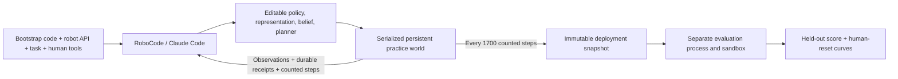

# Full-agentic persistent practice

This arm gives the coding agent the original untrained Python helper library,
object-state observations, robot specifications, and two charged human tools.
It owns all four responsibilities: skill-policy learning, abstract state
representation, belief estimation, and planning. None has a host-imposed graph,
competence model, clustering scheme, or learning schedule.

| Responsibility | Structured EES / PDDL | Full-agentic |
| --- | --- | --- |
| Skill-policy learner | Existing parameter samplers and session updates | Arbitrary generated Python and supporting learned data |
| Abstract state representer | Fixed symbolic predicates and operators | Agent-selected representation |
| Belief estimator / belief space | Existing competence estimators and, for PDDL, grid inference | Agent-selected uncertainty representation |
| Planner | Existing structured practice/deployment planners | Agent-written controller or planner |
| Input | Domain model, skill library, observations, human operators | Original bootstrap, observations, numeric robot interface, human-tool contract |
| Output | Learned samplers and planner state | Frozen `GeneratedApproach` plus supporting files |

The host retains actuator validation, serial physical execution, human execution,
accounting, and held-out scoring. A measurement does not end a trial, reset practice,
ask for a code update, or return evaluation feedback. Pending evaluations do not
block practice. Evaluation results are written outside the coding mount.

## Measurement and learning

Defaults match the infrastructure protocol: 85,000 practice steps, measurements
every 1,700 steps, ten seed-0 held-out tasks, and 500 controller steps per evaluation.
A human invocation consumes one configurable practice step; its existing objective
cost remains five. Trial cost remains one. The original 1,000-step per-trial bound
is retained. Trial boundaries do not impose learning boundaries.

Both native goal attainment and the physical horizon stop evaluation. The host
reports actual executed steps, not a denied extra request. Early submission,
model/CLI termination, physical budget exhaustion, infrastructure failure, and an
external STOP are distinguished; later measurements are never fabricated. If the
final code changes at an existing step count, a second snapshot at that same count
records it. These are distinct policy versions, not extra physical experience.

Durable SQLite receipts prevent duplicate actions after connection loss. A pending
receipt is never replayed; uncertain physical execution ends adaptation. Code runs
in disconnected Docker containers through the recovered RoboCode transport. The
host handles only numeric commands and explicitly allowed human requests. The
configured RoboCode checkout supplies native budget recovery and session resume;
the model remains Claude Opus 5.5, high effort, with a default $20 cap.

## Reproduction

Install the `agentic` extra and the configured RoboCode checkout, populate the
checkout's own simulator dependencies, and supply a `SandboxSettings` JSON with
an immutable Docker image ID and the corresponding RoboCode checkout path.
The planning-enabled image builder is `scripts/build_agentic_planning_image.py`;
its input is the existing strict RoboCode image, a Python 3.11 PyBullet extension,
and the robot URDF. It builds offline and records copied asset hashes.

The packaged `bootstrap_provenance.json` records the original library digest,
prompt digests, and external RoboCode source fingerprints. The bootstrap library
is copied from the pre-pilot input; no learned overnight policy is included.
The prompts retain RoboCode's interface and coding workflow, with the persistent
world/human contract and common measurement budget substituted for free resets.

The entrypoint is `python -m hitl_pmp.full_agentic.runner --sandbox-settings PATH
--output NEW_DIRECTORY`. Set the existing Claude Code authentication in the host
process; never place credentials in the JSON, coding workspace, or generated code.
Run under the existing memory-limited service configuration when a launch is
requested. No experiment starts when this module is imported or `--help` is used.

This change prepares the method only. The new workstation experiment has not been
launched. Validation covers receipts, accounting, immutable snapshots, pending
evaluations, terminal policy revisions, native-goal stopping, and transport
boundaries. A new paid end-to-end run remains unexecuted by user instruction.
