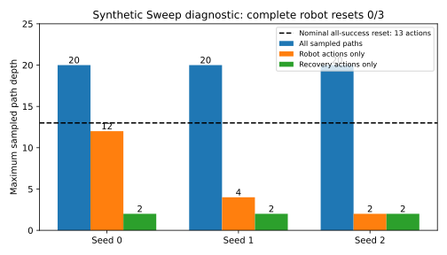

# Sweep determinized readiness — 2026-09-29

The approved existing determinized A* finishes 3/3 synthetic probes in under 0.5 seconds each, but sampled complete robot-reset coverage is **0/3**. Reaching depth 20 does not establish coverage of the 13-action reset. No solver, budget, horizon, objective, or prior was changed to force a reset choice.

## Configuration

Source: `4f6efae80cb42ef2404af2a6c7563597f816a3d3`. Existing `DeterminizedAStarPlanner`, 1000 queue pops, 20 remaining physical actions, observation weight 0, lambda 3e-6, grid 25×16 and 1024 cost particles. These are synthetic Bayesian priors, not calibrated experiment results. The fixture has 28 robot skills and one human reset; current atoms include HoldingWiper, DrawerOpen, DrawerNotClosed, RobotAway and Loose/Blocked for each cube. Stock training skills are OpenDrawer, PickWiper and Sweep. Deployment horizon is 5, with all five InDrawer atoms required. Exploration competence is 0.25. Skill-declared costs are robot 1 and human 3; unknown-cost beliefs remain intact (declarations do not replace the cost posterior).

The exact diagnostic source is preserved as `sweep-determinized-probe.py.txt`; invocation: `python <script> current 1000 <seed>`, inside the project environment and a systemd service with MemoryMax=6G, MemorySwapMax=0 and OOMPolicy=continue. Its obsolete baseline branch was never invoked. Raw traces remain in the isolated worktree's `scratchpad/exact-search/`; their SHA256 hashes and complete summaries are in the adjacent JSON.

## Measured behavior

| Seed | Wall seconds | Queue pops | Unique nodes | All-path depth | Robot-only depth | Recovery-only depth | Root action |
|---|---:|---:|---:|---:|---:|---:|---|
| 0 | 0.480 | 1000/1000 | 1212 | 20 | 12 | 2 | ParkWiper |
| 1 | 0.461 | 1000/1000 | 1125 | 20 | 4 | 2 | ParkWiper |
| 2 | 0.477 | 1000/1000 | 1129 | 20 | 2 | 2 | ask_for_reset_cube_bin_only |

All 3/3 searches terminated at the iteration budget. Robot-only paths exclude human actions; recovery-only paths also exclude stock training skills. All 3/3 have zero complete reset states in their robot-only sampled subgraph. Depth is measured from the initial state, not from a later human reset. Graph annotation records existing cache keys and atoms without changing transitions, priors or search ordering.

## Structural witness

From the same symbolic state, apply successful effects in this order:

`ParkWiper → PickCube0 → PlaceCube0 → PickCube1 → PlaceCube1 → PickCube2 → PlaceCube2 → PickCube3 → PlaceCube3 → PickCube4 → PlaceCube4 → CloseDrawer → ParkRobot`.

All **13/13** preconditions hold sequentially; no failed predicate. Final atoms satisfy HandEmpty, WiperHome, DrawerClosed, RobotHome and all five InPile. This witness was checked independently of the sampled solve (recorded for seeds 1 and 2; the symbolic state is identical across seeds). It uses deterministic successful effects only and is not a physically executed trajectory or a forced search path.

This fixture exposes limited sampled-search coverage rather than an absent modeled reset sequence. These measurements establish fast decisions on this fixture, not physical reset success, calibrated decision quality or coverage guarantees. No budget increase was attempted.

## Validation and preserved work

Compiled deployment evaluation preserves the fixed policy, shared latent competence across retries, conditional effects and empirical failure-context probabilities. An independent copy of the former recursive evaluator agrees within 2e-14 on tested horizons and distributions. Per-skill forecast caching retains exact posterior keys. The combined model, deployment, relaxation and contract suite passed 87/87 tests; Ruff and mypy passed. Floating-point operation order can differ.

Earlier expensive exact probes were stopped when Josh approved this solver. The experimental `sweep_relaxed_bound.py` is unused by production search; source and tests are preserved separately. Its relaxation drops future nonnegative costs and recovery restrictions while keeping independent stock posterior dynamics. No branch-and-bound pruning was integrated, no floating-point pruning certificate was claimed, and no new exact probe was launched after the solver decision.

## Receding-horizon follow-up

A synthetic all-success contract oracle replanned after each chosen action, using the same approved algorithm with 1000 pops per decision and a decreasing 20-action budget. It updated observations and training examples through the actual model API, charged configured costs, and stopped at the first complete reset or STOP. It did not force any action or change the prior. This is **not physical evidence**.

Robot-only completed resets: **0/6**. Human-assisted completed resets: **6/6**. For each seed, human costs 1 and 20 produced the same first-reset sequence:

| Seed | Sequence to first reset | Cheap runtime (s) | High runtime (s) |
|---|---|---:|---:|
| 0 | ParkWiper, PickWiper, human | 1.038 | 1.029 |
| 1 | ParkWiper, PickWiper, ParkWiper, PickWiper, human | 1.395 | 1.429 |
| 2 | human | 0.340 | 0.334 |

The identical first-reset sequences do not measure the eventual learned cost effect: before the first human cost observation, cheap and high arms have the same unknown-cost prior. No calibrated competence observations were inserted. Logs include each decision, remaining budget, search summary and before/after atoms in `sweep-receding-readiness.json`; exact script snapshot is adjacent.

The earlier depth-two cutoff was diagnosed from saved traces. After initial ParkWiper, each seed generated 17/17 recovery children, but popped 0/17 of them (0/51 overall). This included both sampled successes and failures. Their search g was approximately +1.19984e-5; the seed-1 PickWiper learning branch had g approximately −0.057343 and received priority. This establishes search allocation toward immediate modeled learning as the observed cause of missing recovery expansion, rather than failures alone or a failed precondition. No priority, heuristic, policy, budget or solver change was made.
