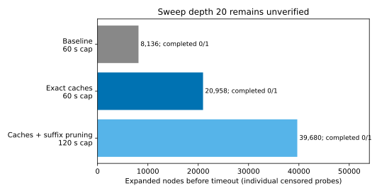
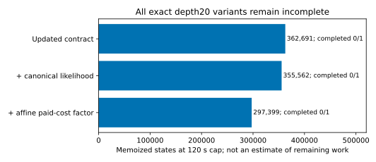

# Sweep exact-search checkpoint

Implementation audit, 2026-09-28. No first-seed experiment batch was launched.
The depth-20 search remains computationally unverified; no completion ETA is supported.

## Changes and correctness

Sweep-only caches reuse atom masks, immutable belief/state signatures and
single-skill imagined posterior updates across unrelated histories and charges.
The latter stores only the changed skill, then restores the caller's other
skills, training counts and accumulated cost. Posterior/state identity caches
use weak references with identity checks; retained posterior-update caches are
bounded to 2048 entries. No posterior distribution is rounded or coarsened.

SweepExpectimaxPlanner inherits the same exact expectimax implementation. Its
only pruning certificate is inability to reach any deployment-relevant skill
within the remaining actions, even under optimistic delete relaxation. The
relaxation includes every conditional addition and learned failure addition,
ignoring their conditions and contexts; it can overestimate reachability but
cannot falsely prove a reachable skill impossible. Until a relevant skill is
attempted, the terminal deployment beliefs and example counts cannot change.
Nonnegative costs and observation surprise therefore make STOP optimal for
that suffix. The root is still fully evaluated for action-value diagnostics.
Requested horizon, solver, objective, inference grids, and all actions remain
unchanged. Collapsed suffixes appear as horizon-zero terminal evaluations in
the existing counters, with a separate pruning-count event.

## Verification

- 28/28 focused tests pass. Six cache tests compare complete root action/value
  outputs against an uncached exhaustive reference (particle/grid, depth0/1/3).
- Pruning tests compare root choices and values at depths1–4, hard-budget and
  linear-cost objectives (lambda0 and3e-6), and surprise weights0 and0.1.
- The full five-cube/29-skill symbolic fixture agrees at depths2/3, including
  every root action value. Depth3 value is0.7092781152855239, human-reset root.
- Learned failure shortcuts are retained by the optimistic reachability check.
- Four changed source files pass mypy; changed files pass Ruff.
- A broader check before pruning passed231/314 and failed83/314. A clean
  da719cbe archive passed224/307 and failed83/307: all83 failing test identities
  match exactly. They are stale Tossing expectations versus the imported
  76732331 production-code overlay. No unrelated tests or methods were edited.
  Logs and failure IDs are in scratchpad/exact-search/.

## Bounded performance probes

| Variant | Depth | Solver seconds | Expanded nodes | Cached states | Peak RSS MiB | Completed |
| --- | ---: | ---: | ---: | ---: | ---: | --- |
| Baseline da719cbe |20|59.303|8136|73519|340.7|0/1|
| Exact caches |20|59.266|20958|171697|643.8|0/1|
| Caches and suffix pruning |20|119.441|39680|340070|1145.1|0/1|
| Baseline da719cbe |3|0.329|43|528|100.2|1/1|
| Exact caches |3|0.172|43|528|100.6|1/1|
| Caches and suffix pruning |3|0.173|40|521|100.8|1/1|

These are individual cProfile diagnostics, not repeated samples or an inferred
speedup. The120s probe pruned8247 suffixes but was still inside its first deep
subtree: only one visited node at every remaining horizon7–20. No final root
value/action was obtained. This evidence does not support starting a long batch.

The common fixture uses da719cbe's symbolic model:28 robot skills plus1 human,
five loose/blocked cubes, held wiper and open drawer. Costs1/3 and random
competence0.25 are diagnostic values, not calibration. Canonical inference is
25x16 grid,1024 cost particles, lambda3e-6, observation weight0. Model/controller
contract corrections under development in the integration worktree are not
included in these matched comparisons. Recheck tractability after integrating
them; do not reinterpret these timings as the updated model's result.

All probes ran as memory-capped systemd services (6GiB, swap0, OOMPolicycontinue).
Raw JSON is [beside this note](sweep-exact-search-benchmarks.json). Profiles,
probe script and a git-show copy of the baseline model are preserved under
scratchpad/exact-search/ in the sweep-exact-search worktree. Service names are
sweep-exact-{baseline,final,pruned}-{3,20}; all are finished.

## Updated contract follow-up

After importing integration contract commit e42f734c, the diagnostic fixture
explicitly includes DrawerNotOpen and SweepReachable0–4 in the valid deployment
start and DrawerNotClosed/RobotAway in its held-wiper/open-drawer practice state.
This is a separate fixture version; do not compare its timing as if the old
model were unchanged. Combined focused method/environment/CLI tests pass48/48.

| Updated-contract variant | Depth | Solver seconds | Expanded | Cached | Completed |
| --- | ---: | ---: | ---: | ---: | --- |
| Baseline exact search |3|0.536|51|819|1/1|
| Exact caches and pruning |3|0.277|43|797|1/1|
| Exact caches and pruning |20|119.303|27485|362691|0/1|

Depth3 baseline and optimized values/actions still agree exactly:
0.7092781152855239 and the human reset. The depth20 probe pruned13159 suffixes
and reached1261.9MiB peak RSS, but remained in the first deep subtree. Thus the
contract corrections do not yet establish depth20 readiness or a completion ETA.
Services sweep-exact-updated-{baseline-3,pruned-3,pruned-20} are finished; updated
profiles and script remain beside the original evidence in scratchpad/exact-search/.

A further read-only diagnostic identified a large potential source of missed
transpositions: all70/70 orderings of four successes and four failures produce
different grid posterior weight byte strings. Maximum absolute weight difference
is1.2143e-17; posterior mean ranges0.545454644313975–0.5454546443139752.
The Bayesian likelihood is mathematically commutative, but sequential floating
normalization is not byte-identical, and the current signature includes those
bytes. A sufficient-statistic/canonical-likelihood factorization might merge
these histories while preserving the mathematical model; it would change the
floating-point operation order and requires separate correctness validation.
No rounding, approximate belief merging or canonicalization was applied here.

## Exact factorization follow-up, 2026-09-29

Josh's delegated approval includes mathematical factorization with explicit
floating-point validation. The preceding "not applied" canonicalization statement
records the earlier checkpoint; this follow-up now implements two factorizations.

First, within a single imagined search segment, every Bayesian skill has a fixed
latent grid/particles, learning-rate values, cost posterior and root posterior.
SweepTransitions never advances the latent process, refits, observes a cost, or
resamples those latents. It only conditions admitted Bernoulli outcomes and
updates separate pending-example/sampler-label counts. Hence admitted success
and failure counts are sufficient for that segment. SweepCanonicalLikelihood
uses the unchanged condition_outcome operation in canonical success-then-failure
order. Identity-verified descendants are tied to one search root. Unknown,
externally conditioned, new-cost, refitted or new-clock beliefs fall back to the
ordinary update. Actual observation/inference code is unchanged. Random evidence
exclusion, total attempt counts and fitted sampler support remain separate.

Second, linear G implies V(b,s,C,h)=V(b,s,0,h)-lambda*C. Interior nodes normalize
only already-paid C, then restore that offset on return. Future skill-cost
beliefs and charges stay unchanged. The root remains in actual paid-cost
coordinates, preserving diagnostic branch costs and values. Hard-budget mode
never uses this normalization. Both changes alter floating operation order,
not the mathematical objective or posterior; no belief-key rounding is used.

Verification:57/57 combined focused method/environment/CLI tests pass, including
37/37 method tests. Twenty orderings per inference engine collapse to one
canonical posterior; sequential weights agree within2e-15. Full five-cube root
choices are identical; root/action values use a declared2e-14 absolute tolerance
and observed differences were1.11e-16. Nonzero paid-cost and hard-budget cases
validate root diagnostics, and foreign posterior/cost/clock mutations are rejected
by canonical segment membership. Changed sources pass Ruff and mypy.

| Updated-contract variant | Depth | Solver seconds | Expanded | Memoized | Peak RSS MiB | Completed |
| --- | ---: | ---: | ---: | ---: | ---: | --- |
| Canonical likelihood and pruning |20|119.172|26933|355562|1247.0|0/1|
| Canonical likelihood and pruning |6|59.091|12406|200988|740.4|0/1|
| Canonical likelihood, paid-cost factor, pruning |20|119.329|22251|297399|1065.4|0/1|
| Canonical likelihood, paid-cost factor, pruning |6|59.152|10565|151146|594.1|0/1|

These remain individual censored cProfile probes on synthetic priors, with no
speedup inference. Memoized-state counts from factorizations are different search
representations and must not be treated as a completion fraction. The final
120s run pruned10463 suffixes but visited only one node at every horizon5–20:
no root action had completed. All named profiling services have terminated.

The remaining bottleneck is structural: the search branches over independently
uncertain recovery skills across five cubes, carrying their distinct success/
failure histories and reachability effects, then over stock training histories.
Canonical likelihoods remove redundant orderings within one skill; they do not
collapse genuinely different evidence allocations across skills. Equal configured
robot charges do not make the unknown cost posteriors interchangeable. Sharing
or fixing them would change the approved model and was not done.

Recommendation: do not launch a batch with this unresolved exact-search gate.
A credible exact next step is an admissible continuation-value bound derived from
a relaxed belief problem in which all three stock skills are always available
and recovery/location constraints and nonnegative costs are removed. Because
recovery evidence does not inform stock competence, every actual continuation
can be embedded in that relaxation. Its value could support branch-and-bound,
with reuse keyed only by stock beliefs, pending examples, sampler support and
remaining actions. The relaxed subproblem itself must be proved and benchmarked;
no useful tight bound or runtime improvement is claimed here. A trivial upper
bound of1 is unlikely to prune much at lambda3e-6. No unproved bound was added.
Changing the solver or declared horizon requires separate authorization.

Separately, the integration owner discovered singleton pinned stock parameter
supports, preventing the intended three-sampler learning experiment. This audit
uses synthetic prior/competence values and is not calibration or evidence that
that independent scientific gate has been resolved.
