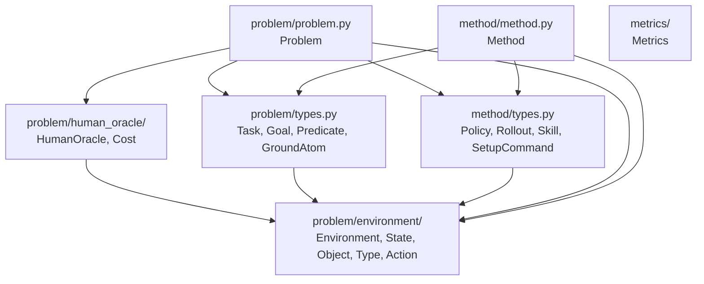

# core

This folder holds the **fixed abstract interfaces** for the project: `Problem`,
`Method`, `Metrics` — plus `Environment` and `HumanOracle`, which live *nested inside*
`problem/` (see "What `Problem` actually is" below for why). Concrete implementations
live in sibling folders, not here.

```
core/
├── problem/
│   ├── problem.py            Problem — the composition root
│   ├── types.py               Task, Goal, Predicate, GroundAtom
│   ├── environment/
│   │   ├── environment.py     Environment — pure dynamics
│   │   └── types.py            State, Object, Type, Action
│   └── human_oracle/
│       ├── human_oracle.py    HumanOracle — the human-cost model
│       └── types.py            Cost
├── method/
│   ├── method.py               Method — the agent side
│   └── types.py                 Policy, Rollout, Skill, SetupCommand
└── metrics/
    └── metrics.py               Metrics — the evaluation protocol
```

## What `Problem` actually is

The project's design doc defines exactly **two** classes: `Problem` and `Method` (plus
`Metrics`). The doc's `Problem` bundles *everything* — task generation,
`send_command_to_human`, `reset_environment`, and the "standard MDP functions"
(`get_current_state`, `transition_function`, `get_valid_actions`, `get_initial_state`)
all sit as plain methods on one class. There is no separate `Environment` or
`HumanOracle` class in the doc at all.

`Environment` and `HumanOracle` as their own classes were introduced during this
codebase's design, not specified by the doc — motivated by wanting one dynamics
implementation to be reusable across differently-configured `HumanOracle` pairings,
and to keep `Environment` Gym-compatible for baselines that want SB3/RLlib. That
reasoning still holds, which is why they stay separate *classes* here rather than being
flattened back into one — but the doc is right that they **belong to `Problem`**, not
beside it: they're nested under `problem/`, not siblings of it in `core/`. `Method` and
`Metrics` stay true top-level siblings, matching the doc's
`run(problem: Problem, method: Method) -> Metrics` treating them as independent peers.

## Conventions applied here

See the root [README's Conventions section](../../../README.md#conventions) for the
full rationale; the short version, as applied in this folder:

- **Data lives in the `types.py` of the module it supports, as pydantic `BaseModel`s**
  — no shared "bucket" file anywhere. `State`/`Object`/`Type`/`Action` support
  `Environment` (defining state/action space is Environment's job) →
  `problem/environment/types.py`. `Cost` supports `HumanOracle` (`send_command`
  produces it) → `problem/human_oracle/types.py`. `Task`/`Goal`/`Predicate`/
  `GroundAtom` support `Problem` (task/goal generation is Problem's job) →
  `problem/types.py`. `Policy`/`Rollout`/`Skill`/`SetupCommand` support `Method` →
  `method/types.py`. `dataclasses`/`attrs` are banned project-wide (ruff `TID251`).
  `Task`/`Goal` are intentionally **not** frozen/hashable (unlike `Object`/`Type`/
  `GroundAtom`/`Predicate`, which sit inside dict keys or a `frozenset`) —
  `get_train_tasks` returns `list[Task]`, not `set[Task]`, because `Task.initial_state`
  wraps a mutable numpy-backed `State` that can't honestly be hashed.
- **No `__init__.py` re-exports anything** — every name has exactly one import path
  (e.g. `from hitl_pmp.core.problem.environment.types import State`), never a second
  shortcut through a package `__init__.py`.
- **Imports are absolute across subpackages, relative within one.** From
  `problem/problem.py`, `.environment.environment` and `.types` are same-tree relative
  imports; from `problem/human_oracle/human_oracle.py`, reaching `environment/` — a
  *sibling*, not a parent — requires the absolute
  `hitl_pmp.core.problem.environment.types`, since `..`-style parent-relative imports
  are banned (ruff `TID252`).
- **No `if TYPE_CHECKING:` guards** — also banned (`TID251`). `Problem.run_task_episode`
  needs `Method`'s `Policy`, and `Method.get_task_policy`/`generate_train_task` need
  `Problem`'s `Task`. This looks like a two-way dependency, but it isn't one at the file
  level: `problem.py` imports `Policy` from `method/types.py` (not `method.py`), and
  `method.py` imports `Task` from `problem/types.py` (not `problem.py`). Neither
  `types.py` imports the other's ABC file back, so there's no cycle — just import the
  target's `types.py` directly and skip the deferred-import trick entirely.
- **Behavior lives in the ABCs, as static-method containers.** None of `Environment`/
  `HumanOracle`/`Problem`/`Method`/`Metrics` is ever instantiated — every method is
  `@staticmethod`, and any state a concrete subclass needs (e.g. `Problem.env`,
  `Problem.human`) is a `ClassVar` set once on the class itself, Java
  static-class/singleton style, not constructor-assigned instance state. Every
  parameter (besides an unavoidable dunder like `__getitem__`) is keyword-only,
  enforced by ruff's `PLR0917` with `max-positional-args = 0`.
- **Files/classes are organized top-down**, most composite first — see
  `problem/types.py` (`Task` → `Goal` → `Predicate` → `GroundAtom`, in decreasing order
  of "what relies on what").

## Why `Environment`/`HumanOracle`/`Problem` split the way they do

Gym/Gymnasium bakes in the assumption that `reset()` is free and automatic whenever an
episode ends. Our research problem breaks that assumption on purpose: a robot deployed
outside the factory can take **irreversible** actions, so ending an episode does not
imply a free reset — a human/oracle must sometimes intervene, at a cost, to move the
environment back to a usable state.

- **`Environment`** is *the real-world environment* (or the real/ground-truth
  simulator standing in for it) — there is exactly one of it, tracked via
  `current_state: ClassVar[State]`. It is **not** a reusable, stateless dynamics
  function that other code can call with a hypothetical state to explore "what if" —
  a `Method` that needs to plan carries its own model for that; it must not borrow
  `Environment` to do it. `take_action(*, action)` advances `current_state` by one
  action via the domain's own underlying dynamics and returns the new state;
  `get_valid_actions()` reads from `current_state` too — neither takes an explicit
  `state` argument, both operate on the one real state. `get_current_state()`/
  `set_state()` are concrete (shared across every `Environment`, not reimplemented
  per domain) — `set_state` is a *privileged external override* (used by a human, via
  `HumanOracle`/`Problem.request_human_reset`, to force a state — distinct from
  `take_action`'s normal forward dynamics). `hard_reset()` resets to the initial state
  distribution but is only ever called by the harness before a run starts, never by
  the agent or tied to a human cost. `action_space` is typed as `gymnasium.spaces.Space`
  (never the legacy `gym` package), not a plain numpy array — a `Space` is
  self-describing (bounds, shape, `sample()`, `contains()`), it's what `to_gym.py` will
  hand straight to SB3/RLlib with zero conversion, and it's left as the abstract
  `Space` rather than hardcoded to `Box` so a domain with a mixed
  discrete-skill/continuous-parameter action structure (e.g. Tossing Room) can pick
  `Discrete`, `MultiDiscrete`, or `Dict` instead.
- **`HumanOracle`** is the human/oracle cost model, independently swappable (the v0
  unconditional oracle up through a v3 natural-language, capability-aware oracle in the
  design doc) from whichever `Environment` it's paired with.
- **`Problem`** is the composition root that binds one `Environment` + one
  `HumanOracle` + a task distribution. "No auto-reset" and "human-mediated reset has a
  cost" live here, via `request_human_reset`, along with train/test task generation.
  Unlike `Environment`, a `Problem` is specific to one research question, not reusable
  across them.

## `Type` declares a feature schema, not just a name

`Type` carries `feature_names: tuple[str, ...]` and a `dim` property (`len(feature_names)`)
— e.g. `Type(name="block", feature_names=("x", "y", "z"))`. This is what lets `State`
actually enforce that an `Object`'s raw feature vector matches its declared type (a
`model_validator` on `State` rejects a vector whose length doesn't equal
`obj.type.dim`), and what lets `State.get(obj=..., feature_name="x")`/`.set(...)` look
up a feature by name instead of a raw, undocumented vector index.

`predicators` also gives `Type` a `parent` for subtype inheritance (e.g. a `"movable"`
type reusing all of `"base-object"`'s `feature_names` plus a few more, and predicates/
skills declared against a parent type automatically applying to every subtype). We
deliberately left it out: nothing in the codebase walks a parent chain yet
(no `is_instance()`), and no current domain needs a type hierarchy — Tossing Room's
`trash`/`recycling` don't need one; they can be flat types, or even a single `item`
type with an `is_recycling` feature. It's cheap to add back (a one-line field, matching
`predicators`' pattern exactly) once a second or third object type actually needs to
share a feature schema, or once a predicate/skill needs to generalize across a family
of related types — e.g. a real robot deployment with many movable-object subtypes
(mirroring Spot's `movable`/`container`/`dustpan`/`broom` in `predicators`), or once
PDDL generation wants a native `:types` hierarchy rather than a flat list.

This is a direct port of the `predicators` precedent
(`hitl-practice/predicators/structs.py`'s `Type`), and it's also the mechanism that
makes purely-symbolic domains (e.g. a grid-position `Type("obj", ("row", "column"))`)
and genuinely continuous ones (e.g. a real robot's
`Type("robot", ("gripper_open_percentage", "x", "y", "z", "qw", "qx", "qy", "qz"))`)
interchangeable under this same interface: neither `Type`/`Object`/`State` nor the
planner ever know or care whether a feature is discrete- or continuous-valued — that
distinction only exists inside a domain's own `Predicate.holds` classifiers.

## Files

- `problem/environment/` — `environment.py` (the `Environment` ABC) + `types.py`
  (`State`, `Object`, `Type`, `Action`). The most foundational subpackage: imports
  nothing else from `core/`.
- `problem/human_oracle/` — `human_oracle.py` (the `HumanOracle` ABC) + `types.py`
  (`Cost`). Imports `State` from `../environment/types.py`.
- `problem/` (`problem.py` + `types.py`) — `Problem`, plus `Task`/`Goal`/`Predicate`/
  `GroundAtom`. Imports from `environment/`, `human_oracle/`, and `method/types.py`.
- `method/` — `method.py` (the `Method` ABC) + `types.py` (`Policy`, `Rollout`,
  `Skill`, `SetupCommand`). Imports from `problem/environment/types.py` and
  `problem/types.py`.
- `metrics/` — `metrics.py`, the (mostly generic) evaluation protocol. No `types.py` —
  it has no supporting types of its own yet.

## Module dependency graph

Most-foundational at the top, most-dependent at the bottom. This is a genuine DAG —
`problem.problem` depends on `method.types`, and `method.method` depends on
`problem.types`, but neither `types.py` imports the sibling ABC file back, so there's
no cycle and no `TYPE_CHECKING` needed anywhere:



## Concrete implementations

Live in sibling folders: [`../environments/`](../environments/),
[`../human_oracles/`](../human_oracles/), [`../methods/`](../methods/),
[`../adapters/`](../adapters/), [`../planning/`](../planning/).
