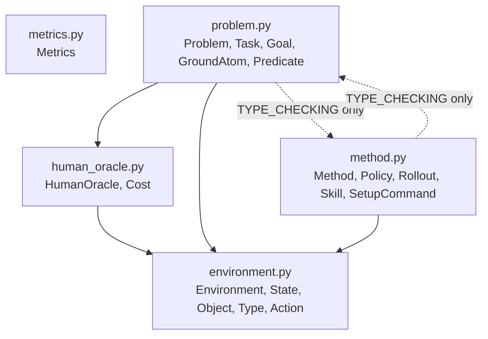

# core

This folder holds the **fixed abstract interfaces** for the project: `Environment`,
`HumanOracle`, `Problem`, `Method`, `Metrics`. Concrete implementations live in
sibling folders, not here.

Two different conventions apply to two different categories of code here — see the
root [README's Conventions section](../../../README.md#conventions) for the full
rationale:

- **Data lives alongside the ABC it supports, as pydantic `BaseModel`s** — there is no
  shared "bucket" file. `State`/`Object`/`Type`/`Action` exist to support `Environment`
  (it's Environment's job to define what state/action even mean), so they live in
  `environment.py`. `Cost` exists to support `HumanOracle` (it's what `send_command`
  produces), so it lives in `human_oracle.py`. `Task`/`Goal`/`GroundAtom`/`Predicate`
  exist to support `Problem` (task/goal generation is Problem's job), so they live in
  `problem.py`. `Policy`/`Rollout`/`Skill`/`SetupCommand` exist to support `Method`, so
  they live in `method.py`. `dataclasses`/`attrs` are banned project-wide (ruff
  `TID251`). Every file that needs another file's types just imports them (e.g.
  `problem.py` imports `State` from `environment.py` and `Cost` from `human_oracle.py`)
  — see the dependency diagram below.
  Each file is also the reference example of **top-down organization**: the ABC is
  defined first, its supporting types after — the reverse of the usual
  leaves-before-use convention. This only works because `from __future__ import
  annotations` makes annotations lazy strings; the explicit `Model.model_rebuild()`
  loop at the bottom of each file forces pydantic to resolve those forward references
  once every class in the file actually exists.
  `Problem.run_task_episode` needs `Policy` (from `method.py`) and `Method.get_task_policy`/
  `generate_train_task` need `Task` (from `problem.py`) — a genuine two-way dependency,
  resolved with `if TYPE_CHECKING:`-guarded imports in both files, since both uses are
  type-hint-only and never needed at runtime.
- **Behavior lives in the five ABCs, as static-method containers.** None of
  `Environment`/`HumanOracle`/`Problem`/`Method`/`Metrics` is ever instantiated — every
  method is `@staticmethod`, and any state a concrete subclass needs (e.g.
  `Problem.env`, `Problem.human`) is a `ClassVar` set once on the class itself, Java
  static-class/singleton style, not constructor-assigned instance state. Every
  parameter (besides an unavoidable dunder like `__getitem__`) is keyword-only,
  enforced by ruff's `PLR0917` with `max-positional-args = 0`.

## Why the Environment / HumanOracle / Problem split

Gym/Gymnasium bakes in the assumption that `reset()` is free and automatic whenever an
episode ends. Our research problem breaks that assumption on purpose: a robot deployed
outside the factory can take **irreversible** actions, so ending an episode does not
imply a free reset — a human/oracle must sometimes intervene, at a cost, to move the
environment back to a usable state.

Rather than bolt cost-aware resets onto Gym's `Env`, we split what Gym conflates:

- **`Environment`** stays pure dynamics only — `simulate`, `get_valid_actions`,
  `get_current_state`/`set_state`. No notion of tasks, humans, or reset cost. This is
  the reusable, importable, Gym-compatible layer that can be shared across research
  questions. `action_space` is typed as `gymnasium.spaces.Space` (never the legacy
  `gym` package), not a plain numpy array — a `Space` is self-describing (bounds,
  shape, `sample()`, `contains()`), it's what `to_gym.py` will hand straight to
  SB3/RLlib with zero conversion, and it's left as the abstract `Space` rather than
  hardcoded to `Box` so a domain with a mixed discrete-skill/continuous-parameter
  action structure (e.g. Tossing Room) can pick `Discrete`, `MultiDiscrete`, or `Dict`
  instead.
- **`HumanOracle`** is the human/oracle cost model, independently swappable (the v0
  unconditional oracle up through a v3 natural-language, capability-aware oracle in the
  design doc) from whichever `Environment` it's paired with.
- **`Problem`** is the composition root that binds one `Environment` + one
  `HumanOracle` + a task distribution. "No auto-reset" and "human-mediated reset has a
  cost" live here, via `request_human_reset`, along with train/test task generation.
  Unlike `Environment`, a `Problem` is specific to one research question, not reusable
  across them.

## Files

- `environment.py` — `Environment`, plus `State`, `Object`, `Type`, `Action`. The most
  external/foundational file: imports nothing else from `core/`.
- `human_oracle.py` — `HumanOracle`, plus `Cost`. Imports `State` from `environment.py`.
- `problem.py` — `Problem`, plus `Task`, `Goal`, `GroundAtom`, `Predicate`. Imports from
  both `environment.py` and `human_oracle.py`.
- `method.py` — `Method`, plus `Policy`, `Rollout`, `Skill`, `SetupCommand`. Imports
  from `environment.py`.
- `metrics.py` — `Metrics`, the (mostly generic) evaluation protocol. Imports nothing
  else from `core/`.

## Module dependency graph

Most-external (fewest internal dependencies) at the top, most-internal at the bottom.
The `Problem <-> Method` edge is `TYPE_CHECKING`-only in both directions (type hints
for `Task`/`Policy`), never a real runtime import cycle:

## Concrete implementations

Live in sibling folders: [`../environments/`](../environments/),
[`../human_oracles/`](../human_oracles/), [`../methods/`](../methods/),
[`../adapters/`](../adapters/), [`../planning/`](../planning/).
