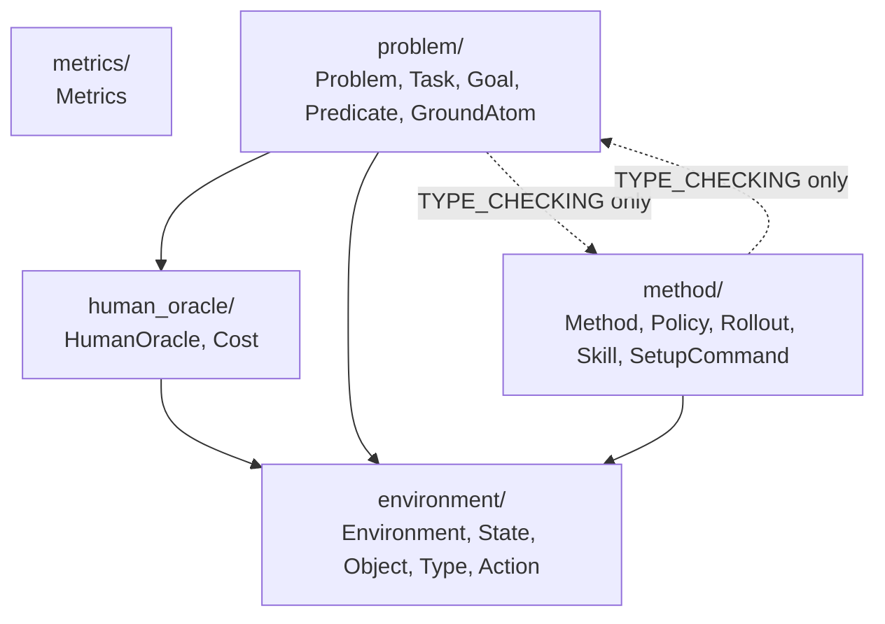

# core

This folder holds the **fixed abstract interfaces** for the project: `Environment`,
`HumanOracle`, `Problem`, `Method`, `Metrics`. Concrete implementations live in
sibling folders, not here.

Each interface is its own subpackage, split into an entrypoint file (the ABC,
capitalized to match the class name) and a `types.py` holding the data it supports —
until any one type grows big enough to earn its own file:

```
environment/
├── __init__.py       (empty)
├── Environment.py     the ABC — the entrypoint to this module
└── types.py           State, Object, Type, Action
```

Two different conventions apply to two different categories of code here — see the
root [README's Conventions section](../../../README.md#conventions) for the full
rationale:

- **Data lives in the `types.py` of the module it supports, as pydantic
  `BaseModel`s** — there is no shared "bucket" file anywhere. `State`/`Object`/`Type`/
  `Action` exist to support `Environment` (it's Environment's job to define what
  state/action even mean), so they live in `environment/types.py`. `Cost` exists to
  support `HumanOracle` (it's what `send_command` produces), so it lives in
  `human_oracle/types.py`. `Task`/`Goal`/`Predicate`/`GroundAtom` exist to support
  `Problem` (task/goal generation is Problem's job), so they live in
  `problem/types.py`. `Policy`/`Rollout`/`Skill`/`SetupCommand` exist to support
  `Method`, so they live in `method/types.py`. `dataclasses`/`attrs` are banned
  project-wide (ruff `TID251`). No `__init__.py` re-exports anything — every name has
  exactly one import path, e.g. `from hitl_pmp.core.environment.types import State`,
  never a second shortcut through a package `__init__.py`.
  `Task`/`Goal` are intentionally **not** frozen/hashable (unlike `Object`/`Type`/
  `GroundAtom`/`Predicate`, which are, since they sit inside dict keys or a
  `frozenset`) — `get_train_tasks` returns `list[Task]`, not `set[Task]`, precisely
  because `Task.initial_state` wraps a mutable numpy-backed `State` that can't
  honestly be hashed.
  `Problem.run_task_episode` needs `Policy` (from `method/types.py`) and
  `Method.get_task_policy`/`generate_train_task` need `Task` (from `problem/types.py`)
  — a genuine two-way dependency, resolved with `if TYPE_CHECKING:`-guarded imports in
  both files, since both uses are type-hint-only and never needed at runtime. Imports
  between subpackages are absolute (`from hitl_pmp.core.environment.types import
  State`), not relative (`from ..environment.types import State`) — ruff's `TID252`
  enforces this.
- **Behavior lives in the five ABCs, as static-method containers.** None of
  `Environment`/`HumanOracle`/`Problem`/`Method`/`Metrics` is ever instantiated — every
  method is `@staticmethod`, and any state a concrete subclass needs (e.g.
  `Problem.env`, `Problem.human`) is a `ClassVar` set once on the class itself, Java
  static-class/singleton style, not constructor-assigned instance state. Every
  parameter (besides an unavoidable dunder like `__getitem__`) is keyword-only,
  enforced by ruff's `PLR0917` with `max-positional-args = 0`.

## Why the Environment / HumanOracle / Problem split

Gym/Gymnasium bakes in the assumption that `reset()` is free and automatic whenever an
episode ends. Our research problem breaks that assumption on purpose: a robot deployed
outside the factory can take **irreversible** actions, so ending an episode does not
imply a free reset — a human/oracle must sometimes intervene, at a cost, to move the
environment back to a usable state.

Rather than bolt cost-aware resets onto Gym's `Env`, we split what Gym conflates:

- **`Environment`** stays pure dynamics only — `step`, `get_valid_actions`,
  `get_current_state`/`set_state`/`hard_reset`. No notion of tasks, humans, or reset
  cost — `hard_reset` resets to the initial state distribution but is only ever called
  by the harness before a run starts, never by the agent or tied to a human cost. This is
  the reusable, importable, Gym-compatible layer that can be shared across research
  questions. `action_space` is typed as `gymnasium.spaces.Space` (never the legacy
  `gym` package), not a plain numpy array — a `Space` is self-describing (bounds,
  shape, `sample()`, `contains()`), it's what `to_gym.py` will hand straight to
  SB3/RLlib with zero conversion, and it's left as the abstract `Space` rather than
  hardcoded to `Box` so a domain with a mixed discrete-skill/continuous-parameter
  action structure (e.g. Tossing Room) can pick `Discrete`, `MultiDiscrete`, or `Dict`
  instead.
- **`HumanOracle`** is the human/oracle cost model, independently swappable (the v0
  unconditional oracle up through a v3 natural-language, capability-aware oracle in the
  design doc) from whichever `Environment` it's paired with.
- **`Problem`** is the composition root that binds one `Environment` + one
  `HumanOracle` + a task distribution. "No auto-reset" and "human-mediated reset has a
  cost" live here, via `request_human_reset`, along with train/test task generation.
  Unlike `Environment`, a `Problem` is specific to one research question, not reusable
  across them.

## Files

- `environment/` — `Environment.py` (the ABC) + `types.py` (`State`, `Object`, `Type`,
  `Action`). The most external/foundational subpackage: imports nothing else from
  `core/`.
- `human_oracle/` — `HumanOracle.py` + `types.py` (`Cost`). Imports `State` from
  `environment/types.py`.
- `problem/` — `Problem.py` + `types.py` (`Task`, `Goal`, `Predicate`, `GroundAtom`).
  Imports from both `environment/` and `human_oracle/`.
- `method/` — `Method.py` + `types.py` (`Policy`, `Rollout`, `Skill`, `SetupCommand`).
  Imports from `environment/`.
- `metrics/` — `Metrics.py`, the (mostly generic) evaluation protocol. No `types.py` —
  it has no supporting types of its own yet.

## Module dependency graph

Most-external (fewest internal dependencies) at the top, most-internal at the bottom.
The `Problem <-> Method` edge is `TYPE_CHECKING`-only in both directions (type hints
for `Task`/`Policy`), never a real runtime import cycle:



## Concrete implementations

Live in sibling folders: [`../environments/`](../environments/),
[`../human_oracles/`](../human_oracles/), [`../methods/`](../methods/),
[`../adapters/`](../adapters/), [`../planning/`](../planning/).
