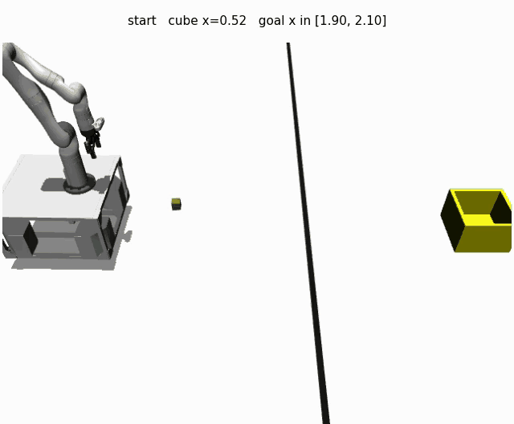

# `tossing3d/` — KINDER's Tossing3D, integrated

[Environment page](https://prpl-group.com/kinder-site/environments/tossing3d/index.html) ·
[benchmark](https://prpl-group.com/kinder-site/) ·
[source](https://github.com/Princeton-Robot-Planning-and-Learning/kindergarden)

A TidyBot++ mobile manipulator has to get a cube from the floor into a goal region on
the far side of an immovable barrier. The barrier is 5 m wide and blocks the base, so
the cube can only get there through the air: the robot must **toss** it.

## This is an integration, not a port

Unlike every other domain here, **no dynamics are written in this repo**. The simulator
is KINDER's own: `kinder_backend.py` calls `kinder.register_all_environments()` and
`kinder.make("kinder/Tossing3D-<variant>-v0")`, and every skill is one of KINDER's own
parameterized controllers — `pick_shelf` from `kinder_models.dynamic3d.shelf`, and
`move_to_target` / `move_arm_to_conf` / `toss` from `kinder_models.dynamic3d.tossing`.
`environment.py` implements no physics; it delegates to the backend and assembles a
`State` from what the backend reads back.

What lives here is **adapter code**, and only adapter code. This repo's `Method`s
consume `core.Environment`, `core.Skill` and `core.Predicate`; KINDER exposes a Gym
env, an `ObjectCentricState` and imperative controllers. Everything in this folder
exists to map the second onto the first:

| KINDER gives us | this folder maps it to | why the mapping is needed |
| --- | --- | --- |
| a Gym `env.step(action_vector)` | `environment.py`'s `[skill_id, param0, param1]` encoding | one transition here is one *skill*, so a `Method` chooses skills, not 20 ms control ticks |
| an `ObjectCentricState` | `environment.py`'s flat `State` over five `Object`s | predicates in this repo are pure functions of `State`, with no simulator handle |
| `_check_goals()`, a method on the env | `predicates.py`'s `InGoalRegion` and friends | Fast Downward needs a symbolic layer it can evaluate off-simulator |
| imperative controllers with `sample_parameters` | `skills.py`'s lifted `Skill`s with pre/add/delete effects | EES task-plans over operators; a controller is not one |
| an episode seed | `tasks.py`'s `Task` (a seed plus a `Goal`) | the harness needs a train/test split and a restorable initial state |
| — | `problem.py` | the `Problem` facade and `H_eval = 3 + 2` |

The glue is the reviewable content. The physics, the controllers and the success
criterion are all upstream's, used verbatim.

## Why this domain

**A tossed cube cannot be retrieved.** Whether the toss succeeds or misses, the cube
ends up past the barrier and no skill brings it back. This is the concrete case the
project's V1 proposal names as EES's predicted failure mode — *"cannot reset the
environment under a suboptimal policy... when the goal is reached it can't reset, even
though it did everything right."*

**Read the experiment log before reading any learning curve measured here.**
`PracticeLoop` resets to the sampled train task at the start of every interaction
period, and `run_task_episode` resets per evaluation episode. That is faithful to
predicators and correct for a reproduction, but it hands out a free reset every
`--max-steps-per-interaction` steps — i.e. exactly the resets the irreversibility
hypothesis is about removing. A curve measured here is a *reproduction* result. It
cannot speak to the hypothesis in either direction.

## Installing the optional dependency

KINDER is the **`tossing3d` extra** in `pyproject.toml` — declared, and pinned to exact
upstream commits, but deliberately not a core dependency: it pulls MuJoCo, PyBullet and
OpenCV, none of which the rest of this repo needs, and `kindergarden` caps
`requires-python` at `<3.13` while this project sets no upper bound.
`kinder_backend.py` imports it lazily, so everything else here imports, typechecks and
tests without it — CI never installs the extra, and the eight simulator tests in
`test_kinder_fidelity.py` skip there.

Install it into a **separate environment**, not on top of the `hitl-pmp` dev env — the
extra's job is to record and pin the versions, not to be layered into the environment
every other domain runs in:

```bash
python -m venv kinder-venv && . kinder-venv/bin/activate
pip install -e "/path/to/this/repo[tossing3d]"
export MUJOCO_GL=egl PYOPENGL_PLATFORM=egl
```

Two repos, two pins, because KINDER is a live upstream that moves underneath this
integration — and since the physics and the controllers are all upstream's, the version
*is* the experiment. The leaked PyBullet client `KinderBackend._release` works around is
an *upstream* bug, so a version that fixes or reshapes it would silently change what a
number measured here means:

| package | repo | pin |
| --- | --- | --- |
| `kindergarden` | [`kindergarden`](https://github.com/Princeton-Robot-Planning-and-Learning/kindergarden) | `39eb7e08` (2026-07-28) — upstream `main` when this adapter was written |
| `kinder_models` | [`kinder-baselines`](https://github.com/Princeton-Robot-Planning-and-Learning/kinder-baselines), subdirectory `kinder-models` | `4c731dc8` (2026-06-29) |

Both SHAs are **inferred, not recorded** — nothing wrote down the KINDER commit this was
built against. `39eb7e08` was upstream `main` for the whole window the adapter was
written in; the next upstream commit landed between that and the EES sweep, and is
excluded on content (it changes cluttered-retrieval sampling, which Tossing3D does not
use) rather than on timing. `kinder-baselines` has not moved since 2026-06-29. Correct
these if you know better — and if you re-measure against a different KINDER, move the
pin and say so in the experiment log.

`kinder_models` is the one that holds the parameterized controllers this domain drives
(`dynamic3d.shelf`, `dynamic3d.tossing`); they are not part of `kindergarden` itself,
and it pulls `bilevel_planning` in turn. To hack on either, clone and install over the
top:

```bash
git clone https://github.com/Princeton-Robot-Planning-and-Learning/kindergarden.git
git clone https://github.com/Princeton-Robot-Planning-and-Learning/kinder-baselines.git
pip install -e kindergarden -e kinder-baselines/kinder-models
```

`MUJOCO_GL=egl` matters: `kinder.register_all_environments()` forces `osmesa` whenever
`DISPLAY` is unset, which is the case under `scripts/run_sweep.py`.
`KinderBackend._ensure_env` snapshots and restores the caller's choice, so the exported
value wins — but it has to be exported.

## Layout

| file | what it is |
| --- | --- |
| `kinder_backend.py` | **The only module that talks to KINDER/MuJoCo**, and it imports it lazily, so importing this package is always safe. Runs one KINDER controller per call to termination. |
| `environment.py` | The `State` layout, the `[skill_id, param0, param1]` action encoding, and `set_state`'s seed contract. |
| `predicates.py` | `InGoalRegion`, `HandEmpty`, `Holding`, `Reachable`, `AtThrowPose` — pure functions of `State`. |
| `skills.py` | `Pick` (2 params), `MoveToThrowPose` (0), `Toss` (1) as lifted `Skill`s for Fast Downward. |
| `tasks.py` | A task *is* a KINDER episode seed; the initial state is read back from a real reset. |
| `problem.py` | `H_eval = 3 + 2`. |
| `skill_oracle_policy.py` | The privileged solve, with a measured swing constant. |
| `renderer.py` | KINDER's `task_view` camera, one frame per skill (a storyboard, not a smooth video). |
| `cli.py` | `python -m hitl_pmp.cli --env tossing3d --method ees ...` |

Everything except `kinder_backend.py` is pure arithmetic over feature vectors and is
covered by ordinary CI tests. `tests/environments/tossing3d/test_kinder_fidelity.py`
holds the tests that genuinely drive the simulator; those skip without the optional
dependency. They test the **integration boundary**, never KINDER itself: that
`InGoalRegion` returns exactly what upstream's `_check_goals()` returns on every state
a random walk of skills visits, that `take_action` stays total when upstream's inverse
kinematics has no solution, that resetting to a seed is deterministic enough for
`set_state`'s contract, and that every swing the sampler's prior can draw is one the
upstream controllers accept. None of them reimplement anything upstream already does.

## Validating the integration: the oracle solves it

The privileged oracle (`skill_oracle_policy.py`, `--method skill-oracle`) is the
end-to-end check that the mapping above is wired correctly: if `State` is read wrong, or
a `GroundSkill` dispatches to the wrong controller, or the goal predicate disagrees with
KINDER's, a hand-authored three-skill plan does not land the cube in the region.



`Pick` lifts the cube off the floor, `MoveToThrowPose` carries it to the barrier, and
`Toss` at the oracle's swing = 0.75 throws it over. **The cube comes to rest short of
the bin and the episode is nevertheless solved** — the goal is a *region* on the floor,
not the bin. Measured off the final `State`, not off the pixels:

| quantity | value |
| --- | --- |
| goal atom | `InGoalRegion(cube_0, blocks_goal_region)` |
| final cube `(x, y, z)` | `(1.9139, 0.0116, 0.0249)` |
| `Goal.is_satisfied` | **True** — 1/1 test tasks solved |
| goal region x | [1.85, 2.15] |
| bin centre x | 2.2304 |

That position sits inside KINDER's region — and inside the raw task-JSON range too — so
this clip is unaffected by the goal-region correction described below.

The clip is 171 frames at 20 fps, rendered by
[`scripts/render_tossing3d_demo.py`](../../../../scripts/render_tossing3d_demo.py) the
way KINDER renders its own — one `env.render()` per MuJoCo control tick, `scene_bg=True`
for the MimicLabs room, and `kinder.gif_utils.optimize_gif` for the GIF:

```bash
MUJOCO_GL=egl PYOPENGL_PLATFORM=egl python -m scripts.render_tossing3d_demo \
  --output docs/tossing3d_skill_oracle_demo.gif --seed 0
```

`--method skill-oracle --output-dir DIR` records the same episode through the ordinary
`core.Renderer` path instead, as a 4-frame captioned storyboard (`episode.mp4`) — one
frame per *skill*, which is all a checkpoint comparison needs and a fraction of the cost.

## Things about this domain that look like bugs and are not

**The goal region is the task JSON's range inflated by 5 cm, not the range itself.**
`blocks_goal_region`'s `ranges[0]` reads `[1.9, -0.1, 0.0, 2.1, 0.1, 0.1]`, but KINDER
never compares a position against that literal: `MujocoGround._create_regions` inflates
it by `ground_placement_threshold` = 0.05 m on every side (z clamped at 0) and stores
the result as `Region.bbox`, which is what `Region.check_in_region` — and hence
`_check_goals` — actually tests. The real `o1` region is therefore

| | x | y | z |
| --- | --- | --- | --- |
| task JSON `ranges[0]` | [1.90, 2.10] | [-0.10, 0.10] | [0.00, 0.10] |
| **what KINDER tests** | **[1.85, 2.15]** | **[-0.15, 0.15]** | **[0.00, 0.15]** |

`KinderBackend.goal_region_bounds()` reads `Region.bbox` back rather than re-deriving
the inflation, so the two cannot drift apart; a fidelity test pins them element-wise.
This domain shipped its first Tossing3D results scoring against the raw range, which is
2/3 of the true width on x — the axis a toss controls — so any landing in the resulting
5 cm shells was a KINDER success scored as a failure. Re-running both arms against the
corrected box moved 6 of 2200 evaluation episodes and changed no reported statistic; see
`docs/experiment-logs/2026-08-04-tossing3d-ees.md` for the measured effect.

**The goal region overlaps the bin, but a full-power toss still overshoots.**
`bin_init_region` puts the 0.30 m bin at x = 2.2305, so its footprint is x ∈ [2.08,
2.38] — which *overlaps* the goal region on x ∈ [2.08, 2.15]. A cube resting on the bin
floor (z = 0.044) in that strip does satisfy KINDER's goal; landing in the bin is not
itself a failure. What makes the swing dial worth learning is that KINDER's own demo
toss (swing = 1.0) lands at x ≈ 2.22, past the region's far edge, so the obvious value
is still the wrong one. This domain uses KINDER's criterion verbatim rather than
substituting an "in the bin" test, so that a number reported here is a number about the
benchmark.

**One transition is one skill, not one control tick.** A `take_action` runs a KINDER
controller for a few hundred MuJoCo steps. This matches every other domain here, and it
is what makes "online transitions" comparable across domains.

**`terminated` is ignored.** KINDER reports termination the instant its goal check
passes. An interaction period runs its full length regardless — a solved state is
absorbing (the cube is past the barrier), and ending early would make a solved period
cheaper in transitions than a failed one, biasing the x-axis of every learning curve.

**A controller is grounded fresh for every skill execution, and the PyBullet client it
opens is released right after.** The obvious tidy-up — memoize the grounding — is wrong
and was tried: `PyBulletSim` carries held-object state (`base_link_to_held_obj`) that
`reset` does not clear, so every `Pick` after the first silently fails and the cube
never leaves its start pose. The reason the fresh grounding needs `_release` at all is
that KINDER's `ground()` mints a new controller each call and each one stands up its own
`p.connect(p.DIRECT)` plus the Kinova URDF, which nothing on KINDER's side ever
disconnects: unreleased, that leaked ~150 MB per `Pick` and ~315 MB per `Toss`, and took
a 40-step run to 18.7 GB. Released, 600 skill executions sit flat at ~0.66 GB.
`test_skill_executions_do_not_leak_memory` pins it.

## Known limitations

- **`o2` is not supported.** It requires two cubes in the goal region; the symbolic
  layer here is single-cube. The CLI accepts `--variant o2` because the backend does,
  but the goal would be under-specified.
- **A fixed `--seed` fully determines a run.** Verified: two identical
  `scripts/run_sweep.py` invocations produced bit-identical `stats.json`. Resetting to a
  seed also reproduces the initial state bit-for-bit (pinned by
  `test_reset_to_the_same_seed_reproduces_the_same_initial_state`). This is a
  determinism claim about one machine, not a portability one — per-seed numbers are
  machine-local and arms should be compared at arm level.

  An earlier version of this file warned that a *marginal* grasp could flip on residual
  MuJoCo solver state. That diagnosis was wrong. The flipping was the leaked PyBullet
  clients described above — before `_release`, seed 1's grasp survived the base move or
  not depending on run history even with a fresh environment per trial; after it, seed 1
  drops the cube on every swing, deterministically. A marginal seed here is
  reproducibly marginal, not flaky.
- **No `HumanOracle`.** The domain is the one in this repo that most needs one. Until
  it exists, `Metrics.num_human_interventions()` reports `(0.0, 0)` here as everywhere
  else — not because no intervention was needed, but because none is representable.
