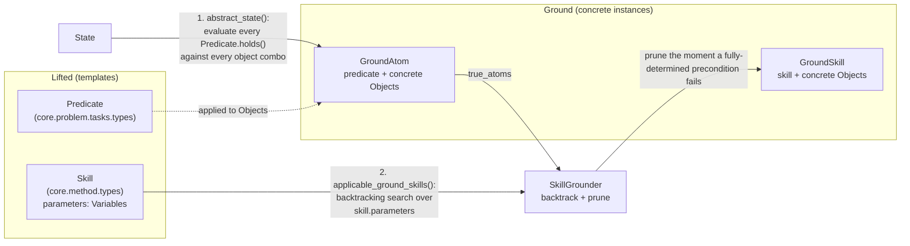

# planning

Will bridge the symbolic `core.Skill`/`core.Predicate`/`core.GroundAtom` layer (see
`core/method/types.py`, `core/problem/tasks/types.py`) to real grounded-skill search and,
eventually, Fast Downward (a classical PDDL planner) — needed to port Practice Makes
Perfect (EES)'s task planning faithfully (see `methods/README.md`): EES plans to reach the
precondition of whichever skill it wants to practice next, using `-log(competence)` as
each skill's edge cost so the minimum-cost plan is the maximum-likelihood-of-success plan.

This package is filled in incrementally, one stacked PR at a time, by whichever
`Method` first needs each piece.

## Files

- `grounding.py` — `SkillGrounder`, a static-method container, domain-agnostic and used
  by every practice-time `Method` that needs "what can I do right now":
  - `abstract_state(*, state, objects, predicates) -> frozenset[GroundAtom]` —
    brute-force evaluates every `Predicate` against every type-matching, distinct-object
    combination to produce the symbolic abstraction `applicable_ground_skills` needs.
  - `applicable_ground_skills(*, skills, objects, true_atoms) -> list[GroundSkill]` —
    backtracking search finding every `GroundSkill` whose (fully-grounded)
    preconditions hold, without brute-force enumerating all object combinations (see
    its own TODOs for where that would bite at large object counts). This is Random
    Skills' entire mechanism: uniformly sample one applicable `GroundSkill`.

## How grounding works

"Grounding" means substituting concrete `Object`s for the free variables in a
*lifted* thing, producing its *ground* counterpart -- the same sense predicators
uses it in. Two different things get grounded here, and `SkillGrounder`'s two
functions are the two steps, run in sequence:

Step 1 (`abstract_state`) grounds *predicates*: it turns the raw numeric `State`
into the set of `GroundAtom`s that currently hold -- the symbolic facts a
precondition check needs, since a lifted `Predicate` can't be checked against a
`State` directly (its `holds` classifier needs concrete `Object`s, not free
variables). Step 2 (`applicable_ground_skills`) grounds *skills*: given those true
atoms, it finds every `Variable -> Object` binding for a `Skill`'s parameters whose
(now-ground) preconditions all hold, producing the actual `GroundSkill`s available
right now -- e.g. Random Skills' whole action space at a given step.

Step 2's own search interleaves generation and checking within one backtracking
pass -- pruning a candidate binding the moment a precondition it fully determines
fails, rather than finishing every parameter before checking anything. This is
deliberately different from predicators' own equivalent (`all_ground_nsrts` +
`get_applicable_operators` in `hitl-practice/predicators/utils.py`), which
generates the *full* Cartesian product of objects for a skill's parameters
first, unconditionally, and only filters by precondition afterward -- see
`_applicable_groundings`'s own TODO(scale) comment for where our pruning still
degrades toward that same worst case (a skill whose preconditions leave several
parameters unconstrained until late in `skill.parameters`' order).

A real `FastDownwardPlanner` (shelling out to a real Fast Downward binary, mirroring the
sibling repo one level up's `hitl-practice/predicators/planning.py`'s
`_sesame_plan_with_fast_downward` two-stage translate/patch-costs/search protocol) and a
PDDL domain/problem text writer are **not implemented yet** — nothing in this codebase
needs cost-aware optimal search over `GroundSkill`s until the Practice Makes Perfect
(EES) reproduction itself lands. We are not extending the sibling `hitl-practice`
codebase (per the project design doc: it is entangled and difficult to extend), but its
planner-invocation protocol is worth reusing rather than reinventing once that PR arrives.

## Why Fast Downward, not a hand-rolled planner

predicators' own built-in `astar` task planner does **not** support per-operator
costs at all (grepped: `ground_op_costs` is only ever consumed by the Fast-Downward
code path) — EES's whole mechanism depends on cost-aware *optimal* search
(`seq-opt-lmcut`), so a real external planner is genuinely load-bearing here, not
an implementation convenience.

## Optionality

Only needed by a planning-based `Method` that requires symbolic search over
`GroundAtom`s to produce a plan — e.g. the Practice Makes Perfect (EES) reproduction
and its paper baselines (`methods/`). Pure deep-RL baselines like MAPLE-Q, or any
`Method` that never grounds its policy in symbolic search, skip this package
entirely and never import from it.
