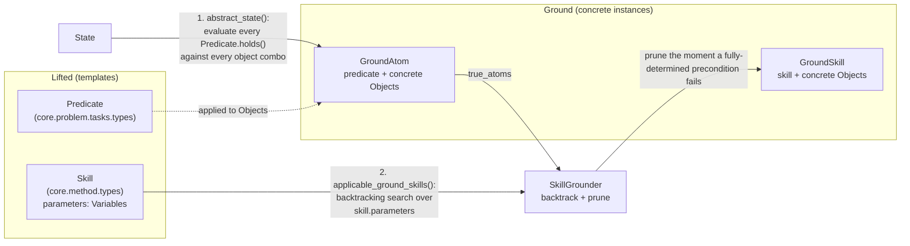

# planning

Will bridge the symbolic `core.Skill`/`core.Predicate`/`core.GroundAtom` layer (see
`core/method/types.py`, `core/problem/tasks/types.py`) to real grounded-skill search and,
eventually, Fast Downward (a classical PDDL planner) — needed to port Practice Makes
Perfect (EES)'s task planning faithfully (see `methods/README.md`): EES plans to reach the
precondition of whichever skill it wants to practice next, using `-log(competence)` as
each skill's edge cost so the minimum-cost plan is the maximum-likelihood-of-success plan.

This package is filled in incrementally, one stacked PR at a time, by whichever
`Method` first needs each piece.

## Files

- `grounding.py` — `SkillGrounder`, a static-method container, domain-agnostic and used
  by every practice-time `Method` that needs "what can I do right now":
  - `abstract_state(*, state, objects, predicates) -> frozenset[GroundAtom]` —
    brute-force evaluates every `Predicate` against every type-matching, distinct-object
    combination to produce the symbolic abstraction `applicable_ground_skills` needs.
  - `applicable_ground_skills(*, skills, objects, true_atoms) -> list[GroundSkill]` —
    backtracking search finding every `GroundSkill` whose (fully-grounded)
    preconditions hold, without brute-force enumerating all object combinations (see
    its own TODOs for where that would bite at large object counts). This is Random
    Skills' entire mechanism: uniformly sample one applicable `GroundSkill`.

## How grounding works

"Grounding" means substituting concrete `Object`s for the free variables in a
*lifted* thing, producing its *ground* counterpart -- the same sense predicators
uses it in. Two different things get grounded here, and `SkillGrounder`'s two
functions are the two steps, run in sequence:



Step 1 (`abstract_state`) grounds *predicates*: it turns the raw numeric `State`
into the set of `GroundAtom`s that currently hold -- the symbolic facts a
precondition check needs, since a lifted `Predicate` can't be checked against a
`State` directly (its `holds` classifier needs concrete `Object`s, not free
variables). Step 2 (`applicable_ground_skills`) grounds *skills*: given those true
atoms, it finds every `Variable -> Object` binding for a `Skill`'s parameters whose
(now-ground) preconditions all hold, producing the actual `GroundSkill`s available
right now -- e.g. Random Skills' whole action space at a given step.

Step 2's own search interleaves generation and checking within one backtracking
pass -- pruning a candidate binding the moment a precondition it fully determines
fails, rather than finishing every parameter before checking anything. This is
deliberately different from predicators' own equivalent (`all_ground_nsrts` +
`get_applicable_operators` in `hitl-practice/predicators/utils.py`), which
generates the *full* Cartesian product of objects for a skill's parameters
first, unconditionally, and only filters by precondition afterward -- see
`_applicable_groundings`'s own TODO(scale) comment for where our pruning still
degrades toward that same worst case (a skill whose preconditions leave several
parameters unconstrained until late in `skill.parameters`' order).

## Cost-aware planning: `pddl.py` + `fast_downward.py`

`SkillGrounder` answers "what can I do right now"; these two answer "what sequence of
skills reaches this goal at minimum total cost". They port the sibling repo's
`hitl-practice/predicators/planning.py` translate/patch-costs/search protocol
(`generate_sas_file_for_fd`, `_update_sas_file_with_costs`, `fd_plan_from_sas_file`)
rather than reinventing it — we do not *extend* that codebase (per the design doc: it
is entangled and hard to extend), but its FD-invocation protocol is worth reusing.

- `pddl.py` — `PddlWriter`, a static-method container that renders the symbolic layer
  as PDDL text matching predicators' `create_pddl_domain`/`create_pddl_problem`
  byte-for-byte:
  - `domain_str(*, skills, predicates, types, domain_name="hitlpmp") -> str`
  - `problem_str(*, objects, init_atoms, goal, domain_name="hitlpmp",
    problem_name="hitlpmpproblem") -> str`

  Two deviations from predicators, both forced by type differences. (1) predicators
  requires `Variable.name` to already start with `"?"`; ours are plain identifiers
  (`"robot"`, `"current_cell"`), so the writer adds the `?` at write time, in
  `:parameters` and in every atom that references a variable — `Variable` itself is
  untouched. (2) predicators sorts by its entities' `__lt__`; ours have none, so
  **everything is sorted by `.name`** (types, predicates, skills, objects) or by the
  emitted PDDL string (atoms) — that is this codebase's deterministic-ordering
  choice, and it makes the same inputs in any order produce an identical file. No
  type hierarchy is emitted (`Type` has no `parent`), and — deliberately, following
  predicators — **no action costs appear in the PDDL at all**.

- `fast_downward.py` — `FastDownwardPlanner` (plus `PlanningFailure`), a static-method
  container wrapping a real, locally-installed Fast Downward:

  ```python
  FastDownwardPlanner.plan(
      *, skills, predicates, types, objects, init_atoms, goal,
      ground_skill_costs: dict[GroundSkill, float] | None = None,
      default_cost: float = 1.0, cost_precision: int = 3,
      timeout: float = 10.0, alias: str = "seq-opt-lmcut",
  ) -> list[GroundSkill]
  ```

  Three stages, matching predicators exactly:
  1. **Translate** — write domain/problem to temp files, run FD with `--sas-file` to
     get a SAS file. `"Driver aborting"` in the output (typically an unreachable goal,
     caught before search even starts) raises `PlanningFailure`.
  2. **Patch costs** — rewrite that SAS file in place: `begin_metric 0` → `1`, and
     each operator block's cost line (`"1"` as translated) → `int(10**cost_precision *
     cost)`, looked up by the SAS name `"<skill> <obj> <obj> ..."`, all lowercased.
     Costs go in *here* rather than in the PDDL precisely because SAS operators are
     already ground: a PDDL `(:functions (total-cost))` domain could only express one
     cost per *lifted* action, which is not what EES needs.
  3. **Search** — run FD on the patched SAS file, `--cleanup`, then parse plan lines
     back into `GroundSkill`s by lowercased skill name + object names. No
     `"Solution found"` → `PlanningFailure`; `"Plan length: 0 step"` → `[]`.

  Deviations from predicators: `subprocess.run` with an argument list and `cwd=` a
  temp directory instead of `subprocess.getoutput` on an interpolated shell string
  (same commands, no shell-quoting hazards, and FD's `sas_plan`/`output.sas` scratch
  files stay out of the caller's working directory); only the skeleton is returned
  (`Metrics`/`max_horizon`/`atoms_sequence` bookkeeping belongs to a `Method`/`Metrics`
  here); and there is no separate `PlanningTimeout` — a timed-out run simply produces
  no `"Solution found"` and raises `PlanningFailure`.

## Installing Fast Downward

Fast Downward is **not** vendored or pip-installable as part of this project; it is an
external checkout that must be built locally:

```bash
# From this repo's parent directory, so the checkout ends up beside it:
git clone https://github.com/aibasel/downward.git && cd downward && ./build.py
export FD_EXEC_PATH=/path/to/downward   # only needed if it is NOT a sibling
```

`FastDownwardPlanner.fd_dir()` reads `FD_EXEC_PATH` (predicators' own convention),
falling back to a `downward/` checkout sitting **beside this repo** — the same
sibling-repo convention `CLAUDE.md` documents for `../hitl-practice`, so the common
case needs no environment variable and no machine-specific absolute path is baked
into the source. A missing `fast-downward.py` raises `FileNotFoundError` with those
instructions, never a confusing subprocess error. On macOS the GNU `timeout` wrapper is `gtimeout`
(`brew install coreutils`); `sys.platform` picks between the two.

`tests/planning/test_fast_downward.py` genuinely shells out to that binary rather than
mocking it (a mock would not exercise the SAS cost patching at all, which is the whole
load-bearing mechanism), including a test asserting that making one `GroundSkill`
expensive actually changes the plan FD returns. Those tests are named `test_integration_*`
and run in well under a second each on Light Switch at `grid_size=5`. This is a
deliberate departure from predicators, which marks its whole FD path `# pragma: no
cover` on the assumption that CI has no Fast Downward — if this project's CI ends up
without one, these tests are the thing to gate, not the source.

## Why Fast Downward, not a hand-rolled planner

predicators' own built-in `astar` task planner does **not** support per-operator
costs at all (grepped: `ground_op_costs` is only ever consumed by the Fast-Downward
code path) — EES's whole mechanism depends on cost-aware *optimal* search
(`seq-opt-lmcut`), so a real external planner is genuinely load-bearing here, not
an implementation convenience.

## Optionality

Only needed by a planning-based `Method` that requires symbolic search over
`GroundAtom`s to produce a plan — e.g. the Practice Makes Perfect (EES) reproduction
and its paper baselines (`methods/`). Pure deep-RL baselines like MAPLE-Q, or any
`Method` that never grounds its policy in symbolic search, skip this package
entirely and never import from it.
